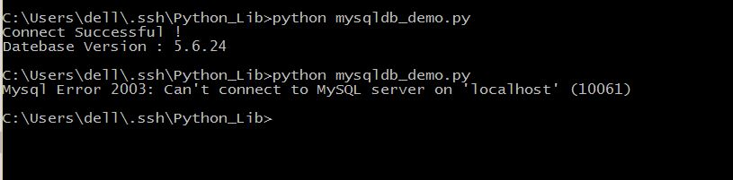
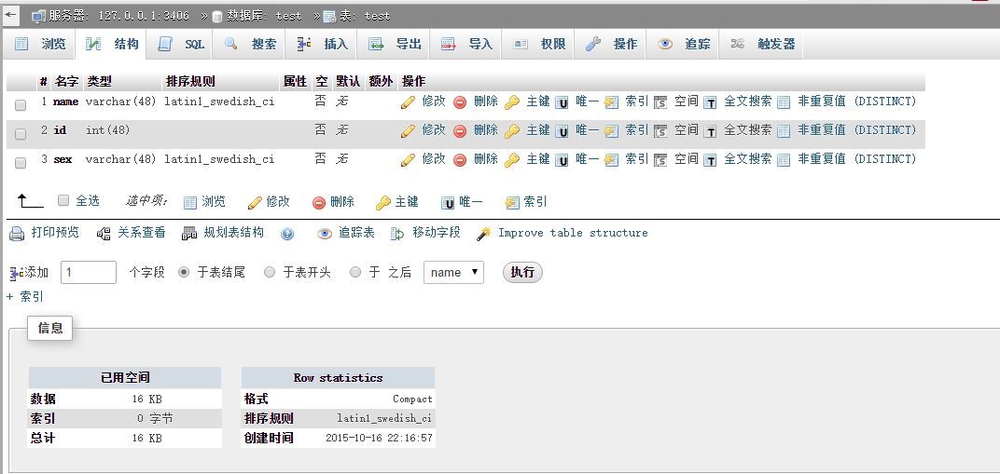
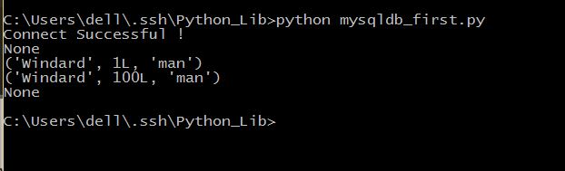
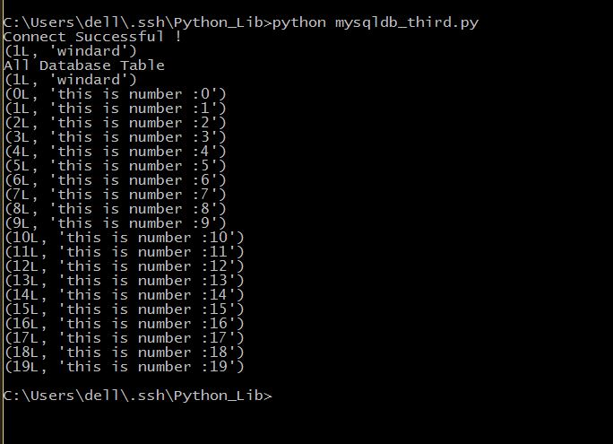
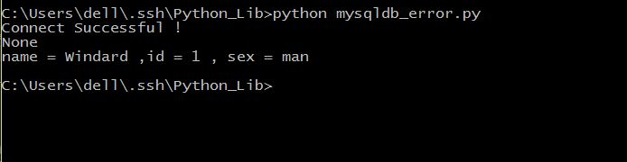
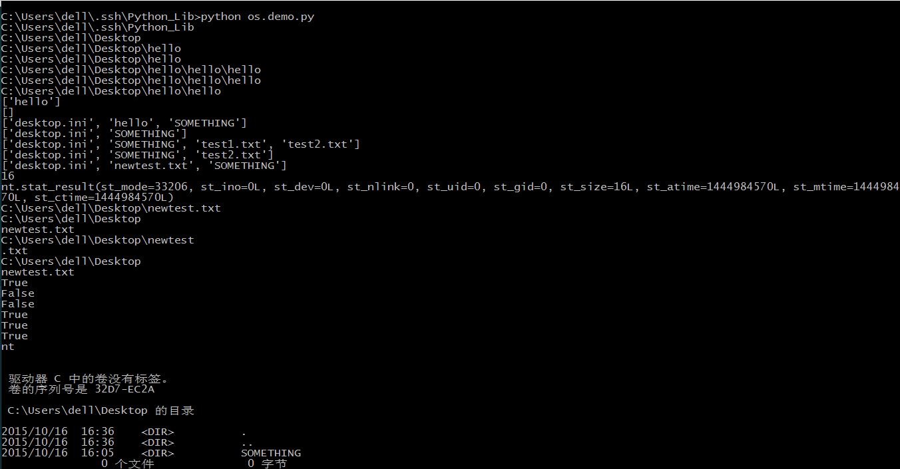
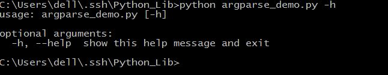
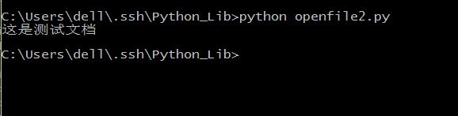

#python 库的学习
===

[TOC]

python的强大之处有很大的一方面在于它有各种各样非常强大的库，那么，这篇博客就是记录我学习各种的库的经历吧。
##MySQLdb
从名字就可以看出来，它的功能是与MySQL数据库连接用的
####基本使用
首先，让我们连接数据库。
```python
import MySQLdb

try:
	conn = MySQLdb.connect(host='localhost',user='root',passwd='',db='test',port=3406)
	print "Connect Successful !"
	conn.close()
except MySQLdb.Error,e:
     print "Mysql Error %d: %s" % (e.args[0], e.args[1])
```
保存为mysqldb_demo.py，运行，看一下结果。

可以看出来，如果MySQL数据库打开且账户密码正确的话就可以正确连接，并显示数据库版本，如果错误则报错并显示错误类型。

接下来，我们试一下数据库的增改删查和刷新。
先来看一下在数据库test中有一个表单test。
test中有三个选项，分别是name，id，sex，数据类型分别是char，int，char。

```python
#coding=utf-8
import MySQLdb

try:
	conn = MySQLdb.connect(host='localhost',user='root',passwd='',db='test',port=3406)
	print "Connect Successful !"
	cur = conn.cursor()
	cur.execute("SELECT * FROM test")
	data = cur.fetchone()
	print data
	value = ["Windard",001,"man"]
	cur.execute("INSERT INTO test(name,id,sex) VALUES(%s,%s,%s)",value)
	#注意一定要有conn.commit()这句来提交，要不然不能真正的插入数据。
	conn.commit()
	cur.execute("SELECT * FROM test")
	data = cur.fetchone()
	print data
	cur.close()
	conn.close()
except MySQLdb.Error,e:
     print "Mysql Error %d: %s" % (e.args[0], e.args[1])
```
保存为mysqldb_first.py,运行，看一下结果。

可以看到之前，在表单里并没有数据，在执行插入了之后有了一行数据。
注意，在执行插入之后一定要commmit()才能实行有效操作，不然不能写入数据库。
再来看一个完整的增改删查的代码。
```python
#coding=utf-8
import MySQLdb

try:
	conn = MySQLdb.connect(host='localhost',user='root',passwd='',db='test',port=3406)
	print "Connect Successful !"
	cur = conn.cursor()
	#首先查询原始数据库状态
	cur.execute("SELECT * FROM test ")
	data = cur.fetchone()
	print data
	#插入一条数据
	value = ["Windard",001,"man"]
	cur.execute("INSERT INTO test(name,id,sex) VALUES(%s,%s,%s)",value)
	conn.commit()
	#查询插入数据库之后的状态
	cur.execute("SELECT * FROM test ")
	data = cur.fetchone()
	print data	
	#更改数据库数据
	cur.execute("UPDATE test SET id = 100 WHERE name = 'Windard'")
	#查询更改数据之后的数据库数据
	cur.execute("SELECT * FROM test ")
	data = cur.fetchone()
	print data
	#删除数据库数据
	cur.execute("DELETE FROM test WHERE name = 'Windard'")
	#查询删除数据之后的数据库数据
	cur.execute("SELECT * FROM test ")
	data = cur.fetchone()
	print data	
	cur.close()		
	conn.close()
except MySQLdb.Error,e:
     print "Mysql Error %d: %s" % (e.args[0], e.args[1])
```
保存为mysqldb_second.py，运行，看一下结果。

这里包含完整的数据库增改删查的操作。

####进阶操作
那我们试一下创建一个新的数据库和新的表单，插入大量的数据来试试。
```python
#coding=utf-8
import MySQLdb

try:
	conn = MySQLdb.connect(host='localhost',user='root',passwd='',port=3406,charset='utf8')
	print "Connect Successful !"
	cur = conn.cursor()
	#创建一个新的数据库名为python
	cur.execute("CREATE DATABASE IF NOT EXISTS python")
	#连接这个数据库
	conn.select_db('python')
	#创建一个新的表单test
	cur.execute("CREATE TABLE test(id int,info varchar(20))")
	#插入单个数据
	value = [1,'windard']
	cur.execute("INSERT INTO test VALUES(%s,%s)",value)
	conn.commit()
	#查看结果
	cur.execute("SELECT * FROM test ")
	data = cur.fetchone()
	print data
	#插入大量数据	
	values = []
	for i in range(20):
		values.append((i,'this is number :' + str(i)))
	cur.executemany("INSERT INTO test VALUES(%s,%s)",values)
	conn.commit()	
	#查看结果，此时execute()的返回值是插入数据得到的行数
	print "All Database Table"
	count = cur.execute("SELECT * FROM test ")
	data = cur.fetchmany(count)
	for item in data:
		print item	
	#删除表单
	cur.execute("DROP TABLE test ")
	#删除数据库
	cur.execute("DROP DATABASE python")
	cur.close()
	conn.close()
except MySQLdb.Error,e:
	print "Mysql Error %d: %s" % (e.args[0], e.args[1])

```
保存为mysqldb_third.py，运行，看一下结果。

在这里连接数据库的时候也加上了数据库使用的编码格式，utf8，在使用的时候可以避免乱码的出现。
```python
#coding=utf-8
import MySQLdb

try:
	conn = MySQLdb.connect(host='localhost',user='root',passwd='',db='test',port=3406)
	print "Connect Successful !"
	cur = conn.cursor()
	cur.execute("SELECT * FROM test")
	data = cur.fetchone()
	print data
	value = ["Windard",001,"man"]
	try:
		cur.execute("INSERT INTO test(name,id,sex) VALUES(%s,%s,%s)",value)
		#注意一定要有conn.commit()这句来提交，要不然不能真正的插入数据。
		conn.commit()
	except :
		#发生错误时回滚
		conn.rollback()
	
	cur.execute("SELECT * FROM test")
	data = cur.fetchall()
	for item in data:
		fname = item[0]
		fid   = item[1]
		fsex  = item[2] 
	print "name = %s ,id = %s , sex = %s " %(fname ,fid ,fsex)
	cur.close()
	conn.close()
except MySQLdb.Error,e:
     print "Mysql Error %d: %s" % (e.args[0], e.args[1])
```
保存为mysqldb_error.py，运行，看一下结果。

这个代码演示了发生错误时候回滚的操作，rollback()能够把游标指针指到错误发生之前的位置。
还有fetchall()即一次取得全部的数据。
还有其他几个功能类似的函数fetchone()，一次取得一个数据，fetchmany(num),一次取得num个数据。


##os
非常基础的一个库，但是却实现了我一个想了很久了功能，识别目录下的所有文件。

1. 取得当前目录--os.getcwd()
5. 更改当前目录——os.chdir()
2. 创建一个目录--os.mkdir()
3. 创建多级目录--os.makedirs()
4. 删除一个目录,只能删除空目录--os.rmdir("path")
5. 删除多个目录,删除目录及其下内容--os.removedirs（"path）
1. 获取目录中的文件及子目录的列表——os.listdir("path")		隐藏文件也会显示出来
3. 删除一个文件--os.remove()
4. 文件或者文件夹重命名--os.rename（old， new）
6. 获取文件大小--os.path.getsize（filename）
7. 获取文件属性--os.stat（file）
8. 修改文件权限与时间戳--os.chmod（file）
9. 路径中加入新的内容--os.path.join(path,file)
6. 将路径分解为目录名和文件名——os.path.split()
7. 将目录分解为目录加文件名和文件名的扩展名——os.path.splitext()
7. 获得路径的路径名--os.path.dirname()
8. 获得路径的文件名--os.path.basename()
8. 判断一个路径是否存在或是否为路径——os.path.isdir("path")
9. 判断一个文件是否存在或这否为文件——os.path.isfile("file")
10. 判断一个路径（目录或文件）是否存在——os.path.exists()
11. 判断一个路径是否是绝对路径--os.path.isabs()
9. 读取和设置环境变量--os.getenv() 与os.putenv()
10. 指示你正在使用的平台--os.name       对于Windows，它是'nt'，而对于Linux/Unix用户，它是'posix'
11. 给出当前平台使用的行终止符--os.linesep()    Windows使用'\r\n',Linux使用'\n',而Mac使用'\r'
12. 运行shell命令-- os.system()
13. 终止当前进程--os.exit（）

```python
#coding=utf-8
import os

currentpath = os.getcwd()
print currentpath
changedpath = 'C:\\Users\\dell\\Desktop' 
os.chdir(changedpath)
currentpath = os.getcwd()
print currentpath
os.mkdir('hello')
changedpath = changedpath + '\\hello'
print changedpath
os.chdir(changedpath)
currentpath = os.getcwd()
print currentpath
os.makedirs('hello\\hello')
changedpath = changedpath + '\\hello\\hello'
print changedpath
os.chdir(changedpath)
currentpath = os.getcwd()
print currentpath
os.chdir('../')
currentpath = os.getcwd()
print currentpath
currentlist = os.listdir(currentpath)
print currentlist
os.rmdir('hello')
currentlist = os.listdir(currentpath)
print currentlist
os.chdir('../../')
currentpath = os.getcwd()
currentlist = os.listdir(currentpath)
print currentlist
os.removedirs('hello\\hello')
currentlist = os.listdir(currentpath)
print currentlist
FILE1 = open('test1.txt','w')
FILE1.close()
FILE2 = open('test2.txt','w')
FILE2.close()
currentlist = os.listdir(currentpath)
print currentlist
os.remove('test1.txt')
currentlist = os.listdir(currentpath)
print currentlist
os.rename('test2.txt','newtest.txt')
currentlist = os.listdir(currentpath)
print currentlist
FILE = open('newtest.txt','w')
FILE.write('THis is for test')
FILE.close()
FILESIZE = os.path.getsize('newtest.txt')
print FILESIZE
FILESTAT = os.stat('newtest.txt')
print FILESTAT
currentpath = currentpath + "\\newtest.txt"
print currentpath
(splitpath,splitfile) = os.path.split(currentpath)
print splitpath
print splitfile
(splitpath,splitfile) = os.path.splitext(currentpath)
print splitpath
print splitfile
splitpath = os.path.dirname(currentpath)
splitfile = os.path.basename(currentpath)
print splitpath
print splitfile
isdir = os.path.isfile(currentpath)
isfile = os.path.isdir(currentpath)
print isdir
print isfile
os.remove('newtest.txt')
currentpath = os.path.dirname(currentpath)
isdir = os.path.isfile(currentpath)
isfile = os.path.isdir(currentpath)
print isdir
print isfile
isexist = os.path.exists(currentpath)
print isexist
isabs = os.path.isabs(currentpath)
print isabs
osname = os.name
print osname
linesep = os.linesep
print linesep
os.system('dir')
```
保存为os_improve.py

保存为os_demo.py，运行，看一下结果


给一个查看目录下的所有文件的代码，如果有目录则空格表示递进关系
```python
import os

def showall(path,leavel=0,filenum=0,show=True):
	newnum = filenum
	currentpath = path;
	dirandfile = os.listdir(path)
	for item in dirandfile:
		newpath = os.path.join(currentpath,item)
		if os.path.isdir(newpath):
			num = showall(newpath,leavel+1,newnum,show)
			newnum = num
		else:
			newnum = newnum + 1
			tab_stop = ""
			if show:
				for tab in range(leavel):
					tab_stop = tab_stop + " "
			print tab_stop + newpath

	return newnum

if __name__ == '__main__':
	num = showall('./',show=False)
	print "File Number : " + str(num)

```

>php也可以打开文件夹，直接用户opendir()就可以。

##shutil
也是用来文件操作，但是它与os不同的是它只用来文件或文件夹操作
- shutil.copyfile('oldfile','newfile') 参数只能是文件，新文件不存在则创建
- shutil.copy("oldfile","newfileordir") olddir只能是文件，newfileordir可以是文件或文件夹
- shutil.copytree("olddir","newdir") 参数只能是目录，且newdir必须不存在
- shutil.move("oldpos","newpos") 移动文件或文件夹
- shutil.rmtree("dir") 可以空目录或者是有非空目录

##argparse
向python中传入命令行参数，解析命令行参数和选项。
####基本使用
```python
import argparse

parser = argparse.ArgumentParser()
parser.parse_args()
```
保存为argparse_demo.py，运行，看一下结果。

什么结果都没有，就是这样，它本来就什么都不做。
我们可以给它一个参数。'-h'或者'--help'

显示这个函数有一个可选参数'-h'或者'--help'，功能是显示帮助，然后退出。
```python
#coding=utf-8
#导入该模块
import argparse
#创建一个解析对象
parser = argparse.ArgumentParser()
#向该对象中添加你要关注的命令行参数和选项，每一个add_argument方法对应一个你要关注的参数或选项
parser.add_argument("echo")
#最后调用parse_args()方法进行解析,解析成功之后即可使用
args = parser.parse_args()
#回显参数
print args.echo

```
保存为argparse_add_argument.py，运行，看一下结果。
不过，现在我们增加了一个参数 'echo'

将输入的参数回显出来。
现在我们来看一下相应的参数
```python
ArgumentParser(prog=None, usage=None,description=None, epilog=None, parents=[],formatter_class=argparse.HelpFormatter, prefix_chars='-',fromfile_prefix_chars=None, argument_default=None,conflict_handler='error', add_help=True)  

```
ArgumentParser()参数用的不多，一般只需要传递description参数。当调用parser.print_help()或者运行程序时由于参数不正确时，会打印这些描述信息。
- prog:程序的名字，默认为None，用来在help信息中描述程序的名称。
- usage:描述程序用途的字符串。
- description：help信息前的文字。
- epilog：help信息后的文字。
- parents：由ArgumentParser对象组成的列表，它们的arguments选项会被包含到新ArgumentParser对象中。
- formatter_prefix：help信息输出的格式
- prefix_chars：参数前缀，默认为'-'
- formfile_prefix_chars：前缀字符，放在文件名前
- argument_default：参数的全局默认值。
- conflict_handle：解决冲突的策略，默认报错。
- add_help：设为False时，help信息里不再显示'-h','--help'信息

```python
add_argument(name or flags...[, action][, nargs][, const][, default][, type][, choices][, required][, help][, metavar][, dest])

```
add_argument()
- name or flags：命令行参数名或者选项，如上面的address或者-p,--port.其中命令行参数如果没给定，且没有设置defualt，则出错。但是如果是选项的话，则设置为None
- nargs：命令行参数的个数，一般使用通配符表示，其中，'?'表示只用一个，'*'表示0到多个，'+'表示至少一个
- action：参数的存储格式化,默认为store。store_const，值存放在const中。  store_true和store_false，值存为True或False。 append：存为列表。 append_const：存为列表，会根据const关键参数进行添加。  count：统计参数出现的次数。version：版本。 help：help信息。
- default：默认值
- type：参数的类型，默认是字符串string类型，还有float、int等类型
- choices：参数的范围，或者说选择的空间
- required：设定某个选项是否为必选参数，必须出现。
- help：和ArgumentParser方法中的参数作用相似，出现的场合也一致
- metavar：参数在帮助信息中的名字。
- dest： 即参数名。


```python
#coding=utf-8
import argparse
parser = argparse.ArgumentParser(description="This is for test")
#这是必选参数
parser.add_argument("echo",help="echo this str")
#这也是必选参数，参数类型为int
parser.add_argument("int",help="count this int",type=int,action="store")
#这是可选参数，可以写长形式或短形式
parser.add_argument("-o","--on",help="show all",action="store_true")
args=parser.parse_args()
string = args.echo
print string
intchar = args.int
answer = intchar**2
#如果选择全部显示，则显示完整
if args.on:
	print "Answer is : " + str(answer)
else:
	print answer
```
保存为argparse_count.py，运行，看一下结果。

不带'-'的参数，调用时必须键入值，且顺序与程序定义的顺序一致。默认值
带'-'的参数，调用时可以不用输入。

##sys
这个模块也可以传入命令行参数
####基本使用
####进阶操作

##文件的读写
####打开文件的方式
f.open('file'[,'mode'])

|模式		|描述				  			 |
|------  |----------------				|
|r		|以读方式打开文件，可读取文件信息。|
|w		|以写方式打开文件，可向文件写入信息。如文件存在，则清空该文件，再写入新内容；如果文件不存在则创建。|
|a	    |以追加模式打开文件（即一打开文件，文件指针自动移到文件末尾），如果文件不存在则创建。|
|r+ 	|以读写方式打开文件，可对文件进行读和写操作。|
|w+		|消除文件内容，然后以读写方式打开文件。|
|a+		|以读写方式打开文件，并把文件指针移到文件尾。|
|b		|以二进制模式打开文件，而不是以文本模式。该模式只对Windows或Dos有效，类Unix的文件是用二进制模式进行操作的。|

####打开文件的方法
|方法		|描述			|
|------	  |---------		|
|f.open() |打开文件				|
|f.close()|关闭文件				 |
|f.name() |获取文件名称		 |
|f.tell()|获得文件指针位置，标记当前位置，以文件开头为原点|
|f.read([size])|读出文件，size为读取的长度，以byte为单位|
|f.readline([size])|读出一行信息，若定义了size，则读出 一行的一部分|
|f.write(string)|把string字符串写入文件，write()不会在str后加上一个换行符。换行需加'\n'|
|f.writelines(list)|把list中的字符串一行一行地写入文件，是连续写入文件，没有换行。换行需加'\n'|
|f.next()|返回下一行，并将文件操作标记位移到下一行。把一个file用于for … in file这样的语句时，就是调用next()函数来实现遍历的。|
|f.readlines([size])|读出所有行，也就是读出整个文件的信息。(把文件每一行作为一个list的一个成员，并返回这个list。其实它的内部是通过循环调用readline()来实现的。如果提供size参数，size是表示读取内容的总长，也就是说可能只读到文件的一部分)|
|f.fileno()|获得文件描述符，是一个数字。返回一个长整型的”文件标签“|
|f.flush()|刷新输出缓存，把缓冲区的内容写入硬盘|
|f.isatty()|如果文件是一个终端设备文件（Linux系统中），则返回True，否则返回False。|
|f.seek(offset[,where])|把文件指针移动到相对于where的offset位置。where为0表示文件开始处，这是默认值 ；1表示当前位置；2表示文件结尾。(注意：如果文件以a或a+的模式打开，每次进行写操作时，文件操作标记会自动返回到文件末尾)|
|f.truncate([size])|把文件裁成规定的大小，默认的是裁到当前文件操作标记的位置。如果size比文件的大小还要大，依据系统的不同可能是不改变文件，也可能是用0把文件补到相应的大小，也可能是以一些随机的内容加上去。|


>按行读取文件的方法
>```python
>file = open("sample.txt")
while 1:
    line = file.readline()
    if not line:
        break
    pass # do something
>```


*2015-10-17*
打开不含英文名的文件一般都没有什么问题，主要是文件名含中文的就比较复杂了。
主要有两种方法：
1. unicode转码
```python
filepath=unicode(filepath,'utf8')
fobj=open(filepath,"r")
```
2. 使用u
```python
filepath = u'中文路径'
fobj = open(filepath)
```
我们来试一下
```python
#coding=utf-8
filepath = unicode('测试文档.txt','utf8')
file1 = open(filepath,'w')
file1.write("This is for test")
file1.close()
filepath = u'测试文档.txt'
file2 = open(filepath,'r')
print file2.read()
file2.close()
```
保存为openfile.py，运行，看一下结果。

确实可以，显示挺好的。
但是这里又有一个问题了，如果我想要把中文打印出来呢？把刚才的代码稍微改一下
```python
#coding=utf-8
filepath = unicode('测试文档.txt','utf8')
file1 = open(filepath,'w')
file1.write('这是测试文档')
file1.close()
filepath = u'测试文档.txt'
file2 = open(filepath,'r')
print file2.read().decode('utf8')
file2.close()
```
保存为openfile2.py，运行，看一下结果。

真的能够显示，但是或许有同学的显示是这样的。

使用`decode('utf8')`正常显示的Windows的cmd的chcp是936的。decode()是指文件内容以何种方式编码，现在则以同样的这种方式解码。
3.encode()转码

这是因为微软的中文操作系统默认的中文编码格式是GBK，所以正常的cmd里面只能显示GBK格式编码的中文，无法显示utf-8格式编码的中文。

如果想要显示utf-8格式的中文，需要在cmd内键入`chcp 65001`，这是将cmd的显示中文编码改为utf-8。
或者你也可以将`decode('utf8')`改为`decode('gbk')`。

*2015-10-18*
既然我们已经试过了用Python打开文件的问题，你们接下来就是用PHP打开中文文件的问题了！

因为微软的Windows是默认中文编码格式GBK，需要转码成utf-8才可以正常的看到。

`$filename=iconv('utf-8','gb2312',$filename);`或者是
`file_get_contents(mb_convert_encoding($filename, 'gbk', 'utf-8'));`
##参考链接
[python学习笔记（七）——文件和目录操作](http://www.cnblogs.com/zhoujie/archive/2013/04/10/python7.html)

[关于python文件操作](http://www.cnblogs.com/rollenholt/archive/2012/04/23/2466179.html)

[python操作MySQL数据库](http://www.cnblogs.com/rollenholt/archive/2012/05/29/2524327.html)

[python操作mysql数据库](http://www.runoob.com/python/python-mysql.html)

[Python命令行解析库argparse](http://www.cnblogs.com/linxiyue/p/3908623.html)

[Python命令行解析库argparse](http://www.cnblogs.com/linxiyue/p/3908623.html)

[Argparse简易教程](http://blog.ixxoo.me/argparse.html)

[ argparse — 命令行选项、参数和子命令的解析器](http://python.usyiyi.cn/python_278/library/argparse.html)

[使用Python Requests 库，提交POST请求上传文件，不支持中文文件名？](http://segmentfault.com/q/1010000002633223)

[PHP解决网址URL编码问题的函数urlencode()、urldecode()、rawurlencode()、rawurldecode()](http://www.phpernote.com/php-template/200.html)

[Python处理中文路径](http://blog.csdn.net/maverick1990/article/details/13770693)

[python读写文件，和设置文件的字符编码比如utf-8](http://outofmemory.cn/code-snippet/629/python-duxie-file-setting-file-charaeter-coding-biru-utf-8)

[windows下Python打开包含中文路径名文件](http://my.oschina.net/mcyang000/blog/289460)

[python中的urlencode与urldecode](http://blog.csdn.net/haoni123321/article/details/15814111)

