#python 库的学习
===

[TOC]

python的强大之处有很大的一方面在于它有各种各样非常强大的库，那么，这篇博客就是记录我学习各种的库的经历吧。
>声明：
>本人使用的Python版本为Python2.7.10，Windows 10 操作系统环境下，以下代码均亲测。

后来，我才知道，原来有一本书叫《Python 标准库》,几百个标准库,还有一本书叫Python图像处理的标准库。       
[《Python 标准库》](python标准库.pdf) [《PythonImagingLibrary中文手册》](PythonImagingLibrary中文手册.pdf)

##MySQLdb
从名字就可以看出来，它的功能是与MySQL数据库连接用的
####基本使用
首先，让我们连接数据库。
```python
import MySQLdb

try:
	conn = MySQLdb.connect(host='localhost',user='root',passwd='',db='test',port=3406)
	print "Connect Successful !"
	conn.close()
except MySQLdb.Error,e:
     print "Mysql Error %d: %s" % (e.args[0], e.args[1])
```
保存为mysqldb_demo.py，运行，看一下结果。
             
可以看出来，如果MySQL数据库打开且账户密码正确的话就可以正确连接，并显示数据库版本，如果错误则报错并显示错误类型。

接下来，我们试一下数据库的增改删查和刷新。
先来看一下在数据库test中有一个表单test。
test中有三个选项，分别是name，id，sex，数据类型分别是char，int，char。

```python
#coding=utf-8
import MySQLdb

try:
	conn = MySQLdb.connect(host='localhost',user='root',passwd='',db='test',port=3406)
	print "Connect Successful !"
	cur = conn.cursor()
	cur.execute("SELECT * FROM test")
	data = cur.fetchone()
	print data
	value = ["Windard",001,"man"]
	cur.execute("INSERT INTO test(name,id,sex) VALUES(%s,%s,%s)",value)
	#注意一定要有conn.commit()这句来提交，要不然不能真正的插入数据。
	conn.commit()
	cur.execute("SELECT * FROM test")
	data = cur.fetchone()
	print data
	cur.close()
	conn.close()
except MySQLdb.Error,e:
     print "Mysql Error %d: %s" % (e.args[0], e.args[1])
```
保存为mysqldb_first.py,运行，看一下结果。
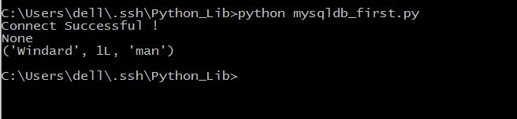
可以看到之前，在表单里并没有数据，在执行插入了之后有了一行数据。
注意，在执行插入之后一定要commmit()才能实行有效操作，不然不能写入数据库。
再来看一个完整的增改删查的代码。
```python
#coding=utf-8
import MySQLdb

try:
	conn = MySQLdb.connect(host='localhost',user='root',passwd='',db='test',port=3406)
	print "Connect Successful !"
	cur = conn.cursor()
	#首先查询原始数据库状态
	cur.execute("SELECT * FROM test ")
	data = cur.fetchone()
	print data
	#插入一条数据
	value = ["Windard",001,"man"]
	cur.execute("INSERT INTO test(name,id,sex) VALUES(%s,%s,%s)",value)
	conn.commit()
	#查询插入数据库之后的状态
	cur.execute("SELECT * FROM test ")
	data = cur.fetchone()
	print data	
	#更改数据库数据
	cur.execute("UPDATE test SET id = 100 WHERE name = 'Windard'")
	#查询更改数据之后的数据库数据
	cur.execute("SELECT * FROM test ")
	data = cur.fetchone()
	print data
	#删除数据库数据
	cur.execute("DELETE FROM test WHERE name = 'Windard'")
	#查询删除数据之后的数据库数据
	cur.execute("SELECT * FROM test ")
	data = cur.fetchone()
	print data	
	cur.close()		
	conn.close()
except MySQLdb.Error,e:
     print "Mysql Error %d: %s" % (e.args[0], e.args[1])
```
保存为mysqldb_second.py，运行，看一下结果。              
              
这里包含完整的数据库增改删查的操作。

####进阶操作
那我们试一下创建一个新的数据库和新的表单，插入大量的数据来试试。
```python
#coding=utf-8
import MySQLdb

try:
	conn = MySQLdb.connect(host='localhost',user='root',passwd='',port=3406,charset='utf8')
	print "Connect Successful !"
	cur = conn.cursor()
	#创建一个新的数据库名为python
	cur.execute("CREATE DATABASE IF NOT EXISTS python")
	#连接这个数据库
	conn.select_db('python')
	#创建一个新的表单test
	cur.execute("CREATE TABLE test(id int,info varchar(20))")
	#插入单个数据
	value = [1,'windard']
	cur.execute("INSERT INTO test VALUES(%s,%s)",value)
	conn.commit()
	#查看结果
	cur.execute("SELECT * FROM test ")
	data = cur.fetchone()
	print data
	#插入大量数据	
	values = []
	for i in range(20):
		values.append((i,'this is number :' + str(i)))
	cur.executemany("INSERT INTO test VALUES(%s,%s)",values)
	conn.commit()	
	#查看结果，此时execute()的返回值是插入数据得到的行数
	print "All Database Table"
	count = cur.execute("SELECT * FROM test ")
	data = cur.fetchmany(count)
	for item in data:
		print item	
	#删除表单
	cur.execute("DROP TABLE test ")
	#删除数据库
	cur.execute("DROP DATABASE python")
	cur.close()
	conn.close()
except MySQLdb.Error,e:
	print "Mysql Error %d: %s" % (e.args[0], e.args[1])

```
保存为mysqldb_third.py，运行，看一下结果。

在这里连接数据库的时候也加上了数据库使用的编码格式，utf8，在使用的时候可以避免乱码的出现。
```python
#coding=utf-8
import MySQLdb

try:
	conn = MySQLdb.connect(host='localhost',user='root',passwd='',db='test',port=3406)
	print "Connect Successful !"
	cur = conn.cursor()
	cur.execute("SELECT * FROM test")
	data = cur.fetchone()
	print data
	value = ["Windard",001,"man"]
	try:
		cur.execute("INSERT INTO test(name,id,sex) VALUES(%s,%s,%s)",value)
		#注意一定要有conn.commit()这句来提交，要不然不能真正的插入数据。
		conn.commit()
	except :
		#发生错误时回滚
		conn.rollback()
	
	cur.execute("SELECT * FROM test")
	data = cur.fetchall()
	for item in data:
		fname = item[0]
		fid   = item[1]
		fsex  = item[2] 
	print "name = %s ,id = %s , sex = %s " %(fname ,fid ,fsex)
	cur.close()
	conn.close()
except MySQLdb.Error,e:
     print "Mysql Error %d: %s" % (e.args[0], e.args[1])
```
保存为mysqldb_error.py，运行，看一下结果。

这个代码演示了发生错误时候回滚的操作，rollback()能够把游标指针指到错误发生之前的位置。
还有fetchall()即一次取得全部的数据。
还有其他几个功能类似的函数fetchone()，一次取得一个数据，fetchmany(num),一次取得num个数据。


##os
非常基础的一个库，但是却实现了我一个想了很久了功能，识别目录下的所有文件。

1. 取得当前目录--os.getcwd()
5. 更改当前目录——os.chdir()
2. 创建一个目录--os.mkdir()
3. 创建多级目录--os.makedirs()
4. 删除一个目录,只能删除空目录--os.rmdir("path")
5. 删除多个目录,删除目录及其下内容--os.removedirs（"path）
1. 获取目录中的文件及子目录的列表——os.listdir("path")		隐藏文件也会显示出来
3. 删除一个文件--os.remove()
4. 文件或者文件夹重命名--os.rename(old， new)
6. 获取文件大小--os.path.getsize（filename）
7. 获取文件属性--os.stat(file)
8. 修改文件权限与时间戳--os.chmod(file)
9. 路径中加入新的内容--os.path.join(path,file)
6. 将路径分解为目录名和文件名——os.path.split()
7. 将目录分解为目录加文件名和文件名的扩展名——os.path.splitext()
7. 获得路径的路径名--os.path.dirname()
8. 获得路径的文件名--os.path.basename()
8. 判断一个路径是否存在或是否为路径——os.path.isdir("path")
9. 判断一个文件是否存在或这否为文件——os.path.isfile("file")
10. 判断一个路径（目录或文件）是否存在——os.path.exists()
11. 判断一个路径是否是绝对路径--os.path.isabs()
9. 读取和设置环境变量--os.getenv() 与os.putenv()
10. 指示你正在使用的平台--os.name       对于Windows，它是'nt'，而对于Linux/Unix用户，它是'posix'
11. 给出当前平台使用的行终止符--os.linesep()    Windows使用'\r\n',Linux使用'\n',而Mac使用'\r'
12. 运行shell命令-- os.system()  
 >但是这个执行命令行没有返回值，直接输出，不管你有没有print                            
13. 执行shell命令-- os.popen() 
>执行命令行，返回一个file open的对象，需要read才能得到执行结果，但是还是没有返回值，如果需要更多的命令行操作，可以使用commands库
13. 终止当前进程--os._exit(0)      
14. 循环遍历目录--os.walk()  返回一个三元组，第一个是路径，第二个是路径下的目录，第三个是路径下的非目录。

```python
#coding=utf-8
import os

currentpath = os.getcwd()
print currentpath
changedpath = 'C:\\Users\\dell\\Desktop' 
os.chdir(changedpath)
currentpath = os.getcwd()
print currentpath
os.mkdir('hello')
changedpath = changedpath + '\\hello'
print changedpath
os.chdir(changedpath)
currentpath = os.getcwd()
print currentpath
os.makedirs('hello\\hello')
changedpath = changedpath + '\\hello\\hello'
print changedpath
os.chdir(changedpath)
currentpath = os.getcwd()
print currentpath
os.chdir('../')
currentpath = os.getcwd()
print currentpath
currentlist = os.listdir(currentpath)
print currentlist
os.rmdir('hello')
currentlist = os.listdir(currentpath)
print currentlist
os.chdir('../../')
currentpath = os.getcwd()
currentlist = os.listdir(currentpath)
print currentlist
os.removedirs('hello\\hello')
currentlist = os.listdir(currentpath)
print currentlist
FILE1 = open('test1.txt','w')
FILE1.close()
FILE2 = open('test2.txt','w')
FILE2.close()
currentlist = os.listdir(currentpath)
print currentlist
os.remove('test1.txt')
currentlist = os.listdir(currentpath)
print currentlist
os.rename('test2.txt','newtest.txt')
currentlist = os.listdir(currentpath)
print currentlist
FILE = open('newtest.txt','w')
FILE.write('THis is for test')
FILE.close()
FILESIZE = os.path.getsize('newtest.txt')
print FILESIZE
FILESTAT = os.stat('newtest.txt')
print FILESTAT
currentpath = currentpath + "\\newtest.txt"
print currentpath
(splitpath,splitfile) = os.path.split(currentpath)
print splitpath
print splitfile
(splitpath,splitfile) = os.path.splitext(currentpath)
print splitpath
print splitfile
splitpath = os.path.dirname(currentpath)
splitfile = os.path.basename(currentpath)
print splitpath
print splitfile
isdir = os.path.isfile(currentpath)
isfile = os.path.isdir(currentpath)
print isdir
print isfile
os.remove('newtest.txt')
currentpath = os.path.dirname(currentpath)
isdir = os.path.isfile(currentpath)
isfile = os.path.isdir(currentpath)
print isdir
print isfile
isexist = os.path.exists(currentpath)
print isexist
isabs = os.path.isabs(currentpath)
print isabs
osname = os.name
print osname
linesep = os.linesep
print linesep
os.system('dir')
```
保存为os_improve.py

保存为os_demo.py，运行，看一下结果             
              
重点是还可以运行shell命令。          
```python
import os
shell = "dir"
print os.system(shell)
```
保存为os_shell.py，运行，看一下结果。            
                  
试一下用`os.walk()`来遍历文件。              
```python
import os

dirlist = r"C:\Users\dell\Desktop\2048"
filenum = 0
dirnum  = 0
for i,j,k in os.walk(dirlist):
	print i
for i,j,k in os.walk(dirlist):
	for item in k:
		print item
	filenum = filenum + 1
	for index in range(len(k)):
		dirnum = dirnum + 1

print filenum
print dirnum
```
保存为os_walk.py，运行，看一下结果。               
      

给一个查看目录下的所有文件的代码，如果有目录则空格表示递进关系         
```python
import os

def showall(path,leavel=0,filenum=0,show=True):
	newnum = filenum
	currentpath = path;
	dirandfile = os.listdir(path)
	for item in dirandfile:
		newpath = os.path.join(currentpath,item)
		if os.path.isdir(newpath):
			num = showall(newpath,leavel+1,newnum,show)
			newnum = num
		else:
			newnum = newnum + 1
			tab_stop = ""
			if show:
				for tab in range(leavel):
					tab_stop = tab_stop + " "
			print tab_stop + newpath

	return newnum

if __name__ == '__main__':
	num = showall('./',show=False)
	print "File Number : " + str(num)

```

>php也可以打开文件夹，直接用户opendir()就可以。

##shutil
也是用来文件操作，但是它与os不同的是它只用来文件或文件夹操作
- shutil.copyfile('oldfile','newfile') 参数只能是文件，新文件不存在则创建
- shutil.copy("oldfile","newfileordir") olddir只能是文件，newfileordir可以是文件或文件夹
- shutil.copytree("olddir","newdir") 参数只能是目录，且newdir必须不存在
- shutil.move("oldpos","newpos") 移动文件或文件夹
- shutil.rmtree("dir") 可以空目录或者是有非空目录

##argparse
向python中传入命令行参数，解析命令行参数和选项。
####基本使用
```python
import argparse

parser = argparse.ArgumentParser()
parser.parse_args()
```
保存为argparse_demo.py，运行，看一下结果。

什么结果都没有，就是这样，它本来就什么都不做。
我们可以给它一个参数。'-h'或者'--help'

显示这个函数有一个可选参数'-h'或者'--help'，功能是显示帮助，然后退出。
```python
#coding=utf-8
#导入该模块
import argparse
#创建一个解析对象
parser = argparse.ArgumentParser()
#向该对象中添加你要关注的命令行参数和选项，每一个add_argument方法对应一个你要关注的参数或选项
parser.add_argument("echo")
#最后调用parse_args()方法进行解析,解析成功之后即可使用
args = parser.parse_args()
#回显参数
print args.echo

```
保存为argparse_add_argument.py，运行，看一下结果。
不过，现在我们增加了一个参数 'echo'
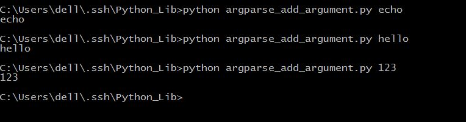
将输入的参数回显出来。
现在我们来看一下相应的参数
```python
ArgumentParser(prog=None, usage=None,description=None, epilog=None, parents=[],formatter_class=argparse.HelpFormatter, prefix_chars='-',fromfile_prefix_chars=None, argument_default=None,conflict_handler='error', add_help=True)  

```
ArgumentParser()参数用的不多，一般只需要传递description参数。当调用parser.print_help()或者运行程序时由于参数不正确时，会打印这些描述信息。
- prog:程序的名字，默认为None，用来在help信息中描述程序的名称。
- usage:描述程序用途的字符串。
- description：help信息前的文字。
- epilog：help信息后的文字。
- parents：由ArgumentParser对象组成的列表，它们的arguments选项会被包含到新ArgumentParser对象中。
- formatter_prefix：help信息输出的格式
- prefix_chars：参数前缀，默认为'-'
- formfile_prefix_chars：前缀字符，放在文件名前
- argument_default：参数的全局默认值。
- conflict_handle：解决冲突的策略，默认报错。
- add_help：设为False时，help信息里不再显示'-h','--help'信息

```python
add_argument(name or flags...[, action][, nargs][, const][, default][, type][, choices][, required][, help][, metavar][, dest])

```
add_argument()
- name or flags：命令行参数名或者选项，如上面的address或者-p,--port.其中命令行参数如果没给定，且没有设置defualt，则出错。但是如果是选项的话，则设置为None
- nargs：命令行参数的个数，一般使用通配符表示，其中，'?'表示只用一个，'*'表示0到多个，'+'表示至少一个
- action：参数的存储格式化,默认为store。store_const，值存放在const中。  store_true和store_false，值存为True或False。 append：存为列表。 append_const：存为列表，会根据const关键参数进行添加。  count：统计参数出现的次数。version：版本。 help：help信息。
- default：默认值
- type：参数的类型，默认是字符串string类型，还有float、int等类型
- choices：参数的范围，或者说选择的空间
- required：设定某个选项是否为必选参数，必须出现。
- help：和ArgumentParser方法中的参数作用相似，出现的场合也一致
- metavar：参数在帮助信息中的名字。
- dest： 即参数名。


```python
#coding=utf-8
import argparse
parser = argparse.ArgumentParser(description="This is for test")
#这是必选参数
parser.add_argument("echo",help="echo this str")
#这也是必选参数，参数类型为int
parser.add_argument("int",help="count this int",type=int,action="store")
#这是可选参数，可以写长形式或短形式
parser.add_argument("-o","--on",help="show all",action="store_true")
args=parser.parse_args()
string = args.echo
print string
intchar = args.int
answer = intchar**2
#如果选择全部显示，则显示完整
if args.on:
	print "Answer is : " + str(answer)
else:
	print answer
```
保存为argparse_count.py，运行，看一下结果。
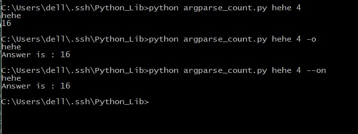
不带'-'的参数，调用时必须键入值，且顺序与程序定义的顺序一致。默认值
带'-'的参数，调用时可以不用输入。

##sys
这个模块也可以传入命令行参数，但是它的参数必须是指定的，没有argparse那么好用，毕竟，这个库的主要功能不是为了传递命令行参数。             
####基本使用
1. `sys.argv` 获得传入的命令行参数。           
```python
#coding=utf-8
import sys
#默认第0个是程序自身
print sys.argv[1]
#默认传进来的参数都是字符串，所以这样的加法是直接相加
print sys.argv[2] + sys.argv[3]
#如果想要做加法的话需要这样相加
print int(sys.argv[2])+int(sys.argv[3])
#计算传进来的未知长度的数字之和
num = 0
for i in sys.argv[2:]:
	num = num+int(i)
print num
```
保存为sys_argv.py，运行，看一下结果。            
     

2. `sys.platform()` 获得当前终端是Windows下还是Linux下。        
3. `sys.exit(n)` 退出程序，它有一个可选的整数参数，当n为0是是正常退出，其他为不正常，可抛异常事件捕获，默认为0。                   
>注意，此处的`sys.exit()`和`os._exit()`和`exit()/quit()`都能够退出Python程序，但是`sys.exit()`一般用在主线程中退出整个Python进程，而`os._exit()`不抛出异常，不执行清理工作，`exit()/quit()`一般在交互式shell中使用。           
4. `sys.path` 系统的环境变量，返回列表。         
```python
#coding=utf-8
import sys
print sys.platform
path = sys.path
for i in path:
	print i
sys.exit(0)
print "This won't run"
```
保存为sys_platform.py，运行，看一下结果。            
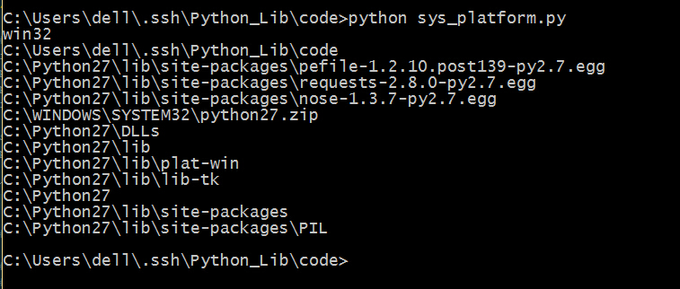         

####进阶操作
5. `sys.modules()` python导入了哪些库，返回元组。           
6. `sys.version` Python解释器的版本信息。              
7. `sys.hexversion` 用十六进制表示Python解释器的版本号。                 
8. `sys.maxint` 最大的int值                   
9. `sys.maxunicode` 最大的Unicode值                 
10. `sys.copyright` Python解释器的版权信息                     
11. `sys.version_info` Python解释器的详细信息                      
12. `sys.api_version` 解释器的C的API版本                     
13. `sys.exec_prefix` Python文件的安装路径                   
14. `sys.byteorder` 本地字节规则的指示器，返回big表示big-endian，little表示little-endian    15. `sys.getdefaultencoding()` 返回你当前所用的默认编码格式。Python z.x返回ASCII，Python 3.x返回Unicode             
16. `sys.setdefaultencoding()` 设定当前的默认编码格式              
17. `sys.executable`  返回Python解释器的具体位置             
18. `sys.getwindowsversion()`  获得Windows版本              
```python
#coding=utf-8
import sys
print sys.version
print sys.version_info
print sys.hexversion
print sys.api_version
print sys.exec_prefix 
print sys.executable
print sys.maxint
print sys.maxunicode
print sys.byteorder
print sys.getdefaultencoding()
print sys.getwindowsversion()
print sys.getfilesystemencoding()
modules =  sys.modules
for i in modules.keys():
	print i
print sys.copyright
```
保存为sys_modules.py，运行，看一下结果。             


19. `sys.stdout` 标准输出            
20. `sys.stdin`  标准输入                   
21. `sys.stderr` 错误输出               
```python
#coding=utf-8
import sys
data = sys.stdin
print data
sys.stdout.write("hello,world")
```
保存为sys_std.py，运行，看一下结果。              
               

##文件的读写
####打开文件的方式
f.open('file'[,'mode'])

|模式		|描述				  			 |
|------  |----------------				|
|r		|以读方式打开文件，可读取文件信息。|
|w		|以写方式打开文件，可向文件写入信息。如文件存在，则清空该文件，再写入新内容；如果文件不存在则创建。|
|a	    |以追加模式打开文件（即一打开文件，文件指针自动移到文件末尾），如果文件不存在则创建。|
|r+ 	|以读写方式打开文件，可对文件进行读和写操作。|
|w+		|消除文件内容，然后以读写方式打开文件。|
|a+		|以读写方式打开文件，并把文件指针移到文件尾。|
|b		|以二进制模式打开文件，而不是以文本模式。该模式只对Windows或Dos有效，类Unix的文件是用二进制模式进行操作的。|

####打开文件的方法
|方法		|描述			|
|------	  |---------		|
|f.open() |打开文件				|
|f.close()|关闭文件				 |
|f.name() |获取文件名称		 |
|f.tell()|获得文件指针位置，标记当前位置，以文件开头为原点|
|f.read([size])|读出文件，size为读取的长度，以byte为单位|
|f.readline([size])|读出一行信息，若定义了size，则读出 一行的一部分|
|f.write(string)|把string字符串写入文件，write()不会在str后加上一个换行符。换行需加'\n'|
|f.writelines(list)|把list中的字符串一行一行地写入文件，是连续写入文件，没有换行。换行需加'\n'|
|f.next()|返回下一行，并将文件操作标记位移到下一行。把一个file用于for … in file这样的语句时，就是调用next()函数来实现遍历的。|
|f.readlines([size])|读出所有行，也就是读出整个文件的信息。(把文件每一行作为一个list的一个成员，并返回这个list。其实它的内部是通过循环调用readline()来实现的。如果提供size参数，size是表示读取内容的总长，也就是说可能只读到文件的一部分)|
|f.fileno()|获得文件描述符，是一个数字。返回一个长整型的”文件标签“|
|f.flush()|刷新输出缓存，把缓冲区的内容写入硬盘|
|f.isatty()|如果文件是一个终端设备文件（Linux系统中），则返回True，否则返回False。|
|f.seek(offset[,where])|把文件指针移动到相对于where的offset位置。where为0表示文件开始处，这是默认值 ；1表示当前位置；2表示文件结尾。(注意：如果文件以a或a+的模式打开，每次进行写操作时，文件操作标记会自动返回到文件末尾)|
|f.truncate([size])|把文件裁成规定的大小，默认的是裁到当前文件操作标记的位置。如果size比文件的大小还要大，依据系统的不同可能是不改变文件，也可能是用0把文件补到相应的大小，也可能是以一些随机的内容加上去。|


>按行读取文件的方法
>```python
>file = open("sample.txt")
while 1:
    line = file.readline()
    if not line:
        break
    pass # do something
>```


*2015-10-17*
打开不含英文名的文件一般都没有什么问题，主要是文件名含中文的就比较复杂了。
主要有两种方法：
1. unicode转码
```python
filepath=unicode(filepath,'utf8')
fobj=open(filepath,"r")
```
2. 使用u
```python
filepath = u'中文路径'
fobj = open(filepath)
```
我们来试一下
```python
#coding=utf-8
filepath = unicode('测试文档.txt','utf8')
file1 = open(filepath,'w')
file1.write("This is for test")
file1.close()
filepath = u'测试文档.txt'
file2 = open(filepath,'r')
print file2.read()
file2.close()
```
保存为openfile.py，运行，看一下结果。

确实可以，显示挺好的。
但是这里又有一个问题了，如果我想要把中文打印出来呢？把刚才的代码稍微改一下
```python
#coding=utf-8
filepath = unicode('测试文档.txt','utf8')
file1 = open(filepath,'w')
file1.write('这是测试文档')
file1.close()
filepath = u'测试文档.txt'
file2 = open(filepath,'r')
print file2.read().decode('utf8')
file2.close()
```
保存为openfile2.py，运行，看一下结果。

真的能够显示，但是或许有同学的显示是这样的。
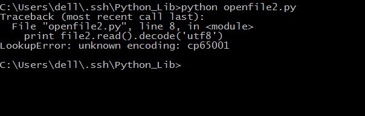
使用`decode('utf8')`正常显示的Windows的cmd的chcp是936的。decode()是指文件内容以何种方式编码，现在则以同样的这种方式解码。
3.encode()转码

这是因为微软的中文操作系统默认的中文编码格式是GBK，所以正常的cmd里面只能显示GBK格式编码的中文，无法显示utf-8格式编码的中文。

如果想要显示utf-8格式的中文，需要在cmd内键入`chcp 65001`，这是将cmd的显示中文编码改为utf-8。
或者你也可以将`decode('utf8')`改为`decode('gbk')`。

*2015-10-18*
既然我们已经试过了用Python打开文件的问题，你们接下来就是用PHP打开中文文件的问题了！

因为微软的Windows是默认中文编码格式GBK，需要转码成utf-8才可以正常的看到。

`$filename=iconv('utf-8','gb2312',$filename);`或者是
`file_get_contents(mb_convert_encoding($filename, 'gbk', 'utf-8'));`


##base64
####基本使用
- base64.b64encode(s[, altchars])
>对字符串使用 Base64 进行编码。返回已编码的字符串。s是要编码的字符串。可选的altchars必须是一个长度至少为2的字符串（多余的字符将被忽略），它表示`+`和`/`字符的替代字母表。这允许应用程序生成的URL或文件系统安全的Base64字符串。默认值为None表示使用标准的Base64字母表。
- base64.b64decode(s[, altchars])
>解码 Base64 编码的字符串。返回已解码的字符串。如果s有错误的填充字符或有非字母表字符出现在字符串中，则引发TypeError .s是要解码的字符串。可选的altchars必须是一个长度至少为2的字符串（多余的字符将被忽略），它表示+和/字符的替代字母表。
- base64.standard_b64encode(s)
>使用标准的Base64字母表编码字符串s。
- base64.standard_b64decode(s)
>使用标准的Base64字母表解码字符串s。
- base64.urlsafe_b64encode(s)
>使用URL安全的字母表编码字符串s，以-和_分别替换标准Base64字母表中的+和/。结果仍然可以包含=。
- base64.urlsafe_b64decode(s)
>使用URL安全的字母表解码字符串s，以-和_分别替换标准Base64字母表中的+和/。
- base64.b32encode(s)
>使用Base32编码字符串。s是要编码的字符串。返回已编码的字符串。
- base64.b32decode(s[, casefold[, map01]])
>对Base32编码的字符串进行解码。返回已解码的字符串。如果s有错误的填充字符或有非字母表字符出现在字符串中，则引发TypeError 。RFC 3548允许数字0映射到字母O，数字1映射到字母I或字母L。可选参数map01不为None时，指定数字1应该映射到哪个字母（当map01不是None时，数字0始终映射到字母O）。出于安全目的缺省值为None，以便在输入中不允许0和1。
- base64.b16encode(s)
>使用Base16编码字符串。s是要编码的字符串。返回已编码的字符串。
- base64.b16decode(s[, casefold])
>对Base16编码的字符串进行解码。返回已解码的字符串。如果s有错误的填充字符或有非字母表字符出现在字符串中，则引发TypeError 。s是要解码的字符串。可选casefold是一个标志，指定是否可以接受小写字母作为输入。出于安全目的，默认值为False。

```python
import base64
old_decode =  "data to be encode"
encode = base64.b64encode(old_decode)
print encode
new_decode = base64.b64decode(encode)
print new_decode
```
保存为base64_demo.py，运行，看一下效果。

####其他函数
- encode()函数也可以进行base64的编码和解码操作
```python
old_decode =  "data to be encode"
encode = old_decode.encode("base64")
print encode
new_decode = encode.decode("base64")
print new_decode
```
保存为base64_encode.py，运行，看一下结果。

可以看出来，效果是与base64模块解码编码一样的结果。
>decode标准语法：str.decode(encoding='UTF-8',errors='strict')
>- encoding -- 要使用的编码，如"UTF-8"。
>- errors -- 设置不同错误的处理方案。默认为 'strict',意为编码错误引起一个UnicodeError。 其他可能得值有 'ignore', 'replace', 'xmlcharrefreplace', 'backslashreplace' 以及通过 codecs.register_error() 注册的任何值。
- 各种转化
```python
int(x [,base ])         #将x转换为一个整数  
long(x [,base ])        #将x转换为一个长整数  
float(x )               #将x转换到一个浮点数  
complex(real [,imag ])  #创建一个复数  
str(x )                 #将对象 x 转换为字符串  
repr(x )                #将对象 x 转换为表达式字符串  
eval(str )              #用来计算在字符串中的有效Python表达式,并返回一个对象  
tuple(s )               #将序列 s 转换为一个元组  
list(s )                #将序列 s 转换为一个列表  
chr(x )                 #将一个整数转换为一个ASCII字符  
unichr(x )              #将一个整数转换为Unicode字符  
ord(x )                 #将一个ASCII字符转换为它的整数值  
hex(x )                #将一个整数转换为一个十六进制字符串  
oct(x )                 #将一个整数转换为一个八进制字符串  
```
其中chr(),ord(),hex()等比较常用。
- 还有hash和md5
 - hash
 在Python中有内置模块hashlib可以用来生成安全散列算法SHA-1,SHA224,SHA256,SHA384,SHA512及RSA的md5算法。  
 我们来试一下生成一个sha-1的密文.
 ```python
 import hashlib
 decode = "data to be encode"
 encode = hashlib.sha1()
 encode.update(decode)
 print encode.hexdigest()
 ```
 保存为hash_sha1.py，运行，看一下结果。   
    
 确实生成了四十位的hash密文。   
 >让我们来看一下hashlib的内置函数有哪些
 >- hashlib.algorithms。一个元组，提供该模块保证支持的哈希算法的名称。
 >- hash.digest_size  。以字节为单位的哈希结果的大小。
 >- hash.block_size   。以字节为单位的哈希算法的内部块的大小。
 >- hash.update(arg)  。用字符串arg更新哈希对象。重复的调用等同于单次调用所有参数的连接：m.update(a); m.update(b) 相当于m.update(a+b)。
 >- hash.digest()     。返回目前为止传递给update()方法的字符串的摘要。它是一个具有digest_size个字节的字符串，其中可能包含非ASCII 字符，包括空字节。
 >- hash.hexdigest()  。类似digest()，但是返回的摘要的字符串的长度翻倍，且只包含十六进制数字。这可用于在电子邮件或其它非二进制环境中安全交换数据。
 >- hash.copy()       。返回哈希对象的一个副本（"克隆"）。这可以用于更有效地计算分享一个共同的初始子字符串的字符串的摘要。
 - md5。能够生成md5的模块主要有两个，md5和hashlib。
 先来演示一下md5模块。
 ```python
 import md5
 decode = "data to be encode"
 encode = md5.new()
 encode.update(decode)
 print encode.hexdigest()
 ```
 保存为md5_md5.py,运行，看一下结果。   
    
 确实生成了32位的md5密文。   
 >md5模块的使用非常简洁，具体看一下相关的函数。   
 >- md5.new([arg]) 。返回一个md5对象，如果给出参数，则相当于调用了update(arg)
 >- md5.updte(arg) 。用string参数arg更新md5对象。注意：如果m.update(a)之后在 m.update(b)，那么就相当于m.update(a+b)。
 >- md5.digest()   。返回16字节的摘要，由传给update的string生成，摘要没有ascii字符
 >- md5.hexdigest()。以16进制的形式返回32位的md5值     
 
 再来试一下hashlib模块
 ```python
 import hashlib
 decode = "data to be encode"
 encode = hashlib.md5()
 encode.update(decode)
 print encode.hexdigest()
 ```
 保存为md5_hash.py，运行，看一下结果。
 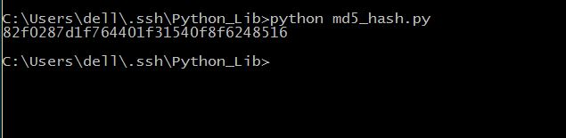
 可以看出来，两次的结果是一样的。  
 在hashlib里面也可以使用一句话模式  
 `print hashlib.new("md5", "data to be encode").hexdigest()  `
 - 文件的md5值
 从上面md5的生成可以看出来，只要是一个字符串都可以生成md5值，同样的方法，如果把一个文件以二进制读取出来也可以计算出来，因为md5的不可解密性，md5值经常用来检验文件是否被修改。
 ```python
 #coding=utf-8
 import hashlib
 #读取二进制文件
 filename = open("md5_hash.py","rb")
 filecontent = filename.read()
 m = hashlib.md5()
 m.update(filecontent)
 decode = m.hexdigest()
 print decode
 ```
 保存为md5_hash_file.py，运行，看一下结果。       
 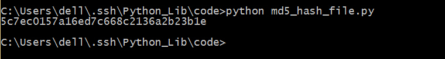      
 这里每次读取文件都是直接打开全部文件读入缓存，如果文件过大的话就会占用过多内存，可以进行稍微改进。      
 ```python
 #coding=utf-8
 import hashlib
 #读取二进制文件
 filename = open("md5_hash.py","rb")
 block = 2**20
 m = hashlib.md5()
 while True:
 	data = filename.read(block)
 	if not data:
 		break
 	m.update(data)
 decode = m.hexdigest()
 print decode
 ```
 保存为md5_hash_bigfile.py，运行，看一下效果。              
 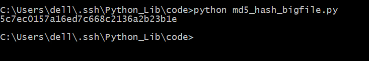

##media
原本以为media是一个很简单的图像处理库，结果下载就纠结我一半天。它不是Python自带的库，需要自行安装，而安装这个库又需要先安装一些其他的东西。本人环境Windows 10 64位处理器Python2.7.10。      
1. 下载[Python Imaging Library 1.1.7 for Python 2.7](PIL-1.1.7.win32-py2.7.exe)，安装。    
2. 下载[pygame-1.9.1.win32-py2.7.msi](pygame-1.9.1.win32-py2.7.msi)，安装。    
3. 下载[numpy-1.6.1-win32-superpack-python2.7.exe](numpy-1.6.1-win32-superpack-python2.7.exe)，安装。    
4. 下载[gwpy-code.zip](gwpy-code.zip)，解压，进入code->install，双击`PyGraphics-2.0.win32.exe`安装。     
>此处，本人安装的时候提示缺少了`MSVCR71.dll`，下载[msvcr71.rar](msvcr71.rar)，安装。    
5. 下载[setuptools-0.6c11.win32-py2.7.exe](setuptools-0.6c11.win32-py2.7.exe)    
6. 最后打开cmd，在命令行中输入`C:\Python27\Scripts\easy_install nose `，当然你得先安装了`ease_install`。   
7. 在cmd中使用`pip install media`即可。   

还有另一种比较简便的方法，全程使用pip安装。   

```
pip install Ampy  
pip install PyGraphics  
pip install nose  
pip install media    
```

####基本使用
算了，大家还是放弃这个库吧。安装非常复杂，使用起来也有问题。     

##Image
这个是专门用来处理图片的，只要你在上面了安装了pil图像处理库，就会自带这个库的。     
####基本操作
```python
import Image
pic = Image.open("../images/test.jpg")
pic.show()
```
保存为image_demo.py，保存，运行即可看到图片。    
   
>但是非常有趣的是，它打开的是jpg的文件，结果在显示的确实bmp文件。所以我在第一次打开的时候需要为bmp文件设定一个默认打开方式，而且打开失败了，结果我在第二次打开的时候，因为已经设定了默认打开方式，竟然能够查看图片了。我用的是win 10自带的照片查看器。

####进阶操作
除了打开图片，我们还可以看一下图片的一些基本信息。   

```python
#coding=utf-8
import Image
pic = Image.open("../images/test.jpg")
#打印图片对象
print pic
#打印图片大小
print pic.size
#打印图片编码格式
print pic.mode
#打印图片保存格式
print pic.format
```
保存为image_second.py，运行，看一下结果。


然后进行一些简单的图片操作，比如说调整文件大小，旋转图像，改变文件格式等。   
```python
#coding=utf-8
import Image
pic = Image.open("../images/test.jpg")

#改变图像大小
pic1 = pic.resize((600,600))
# pic1.show()
print pic1.size
#保存图片,也可以同时改变图片格式
pic1.save("../images/test1.png")
print pic1.mode
print pic1.format

#剪裁图片
pic2 = pic.crop((0,200,600,800))
# pic2.show()
print pic2.size
#保存图片
pic1.save("../images/test2.jpg")
print pic2.mode
print pic2.format

#旋转图片
pic3 = pic2.rotate(45)
pic3.show()
#保存图片
pic3.save("../images/test3.jpg")
```
保存为image_change.py，运行，看一下结果。    

然后查看文件夹，相应的图片也会保存下来。     
然后创建一个新的图像，并与另一张图像合并。   
```python
#coding=utf-8
import Image
#生成一张新的图片
pic1 = Image.new("RGB",(600,600),(255,147,89))
# pic1 = Image.open("../images/test1.png")
#打开一张图片
pic2 = Image.open("../images/test2.jpg")
#先把第二张图片的编码格式转化为与第一张相同
pic2.convert(pic1.mode)
#把两张图片结合到一起
pic3 = Image.blend(pic1,pic2,0.3)
pic3.show()
pic3.save("../images/test4.jpg")
```
保存为image_create.py，运行，看一下结果。    
     
`Image.blend()`的第三个参数为两张图片的透明度p，代表第一张图片透明度1-p，第二张图片透明度p。   
还有注意在结合之前要先做一个格式转换，才能够结合成功。    

最后，对图片进行直方图统计，打印256个灰度级像素点个数的统计值。     
```python
import Image
pic = Image.open("../images/test.jpg")
for i in  range(len(pic.histogram())):
	if i%30==0 and i!=0:
		print ""	
	print pic.histogram()[i],
```
保存为image_histogram.py，运行，看一下结果。        
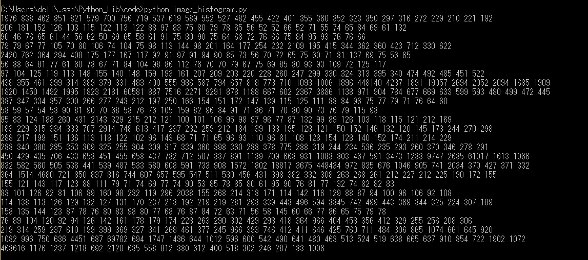          

####ImageDraw
上一个函数库是用来操作图像的，那么这个函数库使用来画图的，这些都属于PIL图像处理库。     
```python
#coding=utf-8
import Image,ImageDraw
pic = Image.open("../images/test2.jpg")
draw = ImageDraw.Draw(pic)
width,height = pic.size

#画两条对角线
draw.line(((0,0),(width-1,height-1)),fill=(136,56,99))
draw.line(((0,height-1),(width-1,0)),fill=(6,156,209))

#画一个圆
draw.arc((0,0,width-1,height-1),0,360,fill=(255,255,0))
pic.show()
pic.save("../images/test5.jpg")
```
保存为imageDraw_demo.py，运行，看一下结果。       
    

####ImageEnhance
这个函数库是用来图像增强，用来色彩增强，亮度增强，对比度增强，图像尖锐化等增强操作。     
```python
#coding=utf-8
import Image,ImageEnhance
pic = Image.open("../images/test2.jpg")

#亮度增强
brightness = ImageEnhance.Brightness(pic)
bright_pic = brightness.enhance(2.0)
bright_pic.show()
bright_pic.save("../images/test6.jpg")

#图像尖锐化
sharpness = ImageEnhance.Sharpness(pic)
sharp_pic = sharpness.enhance(5.0)
sharp_pic.show()
sharp_pic.save("../images/test7.jpg")

#对比度增强
contrast = ImageEnhance.Contrast(pic)
contrast_pic = contrast.enhance(3.0)
contrast_pic.show()
contrast_pic.save("../images/test8.jpg")
```
保存为imageEnhance_demo.py，运行，看一下结果。      
在你的文件夹里就可以看到几张照片，确实是能够有相应的改变。       

####imageFont
遇到了问题，还有其他的在安装opencv的时候也遇到了一个问题。    
`ImportError: The _imagingft C module is not installed`和` error: Unable to find vcvarsall.bat`，算了。不然就可以用Python写验证码了。       
[在Python中用PIL做验证码](http://www.zouyesheng.com/captcha.html)

```python
#coding=utf-8
import Image, ImageDraw, ImageFont, ImageFilter
import random

# 随机字母:
def rndChar():
    return chr(random.randint(65, 90))

# 随机颜色1:
def rndColor():
    return (random.randint(64, 255), random.randint(64, 255), random.randint(64, 255))

# 随机颜色2:
def rndColor2():
    return (random.randint(32, 127), random.randint(32, 127), random.randint(32, 127))

# 240 x 60:
width = 60 * 4
height = 60
image = Image.new('RGB', (width, height), (255, 255, 255))
# 创建Font对象:
font = ImageFont.truetype('Arial.ttf', 36)
# 创建Draw对象:
draw = ImageDraw.Draw(image)
# 填充每个像素:
for x in range(width):
    for y in range(height):
        draw.point((x, y), fill=rndColor())
# 输出文字:
for t in range(4):
    draw.text((60 * t + 10, 10), rndChar(), font=font, fill=rndColor2())
# 模糊:
image = image.filter(ImageFilter.BLUR)
image.show()
image.save('code.jpg', 'jpeg');
```

####imageFilter
图片模糊效果。     
```python
#coding=utf-8
import Image,ImageFilter
pic = Image.open("../images/test2.jpg")
pic1 = pic.filter(ImageFilter.BLUR)
pic1.show()
pic1.save("../images/test9.jpg")
```
保存为imageFilter_demo.py，运行，看一下结果。     


##smtplib
用Python发送邮件，胶水语言当然能够胜任。通过SMTP协议发送邮件，不过它并不是自己的邮件服务器，而是通过调用你的邮箱给别人发送邮件，比如说QQ邮箱或者网易邮箱或者什么什么的。      
先来一个简单的示例。     
>不过想要使用你的邮箱通过SMTP发送邮件需要先确认你的邮箱服务器开通了SMTP服务。    
>以QQ邮箱为例，开通SMTP服务这样的。     
>
####基本使用

```python
#coding=utf-8

import smtplib

#先创建一个连接邮件服务器对象，使用默认端口25
smtpObj = smtplib.SMTP("smtp.qq.com")
#用户名和密码登陆
from_name = '1106911190@qq.com'
to_name = 'me@wenqiangyang.com'
#如果此处用的是QQ邮箱，那么这个密码就是你的QQ邮箱独立密码
password = 'XXXXXX'
#以下为邮件的内容,发送的内容是字符串。
#但是邮件一般由标题，发件人，收件人，邮件内容，附件构成。
#发送邮件的时候需要使用SMTP协议中定义的格式
message = """
From: From Person <1106911190@qq.com>
To: To Person <me@wenqiangyang.com>
Subject: SMTP e-mail test

This is a test.
"""

#登陆邮箱
smtpObj.login(from_name,password)
#发送邮件
smtpObj.sendmail(from_name,to_name,message)
print "Sending Successful"
#关闭连接
smtpObj.close()
```

保存为qqmail_smtp_demo.py，运行，看一下结果。    
         
这样就可以发送一个简单的邮件了，其实真正核心的代码只有四行。    
1. smtplib.SMTP( [host [, port [, local_hostname]]] )     
这句代码用来创建一个SMTP对象，并连接邮件服务器。     
>在此处，也可以化为两步。
>先创建对象`smtpObj = smtplib.SMTP()`，再连接服务器 `smtpObj.connect(host)`
2. SMTP.login(user,password)     
用上一句创建的SMTP对象，登陆发邮件的邮箱     
3. SMTP.sendmail(from_addr, to_addrs, msg[, mail_options, rcpt_options]     
还是用SMTP对象发出邮件，不过要注意一下第三个参数msg，一般不自己写，而是通过MIME来创建一个msg对象再转化为字符串。就像上面的这个例子，我自己写msg并没有效果，被全部当成了邮件正文发送。     
4. SMTP.close()     
关闭SMTP对象的连接，其实如果你不关闭，在代码运行结束也会被自动关闭。      

接下来，我们使用163邮箱也来试一下。   

```python
#coding=utf-8

import smtplib
from email.mime.text import MIMEText

smtpObj = smtplib.SMTP("smtp.163.com")
from_name = '18607571914@163.com'
to_name = 'me@wenqiangyang.com'
password = 'XXXXXX'

#使用MIMEText来创建msg对象
message = MIMEText("天下武功，唯快不破")
message["Subject"] = "千秋万载，一统江湖"
message["From"] = from_name
message["To"] = to_name

smtpObj.login(from_name,password)
#这个地方需要把message对象转化为字符串
smtpObj.sendmail(from_name,to_name,message.as_string())
print "Sending Successful"
smtpObj.close()
```

保存为163mail_smtp_demo.py，运行，看一下结果。    
     

####进阶操作
1. 发送HTML格式的邮件   
其实发送HTML格式的邮件也非常简单，在MIMETest对象里面指定文本为HTML即可。   

```python
#coding=utf-8

import smtplib
from email.mime.text import MIMEText

smtpObj = smtplib.SMTP("smtp.163.com")
from_name = '18607571914@163.com'
to_name = 'me@wenqiangyang.com'
password = 'XXXXXX'

#这是将要发送的HTML部分
HTML = "<p>天下武功，唯快不破<p><br><a href='http://www.wenqiangyang.com'>Click To Find Me</a>"
#只需在MIMETest对象里指定文件格式
message = MIMEText(HTML,_subtype='html',_charset='utf-8')
message["Subject"] = "千秋万载，一统江湖"
message["From"] = from_name
message["To"] = to_name

smtpObj.login(from_name,password)
#这个地方需要把message对象转化为字符串
smtpObj.sendmail(from_name,to_name,message.as_string())
print "Sending Successful"
smtpObj.close()
```

保存为163mail_smtp_html.py，运行，看一下结果。   
   
   

2. 发送附件
发送附件则需要创建MIMEMultipart实例，然后构造附件发送。    

```python
#coding=utf-8

import smtplib
from email.mime.text import MIMEText
from email.mime.multipart import MIMEMultipart

smtpObj = smtplib.SMTP("smtp.163.com")
from_name = '18607571914@163.com'
to_name = 'me@wenqiangyang.com'
password = 'XXXXXX'

#先创建一个带附件的对象
message = MIMEMultipart()

#构造附件
attr = MIMEText(open("163mail_smtp_html.py","rb").read(),"base64","utf-8")
attr["Content-Type"] = 'application/octet-stream'
#此处的文件名写什么，邮件中显示什么名字
attr["Content-Disposition"] = 'attachment; filename="file.py"'

#将附件加入邮件中
message.attach(attr)

#在邮件中加入内容
content = MIMEText("天下英雄，唯君与吾","plain","utf-8")
message.attach(content)

#邮件的收件人，发件人及主题
message["Subject"] = "千秋万载，一统江湖"
message["From"] = from_name
message["To"] = to_name

smtpObj.login(from_name,password)
#这个地方需要把message对象转化为字符串
smtpObj.sendmail(from_name,to_name,message.as_string())
print "Sending Successful"
smtpObj.close()
```

保存为163mail_smtp_multipart.py，运行，看一下结果。   
    
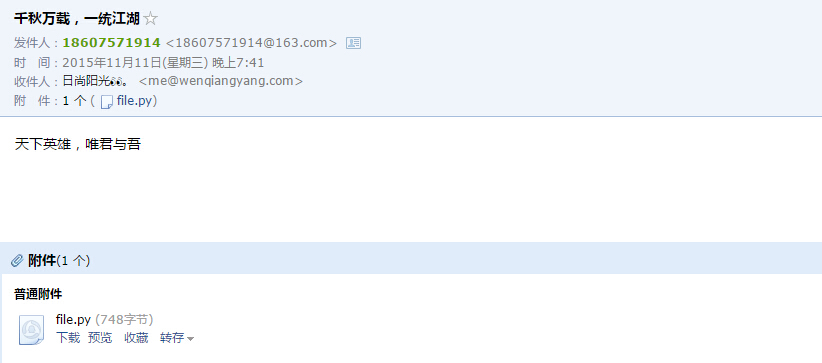   
如果需要发送多个附件则依次创建附件对象并加入邮件即可。    

3. SSL与TLS
python支持SSL/TLS的安全邮件。       
使用`smtpObj.starttls()`即可开启ssl，就像这样。     

```python
#coding=utf-8

import smtplib
import socket

#先创建一个连接邮件服务器对象，使用默认端口25
smtpObj = smtplib.SMTP("smtp.qq.com")
try:
	smtpObj.starttls()
	print "Successful SSL"
except:
	pass
#用户名和密码登陆
from_name = '1106911190@qq.com'
to_name = 'me@wenqiangyang.com'
#如果此处用的是QQ邮箱，那么这个密码就是你的QQ邮箱独立密码
password = 'XXXXXX'
#以下为邮件的内容,发送的内容是字符串。
#但是邮件一般由标题，发件人，收件人，邮件内容，附件构成。
#发送邮件的时候需要使用SMTP协议中定义的格式
message = """
From: From Person <1106911190@qq.com>
To: To Person <me@wenqiangyang.com>
Subject: SMTP e-mail test

日出东方，唯我不败
"""

#登陆邮箱
smtpObj.login(from_name,password)
#发送邮件
smtpObj.sendmail(from_name,to_name,message)
print "Sending Successful"
#关闭连接
smtpObj.close()
```
保存为smtp_ssl.py，保存，运行看一下结果。      
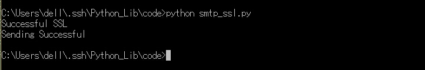    

##envelopes
这是将email和smtplib两个库进行封装，使其发送邮件更加方便。    
不过一般Python并不自带，需要自行安装。
>安装方法
>- Linux下：`pip install envelopes`
>- Windows下，点击[这里](envelopes-master.zip)下载文件压缩包，解压后进入文件夹，`python install setup.py`即可安装。

```python
#coding=utf-8

from envelopes import Envelope

#创建一个envelopes对象
envelope = Envelope(
	#发件人的地址，和名称
	from_addr = (u"1106911190@qq.com",u"Windard"),
	#收件人的地址，和名称
	to_addr = (u"me@wenqiangyang.com",u"Yang"),
	#邮件的主题
	subject = u"天上地下，何以为家",
	#邮件的内容
	text_body = u"眼泪被岁月蒸发"
	)

#在邮件中添加附件也非常简单
envelope.add_attachment('images/163mail_smtp_demo.jpg')

#最后连接邮件服务器并发送
envelope.send("smtp.qq.com",login="1106911190@qq.com",password="XXXXXX",tls=True)

print "Sending Successful"
```

保存为envelopes_demo.py，运行，看一下结果。   
   
   
发送邮件的地方也可以不用`envelope.send()`而用原生的`SMTP.SMTP()`，只需要在开始的时候导入`SMTP`，然后就可以`qq=SMTP(host="XXX",login="XXX",password="XXX")`,再用`qq.send(envelope)`来发送出去。   
>envelope也可以进行群发，只需要在设定`to_addr=(u"XXX@XX.com",u"XXX",u"XXX@XX.com",u"XXX")`即可。
>envelope也可以用来发送HTML，只需在对象中使用`html_body=u'XXX',`即可发送HTML文本。
>envelope也可以设定字符编码，只需在对象中使用` charset=u'XXX',`即可设定编码格式。
>envelope也可设定抄送人，只需在对象中设定` cc_addr=u'XXX',`即可设定抄送人，也可以是多个形式的列表。

##poplib
pop也是邮箱服务的，和SMTP一起用，smtplib用来连接邮箱服务器发送邮件，poplib用来连接服务器接受邮件。  
```python
#coding=utf-8

import poplib

#邮箱信息
host = "pop.163.com"
user = "18607571914@163.com"
password = "XXXXXX"
#连接邮件服务器
p = poplib.POP3(host)
p.user(user)
p.pass_(password)

#邮箱里邮件总的信息
status = p.stat()
print "MailBox has %d message for a total of %s bytes"%(status[0],status[1])
p.quit()
```
保存为pop_demo.py，运行，看一下结果。    
      
好吧，这只是个开始，接下来我们来点复杂的。      
```python
#coding=utf-8

import poplib

#邮箱信息
host = "pop.163.com"
user = "18607571914@163.com"
password = "XXXXXX"
#连接邮件服务器
p = poplib.POP3(host)

#打印服务器欢迎信息
print p.getwelcome()

p.user(user)
p.pass_(password)

#邮箱里邮件总的信息
status = p.stat()
print "MailBox has %d message for a total of %s bytes"%(status[0],status[1])

#返回每个邮件的编号和大小
resp, mails, octets = p.list()
print mails

# 获取最新一封邮件, 注意索引号从1开始:
index = len(mails)
resp, lines, octets = p.retr(index)

print lines

#这样可以更加直观的查看邮件
msg_content = '\r\n'.join(lines)
print msg_content

#删除邮件
try:
	p.dele(index)
	print "Deleting Successful"
except:
	print "Deleting Failed"

p.quit()
```
保存为pop_second.py，运行，看一下结果。   
算了，结果就不放图了，这里已经基本上能够看到大概的邮箱的情况了，但是这还不够，我们需要查看邮件的具体内容。而具体的邮件内容就是我们发邮件时的msg对象的逆向解析了,当然，如果你在发送的时候是直接使用字符串发送过去的，那么接受到的就直接是可以识别的字符串。    
```python
#coding=utf-8

import poplib
import email
from email.parser import Parser
from email.header import decode_header
from email.utils import parseaddr

def showAttachment(msg):
	maintype=msg.get_content_maintype()
	if maintype == 'multipart':
		for part in msg.get_payload():
			showAttachment(part)
	elif maintype == 'text':
		if  not msg["Content-Disposition"]:
			pass
		else:
			print "This mail has an Attachment"
			filename = msg["Content-Disposition"].split("\"")[1]
			print "File Name: "+filename
			print ""

def showSubject(msg):
	try:
		print msg["Subject"]
		print ""
	except:
		print ""	
		pass

#邮箱信息
host = "pop.163.com"
user = "18607571914@163.com"
password = "XXXXXX"
p = poplib.POP3(host)

print p.getwelcome()+"\n"

p.user(user)
p.pass_(password)

#邮箱里邮件总的信息
status = p.stat()
print "MailBox has %d message for a total of %s bytes"%(status[0],status[1])
print "-"*80

#返回每个邮件的编号和大小
resp, mails, octets = p.list()

#显示所有邮件的主题
for index in range(1,len(mails)+1):
	resp, lines, octets = p.retr(index)
	msg_content = '\r\n'.join(lines)
	msg = Parser().parsestr(msg_content)
	print "This Is No.%s Mail Subject :"%index
	showSubject(msg)
	showAttachment(msg)

#获取最新一封邮件, 注意索引号从1开始:
print "\n\n\nThe Lastest Mail is: \n"
index = len(mails)
resp, lines, octets = p.retr(index)
msg_content = '\r\n'.join(lines)
msg = Parser().parsestr(msg_content)
print "Subject :"
showSubject(msg)
showAttachment(msg)

p.quit()
```
保存为pop_third.py，这个代码的功能是读取所有邮件的主题，和最近一封邮件的内容。       
但是可以看到在读取邮件标题的时候还是一堆乱码，需要对其进行解码。  
     
```python
#coding=utf-8

import poplib
import email
from email.parser import Parser
from email.header import decode_header
from email.utils import parseaddr

def showAttachment(msg):
	maintype=msg.get_content_maintype()
	if maintype == 'multipart':
		for part in msg.get_payload():
			showAttachment(part)
	elif maintype == 'text':
		if  not msg["Content-Disposition"]:
			pass
		else:
			print "-"*50
			print "This mail has an Attachment"
			filename = msg["Content-Disposition"].split("\"")[-2]
			print "File Name: "+filename
			print ""

def downloadAttachment(msg):
	maintype=msg.get_content_maintype()
	if maintype == 'multipart':
		for part in msg.get_payload():
			downloadAttachment(part)
	elif maintype == 'text':
		if  not msg["Content-Disposition"]:
			pass
		else:
			download = raw_input("Do You Want To Download The Attachment?[yes|no]\n")
			if download.lower().startswith("no"):
				print "OK,Do Not Download"
				pass
			else:
				filename = msg["Content-Disposition"].split("\"")[-2]
				downloadfile = open(filename,"wb")
				downloadfile.write(msg.get_payload(decode=True))
				downloadfile.close()
				print "Download Successful"

def showSubject(msg):
	try:
		decode = "utf-8"
		if decode_header(msg["Subject"])[0][1]=="gbk":
			print decode_header(msg["Subject"])[0][0].decode("gbk").encode("utf-8")
		print unicode(decode_header(msg["Subject"])[0][0],decode)	
	except:
		print ""	
		pass

def showMoreInfo():
	try:
		print "From: " + msg["From"]
		print "To  : " + msg["to"]
	except:
		print ""
		pass

def showContent(msg):
	contentType = msg.get_content_type()
	if contentType.lower().startswith("multipart"):
		for i in msg.get_payload():
			showContent(i)
	elif contentType.lower().endswith("base64"):
		pass
	else:
		print msg.get_payload(decode=True)


#邮箱信息
host = "pop.163.com"
user = "18607571914@163.com"
password = "XXXXXX"
p = poplib.POP3(host)

print p.getwelcome()+"\n"

p.user(user)
p.pass_(password)

#邮箱里邮件总的信息
status = p.stat()
print "MailBox has %d message for a total of %s bytes"%(status[0],status[1])
print "-"*80

#返回每个邮件的编号和大小
resp, mails, octets = p.list()

#显示所有邮件的主题
for index in range(1,len(mails)+1):
	resp, lines, octets = p.retr(index)
	msg_content = '\r\n'.join(lines)
	msg = Parser().parsestr(msg_content)
	print "This Is No.%s Mail Subject :"%index
	showSubject(msg)
	showAttachment(msg)

#获取最新一封邮件, 注意索引号从1开始:
print "\n\n\nThe Lastest Mail is: \n"
index = len(mails)
resp, lines, octets = p.retr(index)
msg_content = '\r\n'.join(lines)
msg = Parser().parsestr(msg_content)
showMoreInfo()
print "Subject :"
showSubject(msg)
print "Content :"
showContent(msg)
showAttachment(msg)

#是否下载附件
downloadAttachment(msg)

p.quit()

```


##json
python这么强大的语言当然也可以用来处理json，两个主要的函数是`json.dumps()`和`json.loads()`分别用来将dist字典格式的Python数据编码为json数据格式，和将json数据格式解码为Python的数据格式。     
```python
import json

data = {
    'name' : 'ACME',
    'shares' : 100,
    'price' : 542.23,
    'others': ["first thing","second thing","third thing"]
}

json_str = json.dumps(data)
print json_str

python_str = json.loads(json_str)
print python_str
print python_str["name"]
print python_str["price"]
print python_str["others"][0]
```
保存为json_demo.py，运行，看一下结果。    

可以看到第一行是json数据格式，第二行是Python的dist数据格式，也就可以正常的读写。    
在将json数据格式转化为Python的数据格式了之后，为了更好的展示，可以使用`pprint`来代替原生的`print`，它会按照key的字幕顺序以一种更加美观的方式输出。   
```python
import json
from pprint import pprint

data = {
    'name' : 'ACME',
    'shares' : 100,
    'price' : 542.23,
    'others': ["first thing","second thing","third thing"]
}

json_str = json.dumps(data)

python_str = json.loads(json_str)
pprint(python_str)
```
保存为json_demo_2.py,运行，看一下结果。     
     
我们还可以将json数据解析成一个Python对象。    
```python
import json

class JSONObject:
	def __init__(self,d):
		self.__dict__=d

data = {
    'name' : 'ACME',
    'shares' : 100,
    'price' : 542.23,
    'others': ["first thing","second thing","third thing"]
}

json_str = json.dumps(data)

python_str = json.loads(json_str, object_hook=JSONObject)
print isinstance(python_str,object)
print python_str.name
print python_str.price
print python_str.others[1]
```
保存为json_object.py，运行，看一下结果。     
    
在解码json的时候可以采用`pprint`来获得一个比较漂亮的输出，在编码json的时候也可以在`dumps()`函数里加上参数`indent=X`来缩进从而获得一个比较漂亮的输出。     

##time
时间函数time，使用起来也非常简单，一般用来取得当前时间，和计算一段时间差。      
```python
#coding=utf-8
import time
import calendar

# 显示从1970年1月1日到现在经过了多长时间
print time.time()
#延迟3秒
time.sleep(3)
print time.time()

#显示当前时间
print time.ctime()
#time.ctime(t) 显示从1970年1月1日过了t秒钟的时间


#或者这样
print time.asctime( time.localtime(time.time()) )

#详细的时间参数
print "This year is :     " + str(time.localtime(time.time()).tm_year)
print "This month is :    " + str(time.localtime(time.time()).tm_mon)
print "This day is :      " + str(time.localtime(time.time()).tm_mday)
print "This hour is :     " + str(time.localtime(time.time()).tm_hour)
print "This minute is :   " + str(time.localtime(time.time()).tm_min)
print "This second is :   " + str(time.localtime(time.time()).tm_sec)
print "This weekday is :  " + str(time.localtime(time.time()).tm_wday)
print "This year day is : " + str(time.localtime(time.time()).tm_yday)

#获取某月日历
print calendar.month(2008, 1)
```
保存为time_demo.py，运行，看一下效果。           
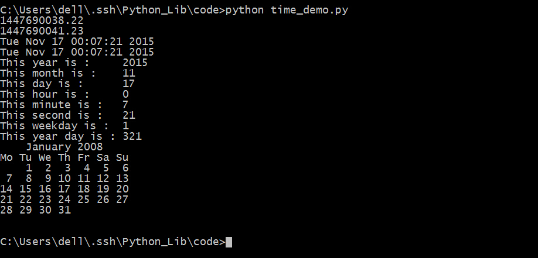       
计算时间差。          
```python
import time

start_time = time.clock()
time.sleep(3)
end_time   = time.clock()
print "%.4f second"%(end_time - start_time) 
```
保存为time_time.py，运行，看一下结果。         
         
可以看到每次执行的时间都不一样，但是都在3秒左右。          

##random
功能非常简单，就是生成随机数了。               
1. random.random()用于生成一个0到1之间的随机浮点数：0<=n<=1 。      
2. random.uniform(a,b)用来生成一个a与b之间的随机符号数，并不指定a与b的相对大小。          
3. random.randint(a,b)用来生成一个a与b之间的整数，其中a是下限，b是上限。             
4. random.randrange([start], stop[, step])用来生成指定范围，按基数递增的一个集合中的一个随机元素。random.randrange(10,100,2)相当于random.choice(range(10,100,2))。         
5. random.choice(sequence)用来生成参数中的一个随机元素，参数的类型可以是列表，元组或者字符串，字典等。        
6. random.shuffle(list)用来将一个列表中的元素打乱，返回原来的数组。
7. random.sample(sequence, k)用来从指定序列中获得指定长度的片段，参数类型不定。         

```python
#coding=utf-8
import random

#生成一个0到1之间的随机数
print random.random()

#生成一个a与b之间的随机符号数
print random.uniform(10,50)
print random.uniform(50,10)

#生成一个大于a小于b的随机整数
print random.randint(10,50)

#生成一个指定范围内按基数递增的集合中的一个随机元素
print random.randrange(10,50,10)
#上一句相当于这一句
print random.choice(range(10,50,10))

#从指定序列中随机选取一个元素
print random.choice("hello,world")
print random.choice(['hello','world'])
print random.choice(('hello','world',"hehe"))

#将一个列表中的序列打乱,返回原来的数组
p = ['1','2','3','four','FIVE','6']
random.shuffle(p)
print p

#生成一个指定序列中指定长度的片段
p = ['1','2','3','four','FIVE','6']
print random.sample(p,3)
```

保存为random_demo.py，运行，看一下结果。              
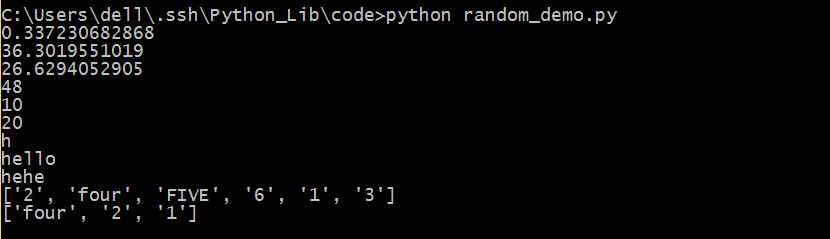          

##xlwt
强大的Python与Excel交互，可以用xlwt打开Excel表单并写入，但是只能写入，不能读取。  
```python
#coding=utf-8
import xlwt
#设定打开文档的编码格式，或者留空
excel = xlwt.Workbook('utf-8')
#新建一个sheet
table1 = excel.add_sheet("sheet_one")
#写入数据table.write(行，列，值)
table1.write(0,0,"test")
#如果对一个单元格重复操作就会报错
#需要引入可以覆盖
table2 = excel.add_sheet("sheet_two",cell_overwrite_ok=True)
for i in range(10):
	for j in range(10):
		table2.write(i,j,i+j)
#另外，也可以为表单使用样式
style = xlwt.XFStyle()
#设置字体
font  = xlwt.Font()
font.name = "MicroSoft YaHei"
#加粗
font.bold = True
style.font = font
table2.write(10,10,"This is ten_ten cell",style)
excel.save('test.xls')
```
保存为xlwt_demo.py，运行，看一下结果。   
   

##xlrd
用Python打开Excel并读取,但是这个只能读。不能写入。         
```python
#coding=utf-8
import xlrd
#打开一个Excel表单
data = xlrd.open_workbook("test.xls")
#查看每个sheet名称
print data.sheet_names()
#得到第一个工作表单
table1 = data.sheets()[0]
#或者也可以这样得到
table2 = data.sheet_by_index(1)
#或者也可以这样得到
table3 = data.sheet_by_name(u"sheet_one")
#获得行数和列数
nrows = table2.nrows
ncols = table2.ncols
print "rows : " + str(nrows) + "  cols : " + str(ncols) 
#获得整行或者整列的值
row1 = table2.row_values(0)
for i in range(ncols):
	print "This is 1 row %s col value : %s"%(i+1,row1[i])
cols = table2.col_values(1)
#得到某个单元格的值
cell = table2.cell(0,0).value
print cell
#也可以使用行列索引
cell = table2.row(10)[10].value
print cell
```
保存为xlrd_demo.py，运行，看一下结果。   
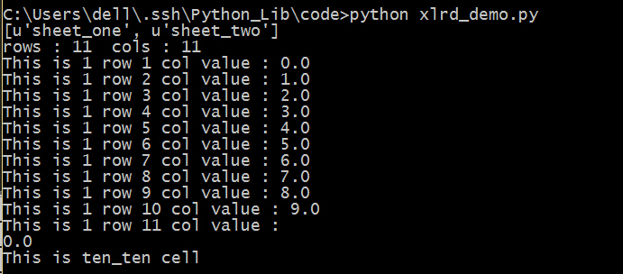   

##xlutils
真是坑爹吖，一个简单的Excel还要这样折磨我，这个是用来再已有的Excel表单上修改的。
而且其实这个是调用了上面两个的方法来实现自己的功能。      
```python
#coding=utf-8
from xlrd import open_workbook
from xlutils.copy import copy
 
 #打开表单时，保留原有表单格式
rb = open_workbook('test.xls',formatting_info=True)
 
#通过sheet_by_index()获取的sheet没有write()方法
rs = rb.sheet_by_index(0)

wb = copy(rb)
 
#通过get_sheet()获取的sheet有write()方法
ws = wb.get_sheet(0)
ws.write(0, 0, 'changed!')
 
wb.save('test.xls')
```
保存为xlutils_demo.py，运行，看一下结果。   
           


##rsa
RSA加密算法是现在世界中应用最广泛最重要的加密算法之一，因为它是非对称加密算法之一，如果密钥长度超过1024的话，在理论上说当今科技是无法破解出来的，至今已破解出来的最长RSA密钥是748位，也就是说超748位暂时都是安全的。
```python
#coding=utf-8
import rsa
#生成1024位的公钥和私钥
(pubkey,privkey) = rsa.newkeys(1024)
#将密钥保存成pem格式，也可以直接使用
#公钥
pub = pubkey.save_pkcs1()
pubfile = open("pubfile.pem","w")
pubfile.write(pub)
pubfile.close()
#私钥
priv = privkey.save_pkcs1()
privfile = open("privfile.pem","w")
privfile.write(priv)
privfile.close()
#导出pem格式的公钥和私钥
with open("pubfile.pem") as publickfile:
	p = publickfile.read()
	pubkey = rsa.PublicKey.load_pkcs1(p)
with open("privfile.pem") as privlickfile:
	p = privlickfile.read()
	privkey = rsa.PrivateKey.load_pkcs1(p)
message = "hello"
#加密信息
crypto = rsa.encrypt(message,pubkey)
#解密信息
message = rsa.decrypt(crypto,privkey)
#用私钥签名认证，用公钥验证签名
signature = rsa.sign(message,privkey,'SHA-1')
rsa.verify("hello",signature,pubkey)
```

##Crypto
这是一个很强大的信息安全库，可以做很多的高级加密，包括但不限于AES，DES，RSA，MD5，sha-1等等加密算法。         
```python
#coding=utf-8
#先从简单的开始吧 MD5 SHA-1
from Crypto.Hash import MD5
from Crypto.Hash import SHA
m = MD5.new()
m.update("This is decode string")
print m.hexdigest()
h = SHA.new()
h.update("This is decode string")
print h.hexdigest()
```
保存为crypto.md5.py，运行，看一下结果。                           
                     
接下来是AES加密，美国标准加密协议。             
```python
#coding=utf-8
from Crypto.Cipher import AES
import base64
#设定一个密钥，密钥可以是是16位, 
#还可以是24 或 32 位长度，
#其对应为 AES-128, AES-196 和 AES-256.
key = '0123456789abcdef'
#设定加密模式
mode = AES.MODE_CBC
#设定加密密钥偏移IV量
IV = "abcdefghijklmnop"
encryptor = AES.new(key, mode,IV)
#明文,密文长度必须为16的倍数，否则需截断或填充
text = "hellodworld11111"
ciphertext = encryptor.encrypt(text)
#密文
results = base64.b64encode(ciphertext)
print results
#有时也会将结果进行十六进制转换
#print ciphertext.encode("hex")
#解密
decryptor = AES.new(key, mode,IV)
ciphertext = base64.b64decode(results)
plain = decryptor.decrypt(ciphertext)
print plain
```
保存为crypto_aes.py，运行，看一下结果。             
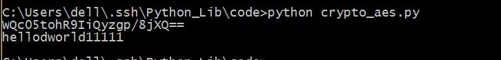
接下来就是DES加密算法，但是DES算法的安全性已经不那么可靠，穷举法还是能够计算出来，现在一般采用三重的DES加密来保证安全性。                                     
两种DES加密算法的实现，分别用crypto库和pyDes库。                        
```python
#coding=utf-8
from pyDes import *
import base64
#DES的key和IV向量都是8位
#在多重DES加密中为8的倍数位
key = "01234567"
IV = "abcdefgl"
#明文必须为16的倍数，否则需截断或填充
text = "helloworld111111"
c = des(key,CBC,IV)
cipytext = c.encrypt(text)
#密文
results = base64.b64encode(cipytext)
print results
#有时也用16进制加密
#results = cipytext.encode("hex")
#解密
m = des(key,CBC,IV)
cipytext = base64.b64decode(results)
plain = m.decrypt(cipytext)
print plain
```
保存为pydes_des.py，运行，看一下结果。              
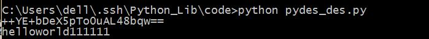                      
```python
#coding=utf-8
from Crypto.Cipher import DES
import base64
key = "01234567"
IV = "abcdefgl"
#明文
text = "helloworld111111"
c = DES.new(key,DES.MODE_CBC,IV)
cipher = c.encrypt(text)
results = base64.b64encode(cipher)
print results
#解密
m = DES.new(key,DES.MODE_CBC,IV)
cipher = base64.b64decode(results)
plain = m.decrypt(cipher)
print plain
```
保存为crypto_des.py，运行，看一下结果。                           
                  
可以看到两个DES加密的结果是一样的，但是这个安全性不高，那么接下来就是我们的三重DES加密。用crypto库创建三重DES是非常容易的，只需要将DES换成3DES即可，还有就是密钥的长度由8位变成了16位。              
```python
#coding=utf-8
from Crypto.Cipher import DES3
import base64
#三重DES加密的密钥是16位的
key = "0123456789abcdef"
IV = "abcdefgl"
#明文
text = "helloworld111111"
c = DES3.new(key,DES3.MODE_CBC,IV)
cipher = c.encrypt(text)
results = base64.b64encode(cipher)
print results
#解密
m = DES3.new(key,DES3.MODE_CBC,IV)
cipher = base64.b64decode(results)
plain = m.decrypt(cipher)
print plain
```
保存为crypto_3des.py，运行，看一下结果。        
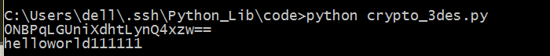

##getpass
这个库的功能很简单，也很有用，就是在输入的时候输入字符不回显出来。它只有两个函数，`getpass`和`getuser`,功能分别是输入不进行回显和获得当前系统登录用户名。
```python
#coding=utf-8
import getpass
#输入不回显，默认会提示password
pass1 = getpass.getpass()
#输入不回显，但是提示 请输入密码
pass2 = getpass.getpass("请输入密码:")
print pass1
print pass2
#登录系统的用户名
print getpass.getuser()
```


##glob
这个库也非常的简单，功能就是windows下的`find`或者是linux下的`grep`。它只有两个函数，`glob()`和`iglob()`,功能是一样的，只不过返回值不一样，前者返回列表，后者返回一个对象。他们都支持绝对路径和相对路径，支持通配符。
```
#coding=utf-8
import glob
#得到当前目录下的所有python文件，返回一个列表
f = glob.glob(r'./*.py')
for i in f:
	print i
#得到父级目录下所有的文件，返回一个对象，但是也能够用for循环遍历
t = glob.iglob(r'../*')
for j in t:
	print j
```

##zipfile


##额外的东西
1. python自带了一个简单web的服务器，当前目录下启动,就可以在`localhost:8080`查看。
```python
python -m SimpleHTTPServer 8080
```

2. PHP 5.4版本及以上也自带了一个简单的web服务器，在当前目录下启动，就可以在`localhost:8000`查看。
```php
php -S localhost:8000
```

3. 最简单的nodejs的服务器。
```javascript
var http = require('http');
http.createServer(function (req, res) {
    res.send('Hello');
    res.end();
}).listen(3000);
```
保存为server.js,在当前目录下cmd里输入`node server.js`即可调用，在`localhost:3000`查看。


##参考链接
[python学习笔记（七）——文件和目录操作](http://www.cnblogs.com/zhoujie/archive/2013/04/10/python7.html)

[关于python文件操作](http://www.cnblogs.com/rollenholt/archive/2012/04/23/2466179.html)

[python操作MySQL数据库](http://www.cnblogs.com/rollenholt/archive/2012/05/29/2524327.html)

[python操作mysql数据库](http://www.runoob.com/python/python-mysql.html)

[Python命令行解析库argparse](http://www.cnblogs.com/linxiyue/p/3908623.html)

[Python命令行解析库argparse](http://www.cnblogs.com/linxiyue/p/3908623.html)

[Argparse简易教程](http://blog.ixxoo.me/argparse.html)

[ argparse — 命令行选项、参数和子命令的解析器](http://python.usyiyi.cn/python_278/library/argparse.html)

[使用Python Requests 库，提交POST请求上传文件，不支持中文文件名？](http://segmentfault.com/q/1010000002633223)

[PHP解决网址URL编码问题的函数urlencode()、urldecode()、rawurlencode()、rawurldecode()](http://www.phpernote.com/php-template/200.html)

[Python处理中文路径](http://blog.csdn.net/maverick1990/article/details/13770693)

[python读写文件，和设置文件的字符编码比如utf-8](http://outofmemory.cn/code-snippet/629/python-duxie-file-setting-file-charaeter-coding-biru-utf-8)

[windows下Python打开包含中文路径名文件](http://my.oschina.net/mcyang000/blog/289460)

[python中的urlencode与urldecode](http://blog.csdn.net/haoni123321/article/details/15814111)

[RFC 3548: Base16, Base32, Base64 数据编码](http://python.usyiyi.cn/python_278/library/base64.html)

[Python decode()方法](http://www.runoob.com/python/att-string-decode.html)

[base64](http://www.liaoxuefeng.com/wiki/001374738125095c955c1e6d8bb493182103fac9270762a000/001399413803339f4bbda5c01fc479cbea98b1387390748000)

[ python各种类型转换-int,str,char,float,ord,hex,oct等](http://blog.csdn.net/emaste_r/article/details/8447192)

[python chr()、unichr()和ord()](http://www.lxway.net/94915002.html)

[python chr()、unichr()和ord()](http://crazier9527.iteye.com/blog/411001)

[python两种生成md5的方法](http://outofmemory.cn/code-snippet/939/python-liangzhong-produce-md5-method)

[Python字符串MD5加密
](http://www.qttc.net/201304314.html)

[python的md5模块使用非常简单](http://kure6.blog.51cto.com/2398286/884529)

[Python hashlib模块 （主要记录md5加密）](http://blog.csdn.net/tys1986blueboy/article/details/7229199)

[md5模块（Python内置模块）和hashlib模块](http://my.oschina.net/duhaizhang/blog/67214)

[python hashlib模块及md5() 、sha()](http://www.361way.com/python-hashlib-md5-sha/4249.html)

[Python/Python3 MD5加密实例学习](http://www.111cn.net/phper/python/89310.htm)

[python模块——hashlib](http://asange.blog.51cto.com/7125040/1426933)

[Python模块学习：hashlib hash加密](http://python.jobbole.com/81556/)

[安全哈希和消息摘要](http://python.usyiyi.cn/python_278/library/hashlib.html)

[python hashlib模块](http://beginman.cn/python/2015/05/07/python-hashlib/)

[python发送各类邮件的主要方法](http://www.cnblogs.com/xiaowuyi/archive/2012/03/17/2404015.html)

[Python使用SMTP发送邮件](http://www.runoob.com/python/python-email.html)

[Python smtplib发送邮件](http://www.zhidaow.com/post/python-send-email-with-smtplib)

[飘逸的python - 发送qq邮件](http://blog.csdn.net/handsomekang/article/details/9785411)

[ python模块之smtplib: 用python发送SSL/TLS安全邮件](http://blog.csdn.net/zhaoweikid/article/details/1638349)

[Envelopes](http://tomekwojcik.github.io/envelopes/)

[python优秀库 － 使用envelopes发送邮件](http://www.cnblogs.com/liulixiang/p/3540270.html)

[Python用Envelopes发送邮件和附件](http://www.zhidaow.com/post/python-envelopes)

[python import media模块](http://tomyong.blog.51cto.com/2094963/1135201)

[Python中通过Image的open之后，去show结果打不开bmp图片，无法正常显示图片](http://www.crifan.com/python_image_show_can_not_open_bmp_image_file/)

[读写JSON数据](http://python3-cookbook.readthedocs.org/zh_CN/latest/c06/p02_read-write_json_data.html)

[python检测文件的MD5值](http://www.sharejs.com/codes/python/7136)

[python学习，计算文件MD5值 ](http://blog.chinaunix.net/uid-29648425-id-4246141.html)

[利用os.path和hashlib遍历目录计算所有文件的md5值](http://www.oschina.net/code/snippet_85544_2805)

[python使用os.path和hashlib遍历目录计算所有文件的md5值](http://outofmemory.cn/code-snippet/3353/python-usage-os-path-hashlib-bianli-directory-tell-suo-exist-file-md5-value)

[python学习之random模块](http://www.cnblogs.com/zmlctt/p/4222316.html)

[python sys模块详解](http://tianhao936.blog.51cto.com/1043670/881535)

[Python之sys模块小探](http://5ydycm.blog.51cto.com/115934/304324)

[python 中 os._exit()， sys.exit()， exit() 的区别是什么？](http://www.zhihu.com/question/21187839)

[python使用xlrd和xlwt读写excel](http://outofmemory.cn/code-snippet/4295/python-read-write-excel-with-xlwt-xlrd)

[Python xlrd、xlwt、xlutils读取、修改Excel文件](http://blog.csdn.net/tianzhu123/article/details/7225809)

[python下RSA加密解密以及跨平台问题](http://www.cnblogs.com/luchanghong/archive/2012/07/18/2596886.html)

[[原创] 用Python处理邮件，全文完．](http://www.chinaunix.net/old_jh/55/575710.html)

[Package Crypto](https://pythonhosted.org/pycrypto/)

[pyDes库 实现python的des加密](http://www.cnblogs.com/SunboyL/p/pyDes.html)

[Python 之getpass模块](http://caisangzi.blog.51cto.com/6387416/1391123)
