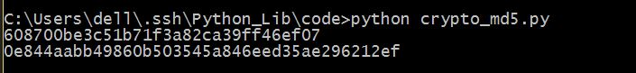
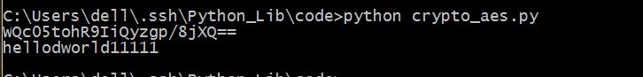
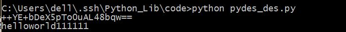
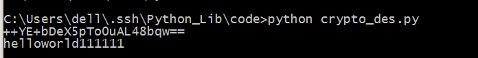
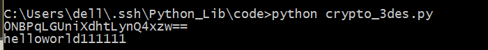

## Crypto

这是一个很强大的信息安全库，可以做很多的高级加密，包括但不限于AES，DES，RSA，MD5，sha-1等等加密算法。               

#### md5和SHA-1

```python
#coding=utf-8
#先从简单的开始吧 MD5 SHA-1
from Crypto.Hash import MD5
from Crypto.Hash import SHA
m = MD5.new()
m.update("This is decode string")
print m.hexdigest()
h = SHA.new()
h.update("This is decode string")
print h.hexdigest()
```

保存为crypto.md5.py，运行，看一下结果。   

      


#### AES

接下来是AES加密，美国标准加密协议。     

```python
#coding=utf-8
from Crypto.Cipher import AES
import base64
#设定一个密钥，密钥可以是是16位, 
#还可以是24 或 32 位长度，
#其对应为 AES-128, AES-196 和 AES-256.
key = '0123456789abcdef'
#设定加密模式
mode = AES.MODE_CBC
#设定加密密钥偏移IV量
IV = "abcdefghijklmnop"
encryptor = AES.new(key, mode,IV)
#明文,密文长度必须为16的倍数，否则需截断或填充
text = "hellodworld11111"
ciphertext = encryptor.encrypt(text)
#密文
results = base64.b64encode(ciphertext)
print results
#有时也会将结果进行十六进制转换
#print ciphertext.encode("hex")
#解密
decryptor = AES.new(key, mode,IV)
ciphertext = base64.b64decode(results)
plain = decryptor.decrypt(ciphertext)
print plain
```

保存为crypto_aes.py，运行，看一下结果。      

     

或者是这样写

```
# coding=utf-8

from Crypto.Cipher import AES
from Crypto import Random

length = 16

BS = AES.block_size
pad = lambda s: s + (BS - len(s) % BS) * chr(BS - len(s) % BS)
def unpad(raw):
  pad = ord(raw[-1])
  if raw[-pad:] != chr(pad) * pad:
    return False
  return raw[:-pad]


key = 'aaaaaaaaaaaaaaaa'
data = '0123456789abcdef'*4


def GetRandomStr(msg,key):
	padmsg = pad(msg) #padding the msg

	iv = Random.new().read(AES.block_size)
	cipher = AES.new(key, AES.MODE_CBC, iv)
	msg = iv + cipher.encrypt(padmsg)
	return msg,iv

def DecryptCheckPadding(msg,iv,key):
	msg = msg[16::]
	cipher = AES.new(key, AES.MODE_CBC, iv)
	msg = cipher.decrypt(msg)
	if unpad(msg):
		return unpad(msg)
	else :
		return False

ciphertext,iv = GetRandomStr(data,key)
msg= DecryptCheckPadding(ciphertext,iv,key)

print msg
```

#### DES

接下来就是DES加密算法，但是DES算法的安全性已经不那么可靠，穷举法还是能够计算出来，现在一般采用三重的DES加密来保证安全性。                                     
两种DES加密算法的实现，分别用crypto库和pyDes库。     

```python
#coding=utf-8
from pyDes import *
import base64
#DES的key和IV向量都是8位
#在多重DES加密中为8的倍数位
key = "01234567"
IV = "abcdefgl"
#明文必须为16的倍数，否则需截断或填充
text = "helloworld111111"
c = des(key,CBC,IV)
cipytext = c.encrypt(text)
#密文
results = base64.b64encode(cipytext)
print results
#有时也用16进制加密
#results = cipytext.encode("hex")
#解密
m = des(key,CBC,IV)
cipytext = base64.b64decode(results)
plain = m.decrypt(cipytext)
print plain
```

保存为pydes_des.py，运行，看一下结果。        

             

```python
#coding=utf-8
from Crypto.Cipher import DES
import base64
key = "01234567"
IV = "abcdefgl"
#明文
text = "helloworld111111"
c = DES.new(key,DES.MODE_CBC,IV)
cipher = c.encrypt(text)
results = base64.b64encode(cipher)
print results
#解密
m = DES.new(key,DES.MODE_CBC,IV)
cipher = base64.b64decode(results)
plain = m.decrypt(cipher)
print plain
```

保存为crypto_des.py，运行，看一下结果。            

                  

可以看到两个DES加密的结果是一样的，但是这个安全性不高。

#### DES3

那么接下来就是我们的三重DES加密。用crypto库创建三重DES是非常容易的，只需要将DES换成3DES即可，还有就是密钥的长度由8位变成了16位。              
```python
#coding=utf-8
from Crypto.Cipher import DES3
import base64
#三重DES加密的密钥是16位的
key = "0123456789abcdef"
IV = "abcdefgl"
#明文
text = "helloworld111111"
c = DES3.new(key,DES3.MODE_CBC,IV)
cipher = c.encrypt(text)
results = base64.b64encode(cipher)
print results
#解密
m = DES3.new(key,DES3.MODE_CBC,IV)
cipher = base64.b64decode(results)
plain = m.decrypt(cipher)
print plain
```

保存为crypto_3des.py，运行，看一下结果。       
 


