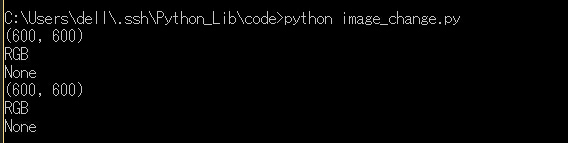
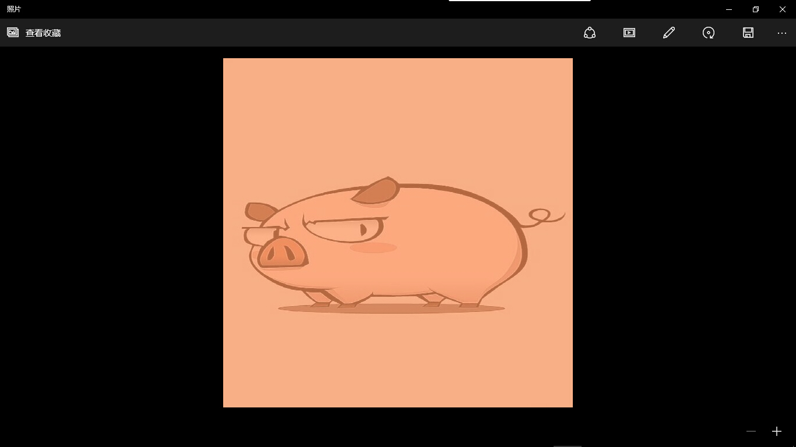
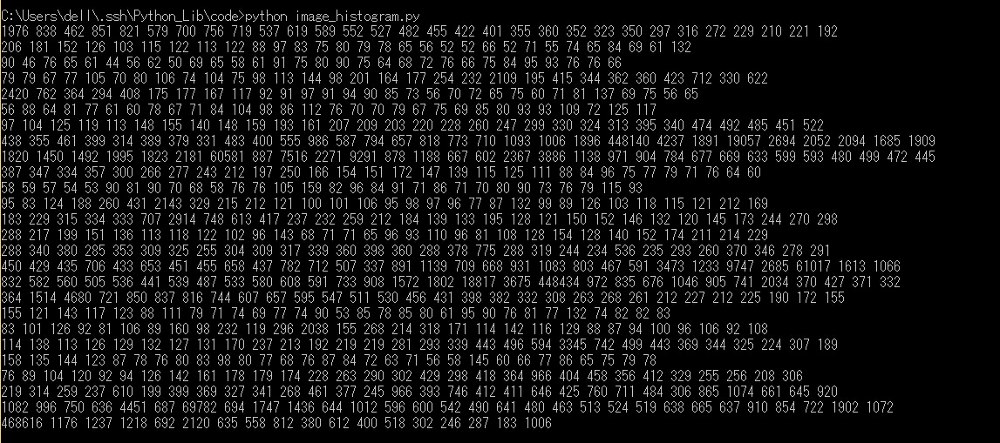

##Image

这个是专门用来处理图片的，只要你在上面了安装了pil图像处理库，就会自带这个库的。     
####基本操作
```python
import Image
pic = Image.open("../images/test.jpg")
pic.show()
```
保存为image_demo.py，保存，运行即可看到图片。    
   
>但是非常有趣的是，它打开的是jpg的文件，结果在显示的确实bmp文件。所以我在第一次打开的时候需要为bmp文件设定一个默认打开方式，而且打开失败了，结果我在第二次打开的时候，因为已经设定了默认打开方式，竟然能够查看图片了。我用的是win 10自带的照片查看器。

####进阶操作
除了打开图片，我们还可以看一下图片的一些基本信息。   

```python
#coding=utf-8
import Image
pic = Image.open("../images/test.jpg")
#打印图片对象
print pic
#打印图片大小
print pic.size
#打印图片编码格式
print pic.mode
#打印图片保存格式
print pic.format
```
保存为image_second.py，运行，看一下结果。


然后进行一些简单的图片操作，比如说调整文件大小，旋转图像，改变文件格式等。   
```python
#coding=utf-8
import Image
pic = Image.open("../images/test.jpg")

#改变图像大小
pic1 = pic.resize((600,600))
# pic1.show()
print pic1.size
#保存图片,也可以同时改变图片格式
pic1.save("../images/test1.png")
print pic1.mode
print pic1.format

#剪裁图片
pic2 = pic.crop((0,200,600,800))
# pic2.show()
print pic2.size
#保存图片
pic1.save("../images/test2.jpg")
print pic2.mode
print pic2.format

#旋转图片
pic3 = pic2.rotate(45)
pic3.show()
#保存图片
pic3.save("../images/test3.jpg")
```
保存为image_change.py，运行，看一下结果。    

然后查看文件夹，相应的图片也会保存下来。     
然后创建一个新的图像，并与另一张图像合并。   
```python
#coding=utf-8
import Image
#生成一张新的图片
pic1 = Image.new("RGB",(600,600),(255,147,89))
# pic1 = Image.open("../images/test1.png")
#打开一张图片
pic2 = Image.open("../images/test2.jpg")
#先把第二张图片的编码格式转化为与第一张相同
pic2.convert(pic1.mode)
#把两张图片结合到一起
pic3 = Image.blend(pic1,pic2,0.3)
pic3.show()
pic3.save("../images/test4.jpg")
```
保存为image_create.py，运行，看一下结果。    
     
`Image.blend()`的第三个参数为两张图片的透明度p，代表第一张图片透明度1-p，第二张图片透明度p。   
还有注意在结合之前要先做一个格式转换，才能够结合成功。    

最后，对图片进行直方图统计，打印256个灰度级像素点个数的统计值。     
```python
import Image
pic = Image.open("../images/test.jpg")
for i in  range(len(pic.histogram())):
	if i%30==0 and i!=0:
		print ""	
	print pic.histogram()[i],
```
保存为image_histogram.py，运行，看一下结果。        
          
