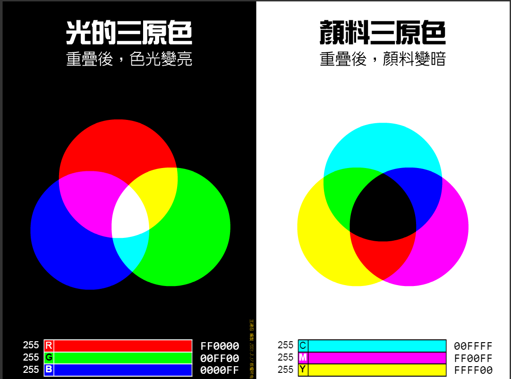
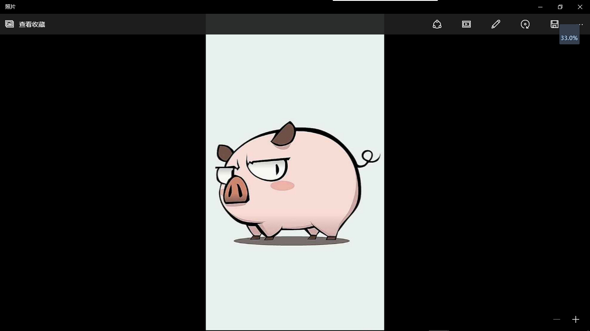
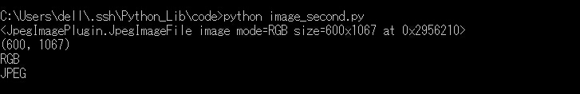

## Image

这个是专门用来处理图片的，只要你在上面了安装了pil图像处理库，就会自带这个库的。

在开始图片之前，我们先来认识一下三原色和三基色。
- 三原色一般是指颜料三原色红黄蓝，组合颜色是黑色
- 三基色一般是指光学三原色红绿蓝，组合颜色是白色, RGB



#### 基本操作

```python
# coding=utf-8

import Image

# from PIL import Image

pic = Image.open("../images/test.jpg")
pic.show()
```

保存为image_demo.py，保存，运行即可看到图片。



>但是非常有趣的是，它打开的是jpg的文件，结果在显示的确实bmp文件。所以我在第一次打开的时候需要为bmp文件设定一个默认打开方式，而且打开失败了，结果我在第二次打开的时候，因为已经设定了默认打开方式，竟然能够查看图片了。我用的是win 10自带的照片查看器。

#### 进阶操作

除了打开图片，我们还可以看一下图片的一些基本信息。

```python


import Image

pic = Image.open("../images/test.jpg")
#打印图片对象

print pic
#打印图片大小
print pic.size
#打印图片编码格式
print pic.mode
#打印图片保存格式
print pic.format
```

保存为image_second.py，运行，看一下结果。



然后进行一些简单的图片操作，比如说调整文件大小，旋转图像，改变文件格式等。

```python


import Image

pic = Image.open("../images/test.jpg")

#改变图像大小
pic1 = pic.resize((600,600))
# pic1.show()
print pic1.size
#保存图片,也可以同时改变图片格式
pic1.save("../images/test1.png")
print pic1.mode
print pic1.format

#剪裁图片
pic2 = pic.crop((0,200,600,800))
# pic2.show()
print pic2.size
#保存图片
pic1.save("../images/test2.jpg")
print pic2.mode
print pic2.format

#旋转图片
pic3 = pic2.rotate(45)
pic3.show()
#保存图片
pic3.save("../images/test3.jpg")
```

保存为image_change.py，运行，看一下结果。


然后查看文件夹，相应的图片也会保存下来。
然后创建一个新的图像，并与另一张图像合并。

```python


import Image

#生成一张新的图片
pic1 = Image.new("RGB",(600,600),(255,147,89))
# pic1 = Image.open("../images/test1.png")
#打开一张图片
pic2 = Image.open("../images/test2.jpg")
#先把第二张图片的编码格式转化为与第一张相同
pic2.convert(pic1.mode)
#把两张图片结合到一起
pic3 = Image.blend(pic1,pic2,0.3)
pic3.show()
pic3.save("../images/test4.jpg")
```

保存为image_create.py，运行，看一下结果。


`Image.blend()` 的第三个参数为两张图片的透明度p，代表第一张图片透明度1-p，第二张图片透明度p。
还有注意在结合之前要先做一个格式转换，才能够结合成功。

最后，对图片进行直方图统计，打印256个灰度级像素点个数的统计值。

```python
import Image

pic = Image.open("../images/test.jpg")
for i in  range(len(pic.histogram())):
	if i%30==0 and i!=0:
		print ""
	print pic.histogram()[i],
```

保存为image_histogram.py，运行，看一下结果。


还能用来玩 找不同 的游戏

```


import Image, ImageChops

im1 = Image.open('image1.png')
im2 = Image.open('image2.png')
im3 = ImageChops.invert(im2)
Image.blend(im1,im3,0.5).show()

```

### 高斯模糊

```
# -*- coding: utf-8 -*-

from PIL import Image, ImageFilter


img = Image.open("card.jpeg")
im = img.filter(ImageFilter.GaussianBlur(25))

im.show()

```

### 切换证件照背景色

```
# -*- coding: utf-8 -*-
# coding=utf-8

from PIL import Image

im = Image.open('card.jpeg')
r, g, b = im.split()
h,w = im.size
print h,w

# 创建一个新的 r 通道分量, 注意 mode 值为 'L'
# 255 是白
# 0 是黑
n = Image.new('L', (h, w), color=0)

for i in range(h):
    for j in range(w):
        pixel = im.getpixel((i, j))
        if all(map(lambda x:x>210, pixel)):
            im.putpixel((i, j), (0, 0, 255))
# im = Image.merge('RGB', (n, n, b))
im.show()

```
