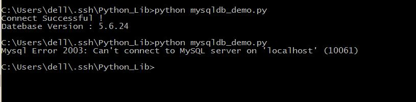
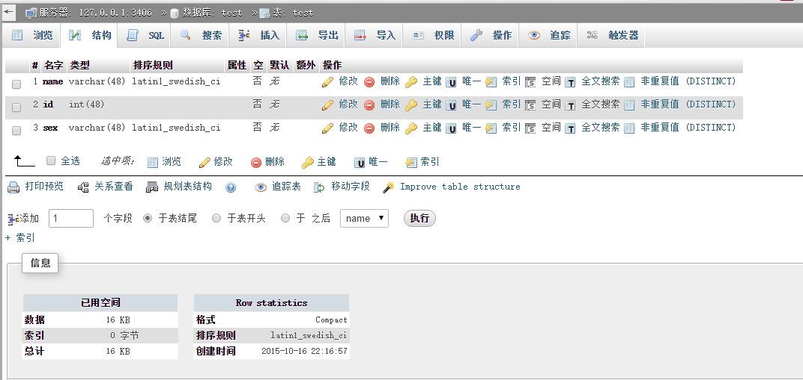
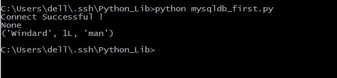
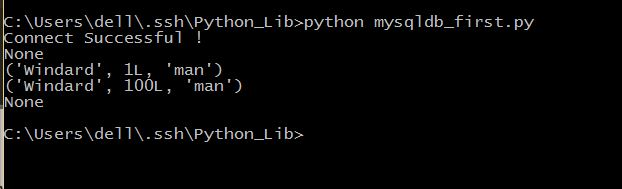
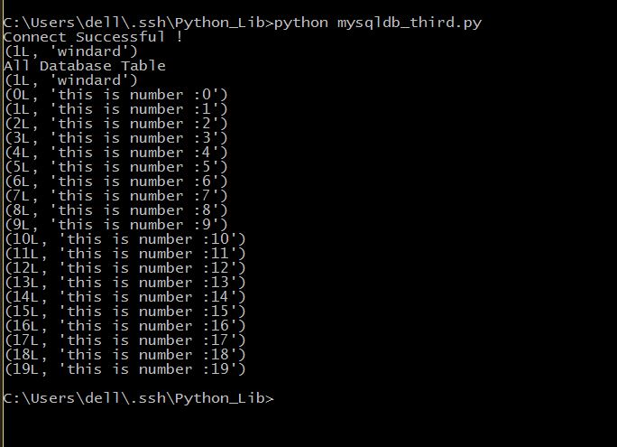
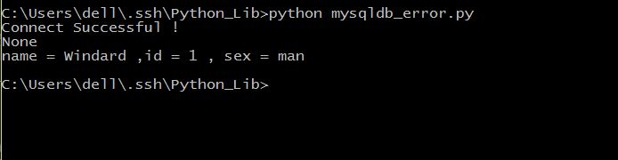

##MySQLdb

从名字就可以看出来，它的功能是与MySQL数据库连接用的
####基本使用
首先，让我们连接数据库。
```python
import MySQLdb

try:
	conn = MySQLdb.connect(host='localhost',user='root',passwd='',db='test',port=3406,charser='utf8')
	print "Connect Successful !"
	conn.close()
except MySQLdb.Error,e:
     print "Mysql Error %d: %s" % (e.args[0], e.args[1])
```
保存为mysqldb_demo.py，运行，看一下结果。
             
可以看出来，如果MySQL数据库打开且账户密码正确的话就可以正确连接，并显示数据库版本，如果错误则报错并显示错误类型。

接下来，我们试一下数据库的增改删查和刷新。
先来看一下在数据库test中有一个表单test。
test中有三个选项，分别是name，id，sex，数据类型分别是char，int，char。

```python
#coding=utf-8
import MySQLdb

try:
	conn = MySQLdb.connect(host='localhost',user='root',passwd='',db='test',port=3406)
	print "Connect Successful !"
	cur = conn.cursor()
	cur.execute("SELECT * FROM test")
	data = cur.fetchone()
	print data
	value = ["Windard",001,"man"]
	cur.execute("INSERT INTO test(name,id,sex) VALUES(%s,%s,%s)",value)
	#注意一定要有conn.commit()这句来提交，要不然不能真正的插入数据。
	conn.commit()
	cur.execute("SELECT * FROM test")
	data = cur.fetchone()
	print data
	cur.close()
	conn.close()
except MySQLdb.Error,e:
     print "Mysql Error %d: %s" % (e.args[0], e.args[1])
```
保存为mysqldb_first.py,运行，看一下结果。
                   
可以看到之前，在表单里并没有数据，在执行插入了之后有了一行数据。
注意，在执行插入之后一定要commmit()才能实行有效操作，不然不能写入数据库。

在这里注意一下，如果在你的数据中使用了中文的话，需要加入一下四行代码，来确定中文的正常读写。

```python
conn.set_character_set('utf8')
cur.execute('SET NAMES utf8;')
cur.execute('SET CHARACTER SET utf8;')
cur.execute('SET character_set_connection=utf8;')
```

再来看一个完整的增改删查的代码。
```python
#coding=utf-8
import MySQLdb

try:
	conn = MySQLdb.connect(host='localhost',user='root',passwd='',db='test',port=3406)
	print "Connect Successful !"
	cur = conn.cursor()
	#首先查询原始数据库状态
	cur.execute("SELECT * FROM test ")
	data = cur.fetchone()
	print data
	#插入一条数据
	value = ["Windard",001,"man"]
	cur.execute("INSERT INTO test(name,id,sex) VALUES(%s,%s,%s)",value)
	conn.commit()
	#查询插入数据库之后的状态
	cur.execute("SELECT * FROM test ")
	data = cur.fetchone()
	print data	
	#更改数据库数据
	cur.execute("UPDATE test SET id = 100 WHERE name = 'Windard'")
	#查询更改数据之后的数据库数据
	cur.execute("SELECT * FROM test ")
	data = cur.fetchone()
	print data
	#删除数据库数据
	cur.execute("DELETE FROM test WHERE name = 'Windard'")
	#查询删除数据之后的数据库数据
	cur.execute("SELECT * FROM test ")
	data = cur.fetchone()
	print data	
	cur.close()		
	conn.close()
except MySQLdb.Error,e:
     print "Mysql Error %d: %s" % (e.args[0], e.args[1])
```
保存为mysqldb_second.py，运行，看一下结果。              
              
这里包含完整的数据库增改删查的操作。

####进阶操作
那我们试一下创建一个新的数据库和新的表单，插入大量的数据来试试。
```python
#coding=utf-8
import MySQLdb

try:
	conn = MySQLdb.connect(host='localhost',user='root',passwd='',port=3406,charset='utf8')
	print "Connect Successful !"
	cur = conn.cursor()
	#创建一个新的数据库名为python
	cur.execute("CREATE DATABASE IF NOT EXISTS python")
	#连接这个数据库
	conn.select_db('python')
	#创建一个新的表单test
	cur.execute("CREATE TABLE test(id int,info varchar(20))")
	#插入单个数据
	value = [1,'windard']
	cur.execute("INSERT INTO test VALUES(%s,%s)",value)
	conn.commit()
	#查看结果
	cur.execute("SELECT * FROM test ")
	data = cur.fetchone()
	print data
	#插入大量数据	
	values = []
	for i in range(20):
		values.append((i,'this is number :' + str(i)))
	cur.executemany("INSERT INTO test VALUES(%s,%s)",values)
	conn.commit()	
	#查看结果，此时execute()的返回值是插入数据得到的行数
	print "All Database Table"
	count = cur.execute("SELECT * FROM test ")
	data = cur.fetchmany(count)
	for item in data:
		print item	
	#删除表单
	cur.execute("DROP TABLE test ")
	#删除数据库
	cur.execute("DROP DATABASE python")
	cur.close()
	conn.close()
except MySQLdb.Error,e:
	print "Mysql Error %d: %s" % (e.args[0], e.args[1])

```
保存为mysqldb_third.py，运行，看一下结果。
          
在这里连接数据库的时候也加上了数据库使用的编码格式，utf8，在使用的时候可以避免乱码的出现。
```python
#coding=utf-8
import MySQLdb

try:
	conn = MySQLdb.connect(host='localhost',user='root',passwd='',db='test',port=3406)
	print "Connect Successful !"
	cur = conn.cursor()
	cur.execute("SELECT * FROM test")
	data = cur.fetchone()
	print data
	value = ["Windard",001,"man"]
	try:
		cur.execute("INSERT INTO test(name,id,sex) VALUES(%s,%s,%s)",value)
		#注意一定要有conn.commit()这句来提交，要不然不能真正的插入数据。
		conn.commit()
	except :
		#发生错误时回滚
		conn.rollback()
	
	cur.execute("SELECT * FROM test")
	data = cur.fetchall()
	for item in data:
		fname = item[0]
		fid   = item[1]
		fsex  = item[2] 
	print "name = %s ,id = %s , sex = %s " %(fname ,fid ,fsex)
	cur.close()
	conn.close()
except MySQLdb.Error,e:
     print "Mysql Error %d: %s" % (e.args[0], e.args[1])
```
保存为mysqldb_error.py，运行，看一下结果。
               
这个代码演示了发生错误时候回滚的操作，rollback()能够把游标指针指到错误发生之前的位置。
还有fetchall()即一次取得全部的数据。
还有其他几个功能类似的函数fetchone()，一次取得一个数据，fetchmany(num),一次取得num个数据。

