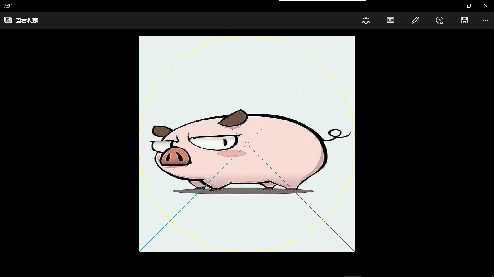
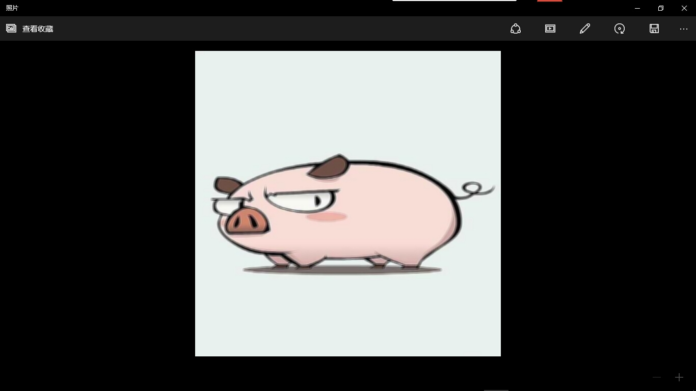

##PIL

####ImageDraw
Image函数库是用来操作图像的，那么这个函数库使用来画图的，这些都属于PIL图像处理库。     
```python
#coding=utf-8
import Image,ImageDraw
pic = Image.open("../images/test2.jpg")
draw = ImageDraw.Draw(pic)
width,height = pic.size

#画两条对角线
draw.line(((0,0),(width-1,height-1)),fill=(136,56,99))
draw.line(((0,height-1),(width-1,0)),fill=(6,156,209))

#画一个圆
draw.arc((0,0,width-1,height-1),0,360,fill=(255,255,0))
pic.show()
pic.save("../images/test5.jpg")
```
保存为imageDraw_demo.py，运行，看一下结果。       
    

####ImageEnhance
这个函数库是用来图像增强，用来色彩增强，亮度增强，对比度增强，图像尖锐化等增强操作。     
```python
#coding=utf-8
import Image,ImageEnhance
pic = Image.open("../images/test2.jpg")

#亮度增强
brightness = ImageEnhance.Brightness(pic)
bright_pic = brightness.enhance(2.0)
bright_pic.show()
bright_pic.save("../images/test6.jpg")

#图像尖锐化
sharpness = ImageEnhance.Sharpness(pic)
sharp_pic = sharpness.enhance(5.0)
sharp_pic.show()
sharp_pic.save("../images/test7.jpg")

#对比度增强
contrast = ImageEnhance.Contrast(pic)
contrast_pic = contrast.enhance(3.0)
contrast_pic.show()
contrast_pic.save("../images/test8.jpg")
```
保存为imageEnhance_demo.py，运行，看一下结果。      
在你的文件夹里就可以看到几张照片，确实是能够有相应的改变。       

####imageFont
遇到了问题，还有其他的在安装opencv的时候也遇到了一个问题。    
`ImportError: The _imagingft C module is not installed`和` error: Unable to find vcvarsall.bat`，算了。不然就可以用Python写验证码了。       
[在Python中用PIL做验证码](http://www.zouyesheng.com/captcha.html)

```python
#coding=utf-8
import Image, ImageDraw, ImageFont, ImageFilter
import random

# 随机字母:
def rndChar():
    return chr(random.randint(65, 90))

# 随机颜色1:
def rndColor():
    return (random.randint(64, 255), random.randint(64, 255), random.randint(64, 255))

# 随机颜色2:
def rndColor2():
    return (random.randint(32, 127), random.randint(32, 127), random.randint(32, 127))

# 240 x 60:
width = 60 * 4
height = 60
image = Image.new('RGB', (width, height), (255, 255, 255))
# 创建Font对象:
font = ImageFont.truetype('Arial.ttf', 36)
# 创建Draw对象:
draw = ImageDraw.Draw(image)
# 填充每个像素:
for x in range(width):
    for y in range(height):
        draw.point((x, y), fill=rndColor())
# 输出文字:
for t in range(4):
    draw.text((60 * t + 10, 10), rndChar(), font=font, fill=rndColor2())
# 模糊:
image = image.filter(ImageFilter.BLUR)
image.show()
image.save('code.jpg', 'jpeg');
```

####imageFilter
图片模糊效果。     
```python
#coding=utf-8
import Image,ImageFilter
pic = Image.open("../images/test2.jpg")
pic1 = pic.filter(ImageFilter.BLUR)
pic1.show()
pic1.save("../images/test9.jpg")
```
保存为imageFilter_demo.py，运行，看一下结果。     

