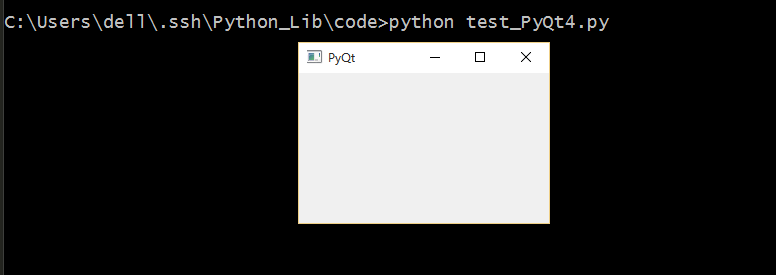
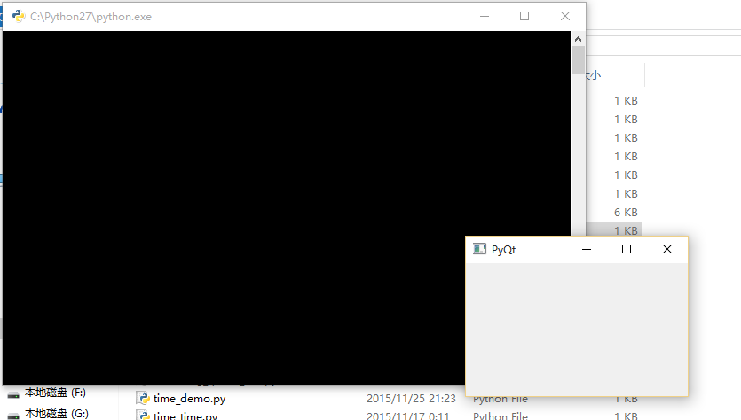

## PyQt

### 安装

#### Windows

在[这里](https://riverbankcomputing.com/software/pyqt/download)下载对应系统和Python版本的PyQt4安装即可

#### Ubuntu

```bash
sudo apt-get install libxext6 libxext-dev libqt4-dev libqt4-gui libqt4-sql qt4-dev-tools qt4-doc qt4-designer qt4-qtconfig "python-qt4-*" python-qt4
```

### 测试

一个简单的例子

```python
#coding=utf-8

import sys
from PyQt4 import QtGui

app = QtGui.QApplication(sys.argv)
widget = QtGui.QWidget()
widget.resize(250, 150)
widget.setWindowTitle('PyQt')
widget.show()
sys.exit(app.exec_())
```

保存为test_PyQt4.py，运行，看一下效果



当然，也可以双击运行，执行的时候会有一个黑色的cmd窗口出现，将文件后缀名改为pyw就没有了。



### Tips

在 PyQt 中使用中文的话会出现乱码的情况，最好是将中文字符串进行 unicode 转码一下，转成 Unicode 编码就可以了。

### 更多

[这里](http://zetcode.com/gui/pyqt4/)有一个比较好的PyQt4的教程,或者[这里](http://www.qaulau.com/books/PyQt4_Tutorial/index.html)是中文版，或者是PyQt5在[这里](http://zetcode.com/gui/pyqt5/)。

[这里](https://github.com/1106911190/PyQt_2048)是我用Python2.7 和PyQt4写的2048小游戏

### CSS stylesheet

除了正常的设计你的 Qt GUI 之外，Qt 还支持使用 CSS 设计。

 
