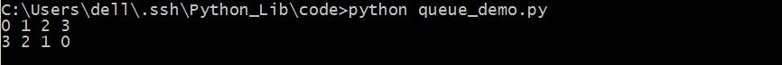

##Queue

队列库，队列就是先进先出(First Input First Output)型的一种数据结构，但是这个库也可以表示栈，就是先进后出型(Last Input First Output)的数据结构，不仅如此，还有一种按优先级别的队列结构。                             
队列一般用于解决多线程问题，在生产者消费者模式中经常用到。                    

####它们分别的类是：       

```python               
Queue.Queue(maxsize=0)                    FIFO                      
Queue.LifoQueue(maxsize=0)                LIFO                     
Queue.PriorityQueue(maxsize=0)            优先级别队列                        
```

####这个库中的常用方法：（通用）
1. Queue.qsize()                                    返回队列已用大小

1. Queue.empty()                                    返回队列是否为空

1. Queue.full()                                     返回队列是否为满

1. Queue.put(item[,block[,timeout]])                往队列中加入数据
>block为False或者是True，表示是否为阻塞型，默认为True，timeout为如果阻塞最多等待时间，默认为None。                                  
>阻塞型，如果队列为非空，如果为设定timeout，则阻塞进程等待空闲为止，如果设定了timeout，超时仍未空闲则报错。                              
>非阻塞型，如果队列为非空，则报错。                       
5. Queue.put_nowait(item)                           往队列中写入数据             
>即 Queue.put()  非阻塞型
6. Queue.get([block[,timeout]])                     从队列中取得数据             
>默认block为True,timeout为None
7. Queue.get_nowait()                               从队列中取得数据         
> 即 Queue.get()  非阻塞型
8. Queue.join()                                     将队列加入主线程
>将队列加入主线程之后，即主线程等该任务结束之后再进行下一个任务，阻塞线程的继续。           

####一个小例子

```python
#coding=utf-8

import Queue

#FIFO
a = Queue.Queue(4)
a.join()

for i in range(4):
	a.put(i)

for i in range(4):
	print a.get(),
	a.task_done()

print 

b = Queue.LifoQueue(4)
b.join()

for i in range(4):
	b.put(i)

for i in range(4):
	print b.get(),
	b.task_done()
```

保存为queue_demo.py，运行，看一下结果。                            

