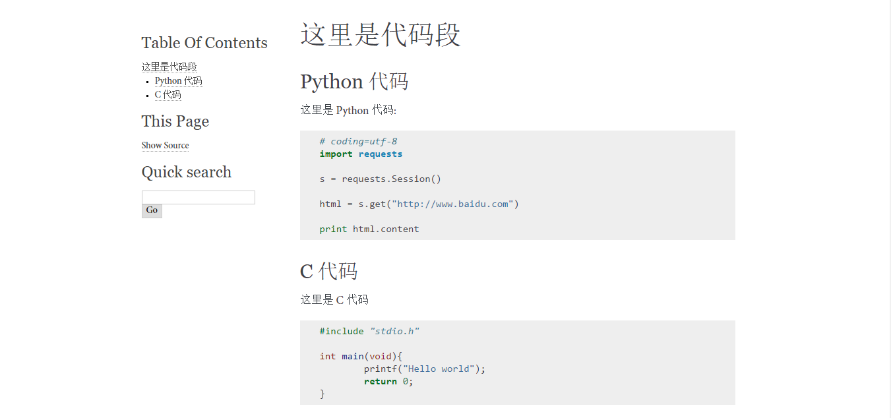

## Sphinx

一个用来写文档的库，生成看起来标准，很规范的文档。很多 Python 库的文档都是由 Sphinx 生成的，比如说 requests ，sphinx 由 rst 格式文件书写而成，也是一种类似于 markdown 的轻量型标记语言。

sphinx 一般常用于两个用途，一是对于某些 Python 库，它给你提供的文档就是 rst 文件，需要你自己去生成可以更好的查看的 HTML 或者是 PDF 文件，另一个就是你自己需要写文档的时候，也可以用 sphinx 书写。好像也就是 Python 的库用 rst 语言，一般还是用 markdown 比较多一点。

以下是由 sphinx 生成的 request 文档。


## 安装 sphinx 

只要你安装了 pip 的话，一般的 Python 库就都能够很简单的安装。

```
pip install sphinx
```

在安装好之后，它会自动在你的 PATH 里添加路径，然后你的 cmd 里就会多出来四个命令 `sphinx-apidoc.exe`,`sphinx-autogen.exe`,`sphinx-build.exe`,`sphinx-quickstart.exe`，我是在 Windows 下，也可以很方便的使用。

## 用 sphinx 来生成文档

用来生成文档的一般是 `sphinx-build` ，用法是 `sphinx-build.exe sourcedir outputdir ` 或者是 `make html`

注意 sourcedir 指的是库文档的 index.rst 文件所在的目录，outputdir 指的是你想要生成的 HTML 文件放的文件夹。

## 用 sphinx 来写文档

然后就是自己写文档的时候需要用到 sphinx 了，主要是用 rst 这个轻量型的标记语言书写，然后由 sphinx 将其生成为 HTML ，sphinx 自带很多默认的模板，还是挺规整标准的。

首先进入你想要创建文档的目录，然后输入 `sphinx-quickstart.exe`。

然后就是各种回车就可以了，要是必须输入的内容，你回车它也不会让你过的，其他的都是有默认值的，按默认值就可以啦。

再说就算写错了，后面还有 conf 文件，基本上都是可以改的。

```
D:\Documents
λ sphinx-quickstart.exe
Welcome to the Sphinx 1.4.6 quickstart utility.

Please enter values for the following settings (just press Enter to
accept a default value, if one is given in brackets).

Enter the root path for documentation.
> Root path for the documentation [.]:

You have two options for placing the build directory for Sphinx output.
Either, you use a directory "_build" within the root path, or you separate
"source" and "build" directories within the root path.
> Separate source and build directories (y/n) [n]:

Inside the root directory, two more directories will be created; "_templates"
for custom HTML templates and "_static" for custom stylesheets and other static
files. You can enter another prefix (such as ".") to replace the underscore.
> Name prefix for templates and static dir [_]:

The project name will occur in several places in the built documentation.
> Project name:
* Please enter some text.
> Project name: sphinx-test
> Author name(s):
* Please enter some text.
> Author name(s): windard

Sphinx has the notion of a "version" and a "release" for the
software. Each version can have multiple releases. For example, for
Python the version is something like 2.5 or 3.0, while the release is
something like 2.5.1 or 3.0a1.  If you don't need this dual structure,
just set both to the same value.
> Project version:
* Please enter some text.
> Project version: 0.0.1
> Project release [0.0.1]:

If the documents are to be written in a language other than English,
you can select a language here by its language code. Sphinx will then
translate text that it generates into that language.

For a list of supported codes, see
http://sphinx-doc.org/config.html#confval-language.
> Project language [en]:

The file name suffix for source files. Commonly, this is either ".txt"
or ".rst".  Only files with this suffix are considered documents.
> Source file suffix [.rst]:

One document is special in that it is considered the top node of the
"contents tree", that is, it is the root of the hierarchical structure
of the documents. Normally, this is "index", but if your "index"
document is a custom template, you can also set this to another filename.
> Name of your master document (without suffix) [index]:

Sphinx can also add configuration for epub output:
> Do you want to use the epub builder (y/n) [n]:

Please indicate if you want to use one of the following Sphinx extensions:
> autodoc: automatically insert docstrings from modules (y/n) [n]:
> doctest: automatically test code snippets in doctest blocks (y/n) [n]:
> intersphinx: link between Sphinx documentation of different projects (y/n) [n]:
> todo: write "todo" entries that can be shown or hidden on build (y/n) [n]:
> coverage: checks for documentation coverage (y/n) [n]:
> imgmath: include math, rendered as PNG or SVG images (y/n) [n]:
> mathjax: include math, rendered in the browser by MathJax (y/n) [n]:
> ifconfig: conditional inclusion of content based on config values (y/n) [n]:
> viewcode: include links to the source code of documented Python objects (y/n) [n]:
> githubpages: create .nojekyll file to publish the document on GitHub pages (y/n) [n]:

A Makefile and a Windows command file can be generated for you so that you
only have to run e.g. `make html' instead of invoking sphinx-build
directly.
> Create Makefile? (y/n) [y]:
> Create Windows command file? (y/n) [y]:

Creating file .\conf.py.
Creating file .\index.rst.
Creating file .\Makefile.
Creating file .\make.bat.

Finished: An initial directory structure has been created.

You should now populate your master file .\index.rst and create other documentation
source files. Use the Makefile to build the docs, like so:
   make builder
where "builder" is one of the supported builders, e.g. html, latex or linkcheck.


D:\Documents
λ ls
Makefile  _build/  _static/  _templates/  conf.py  index.rst  make.bat
D:\Documents
λ tree /F
卷 本地磁盘 的文件夹 PATH 列表
卷序列号为 B0DF-0AA1
D:.
│  conf.py
│  index.rst
│  make.bat
│  Makefile
│
├─_build
├─_static
└─_templates

```

- _build目录 运行make命令后，生成的文件都在这个目录里面
- make.bat 批处理命令
- makefile 批量处理的配置文件
- _static 静态文件的位置，比如 css，js，图片之类的
- _templates 模板文件
- index.rst 主源文件

然后我们还有一个地方需要修改一下，就是在 conf.py 里面的大概是在第 69 行，将语言选项改为中文，网上的很多教程说这个中文的语言包还要自己下载，但是我发现可能是我的 sphinx 比较新的吧，自带了简体中文的语言包。

```
language = "zh_CN"
```

其实要是你注意一下的话，在前面的配置的时候就可以写入了，算了，其实都一样。

接下来就是写文档的时候了。

## 开始写文档了

打开 index.rst 文档，这就是我们的主文档，然后你可以全部都在写在这个文件中，也可以分别写在不同的文件中，然后统一集合在主文档中。

### rst 规则

#### 标题

    这样的话是一级标题
    ===========================

    这样的话是二级标题
    ------------------------------------------

    估计你也猜到了
    ~~~~~~~~~~~~~~~~~

    标题等级与下划线长度无关
    ^^^^^^^^^^^^^^^^^^^^^^^^^^^^^^^^^^

    只要有下划线就可以
    +++++++++++++++++++++++++

    其实还和下划线标志也无关
    ,,,,,,,,,,,,,,,,,,,,,,,,,,


    -----------------------------


    如果下划线上没有字，就是正常的下划线


好，现在我们在当前目录下在创建一个文件 demo.rst ，在 demo.rst 中加入上面的内容，然后在 index.rst 中的 `toctree` 中添加 demo

```
.. toctree::
   :maxdepth: 2

   demo

```

现在，就可以运行生成 HTML 文档了，在当前目录下执行 `make html`

```
D:\Documents
λ make html
Running Sphinx v1.4.6
making output directory...
loading pickled environment... not yet created
building [mo]: targets for 0 po files that are out of date
building [html]: targets for 2 source files that are out of date
updating environment: 2 added, 0 changed, 0 removed
reading sources... [100%] index
D:\Documents\demo.rst:20: SEVERE: Incomplete section title.

-----------------------------------------
如果下划线上没有字，就是正常的下划线
looking for now-outdated files... none found
pickling environment... done
checking consistency... done
preparing documents... done
writing output... [100%] index
generating indices... genindex
writing additional pages... search
copying static files... done
copying extra files... done
dumping search index in English (code: en) ... done
dumping object inventory... done
build succeeded, 1 warning.

Build finished. The HTML pages are in _build/html.

```

好了，现在就可以去 `_build/html` 目录下查看生成的 HTML 页面了。


#### 列表

```
这是有序列表和无序列表
=============================

* 这是无序列表
* 还有无序列表
* 继续无序列表
 - 分层的无序列表
 - 接着无序列表
  + 继续无序列表
  + 还有无序列表
 - 返回上一级
* 返回上上一级
* 接着上上一级


1. 现在是有序列表
2. 继续有序列表
 1. 缩进的有序列表
 2. 缩进的有列表
3. 回来吧，有序列表

```

接着创建一个 list.rst ，写入上面的内容，同样的，将 list 加入 index.rst ，在加入的时候需要空行同等缩进写入，然后编译生成 HTML 。 

```
.. toctree::
   :maxdepth: 2

   demo

   list

```

效果就像这样。


#### 代码段

以两个冒号 `::` 开始的带缩进的都是代码段

```
这里是代码段
==========================

Python 代码
------------------
这里是 Python 代码::

	# coding=utf-8
	import requests

	s = requests.Session()

	html = s.get("http://www.baidu.com")

	print html.content


C 代码
-----------------------
这里是 C 代码

.. code-block:: C

	#include "stdio.h"

	int main(void){
		printf("Hello world");
		return 0;
	}

在双冒号之后要空行

```

同样的步骤，看一下效果。



自动的代码识别，代码高亮。

#### 超链接和图片

```

超链接和图片
=============================

超链接
---------------------------
- 访问 Baidu<http://www.baidu.com>
- 访问 https://github.com
- 链接到 MyBlog_ 

.. _MyBlog: http://windard.com


各种字体
----------------------------

1. 这是 ``标注``
2. 还有 *加粗*
3. 或者 **斜体** 

图片
-----------------------------------

* 这是一张图片 
.. figure:: /_static/images/headlogo.jpg

* 再来一张 
.. image:: /_static/images/favicon.gif

* 照片必须单置一行，顶格写起
```

现在才发现，刚开始的那个语言变量修改之后还没有保存，写一半天都没发现，这才是中文正确的样子。


#### 表格

```
最后的最后介绍一下表格
=========================

大概就是用下划线把整个包起来就是了

.. table:: 表格
   :class: classic

   +---------+--------+--------+
   | head1   | head2  | head3  |
   +=========+========+========+
   |         | cell   | cell   |
   | rowspan +--------+--------+
   |         | * colspan       |
   |         | * another line  |
   +---------+-----------------+


```

结束了，剩下的也都是一些不常用的。

在生成 sphinx 的时候，还是可以将源代码和生成页面分开的，那样好看一些，

大体就是这样的了，怪不得 rst 没人用，太复杂了，各种缩进一点不规范都不行，简直比 HTML 还复杂，谁用。

## 参考链接

[附录：轻量级标记语言](http://www.worldhello.net/gotgithub/appendix/markups.html)

[http://www.sphinx-doc.org/en/stable/index.html](http://www.sphinx-doc.org/en/stable/index.html)