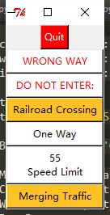
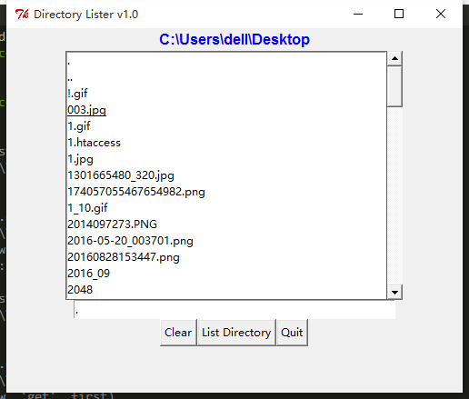

## Tkinter

这个是 Python 自带的 GUI 图像库，然而我最先学的 Python GUI 并不是这个，而是 PyQt 4 ，感觉那个比这个要好看一些，不过这几天有空也可以看一下这个库，看与 PyQt 有什么区别。

先来一个简单的例子试一下

```python
# coding=utf-8

import Tkinter 

top = Tkinter.Tk()
label = Tkinter.Label(top,text="Hello World")
label.pack()
Tkinter.mainloop()
```

效果大概就像这样


竟然还自带一个小的 ico ,真是丑。。。

再来一个小按钮

```python
# coding=utf-8

import Tkinter 

top = Tkinter.Tk()

label = Tkinter.Label(top,text="Hello World")
label.pack()

quit = Tkinter.Button(top,text="Quit",command=top.quit)
quit.pack()

Tkinter.mainloop()
```

效果就像这样


点击 Quit 按钮即可退出。

```
# coding=utf-8

import Tkinter

top = Tkinter.Tk()

hello = Tkinter.Label(top,text="hello,world!")
hello.pack()

quit = Tkinter.Button(top,text="QUIT",command=top.quit,bg='red',fg='white')

quit.pack(fill=Tkinter.X,expand=1)

Tkinter.mainloop()

```

这是一个有些颜色的按钮


接下来是一个可以设置字体大小的按钮

```
# coding=utf-8

import Tkinter

def resize(ev=None):
	label.config(font="Helvetica %d bold"%(scale.get()))

top = Tkinter.Tk()
top.geometry('250x150')

label = Tkinter.Label(top,text='hello world',font="Helvetica -12 bold")
label.pack(fill=Tkinter.Y,expand=1)

scale = Tkinter.Scale(top,from_=10,to=40,orient=Tkinter.HORIZONTAL,command=resize)
scale.set(12)
scale.pack(fill=Tkinter.X,expand=1)

quit = Tkinter.Button(top,text="Quit",command=top.quit,activeforeground='white',activebackground='red')
quit.pack()

top.mainloop()
```

这是一个可以调节字体大小的 Scale ，注意在设置大小的时候，中间的不是乘号 `*` 而是小写的 `X` 。


接下来是一个应用到一点偏函数的东西。

```
# coding=utf-8

from functools import partial
from Tkinter import Tk,Button,X
from tkMessageBox import showinfo,showwarning,showerror

WARN = 'warn'
CRIT = 'crit'
REGU = 'regu'

SIGNS = {
	'do not enter:':CRIT,
	'railroad crossing':WARN,
	'55\nspeed limit':REGU,
	'wrong way':CRIT,
	'merging traffic':WARN,
	'one way':REGU,
}

critCB = lambda :showerror('Error','Error Button Pressed!')
warnCB = lambda :showwarning('Warning','Warning Button Pressed!')
infoCB = lambda :showinfo('Info','Info Button Pressed!')

top = Tk()
top.title('Road Signs')

Button(top,text='Quit',command=top.quit,bg='red',fg='white').pack()

MyButton = partial(Button,top)
CritButton = partial(MyButton,command=critCB,bg='white',fg='red')
WarnButton = partial(MyButton,command=warnCB,bg='goldenrod1')
ReguButton = partial(MyButton,command=infoCB,bg='white')

for eachSign in SIGNS:
	signType = SIGNS[eachSign]
	cmd = '%sButton(text=%r%s).pack(fill=X,expand=True)'%(signType.title(),eachSign,'.upper()' if signType==CRIT else '.title()')
	eval(cmd)

top.mainloop()
```

效果大概是这样



最后，我们来做一个目录查看器，并能够对后缀名进行批量替换。

```
# coding=utf-8

import os
from time import sleep
from Tkinter import *

class DirList(object):
	def __init__(self,initdir=None):
		self.top = Tk()
		self.top.title('Directory Lister v1.0')
		self.cwd = StringVar(self.top)
		self.initUI()
		self.centerWindow()

		if initdir:
			self.cwd.set(os.curdir)
			self.doLS

	def centerWindow(self):
		w = 500
		h = 400
		sw = self.top.winfo_screenwidth()
		sh = self.top.winfo_screenheight()

		x = (sw - w)/2
		y = (sh - h)/2
		self.top.geometry('%dx%d+%d+%d' % (w, h, x, y))

	def initUI(self):
		self.dir1 = Label(self.top,fg='blue',font=('Helvetica',12,'bold'))
		self.dir1.pack()

		self.dirfm = Frame(self.top)
		self.dirsb = Scrollbar(self.dirfm)
		self.dirsb.pack(side=RIGHT,fill=Y)
		self.dirs = Listbox(self.dirfm,height=15,width=50,yscrollcommand=self.dirsb.set)
		self.dirs.bind('<Double-1>',self.setDirAndGo)
		self.dirsb.config(command=self.dirs.yview)
		self.dirs.pack(side=LEFT,fill=BOTH)
		self.dirfm.pack()

		self.dirn = Entry(self.top,width=50,textvariable=self.cwd)
		self.dirn.bind('<Return>',self.doLS)
		self.dirn.pack()

		self.bfm = Frame(self.top)
		self.clr = Button(self.bfm,text='Clear',command=self.clrDir,activeforeground='white',activebackground='blue')
		self.ls = Button(self.bfm,text='List Directory',command=self.doLS,activeforeground='white',activebackground='green')
		self.quit = Button(self.bfm,text='Quit',command=self.top.quit,activeforeground='white',activebackground='red')
		self.clr.pack(side=LEFT)
		self.ls.pack(side=LEFT)
		self.quit.pack(side=LEFT)
		self.bfm.pack()

	def clrDir(self,ev=None):
		self.cwd.set('')

	def setDirAndGo(self,ev=None):
		self.last = self.cwd.get()
		self.dirs.config(selectbackground='red')
		check = self.dirs.get(self.dirs.curselection())
		if not check:
			check = os.curdir
		self.cwd.set(check)
		self.doLS()

	def doLS(self,ev=None):
		error = ''
		tdir = self.cwd.get()
		if not tdir:
			tdir = os.curdir

		if not os.path.exists(tdir):
			error = tdir+':no such file'
		elif not os.path.isdir(tdir):
			os.system('start '+tdir)
			error = tdir+':not a directory'

		if error:
			self.cwd.set(error)
			self.top.update()
			sleep(2)
			if not (hasattr(self,'last') and self.last):
				self.last = os.curdir
			self.cwd.set(self.last)
			self.dirs.config(selectbackground='LightSkyBlue')
			self.top.update()
			return
		self.cwd.set('FETCHING DIRECTORY CONTENTS ...')
		self.top.update()

		dirlist = os.listdir(tdir)
		dirlist.sort()
		os.chdir(tdir)

		self.dir1.config(text=os.getcwd())
		self.dirs.delete(0,END)
		self.dirs.insert(END,os.curdir)
		self.dirs.insert(END,os.pardir)

		for eachFile in dirlist:
			self.dirs.insert(END,eachFile)
		self.cwd.set(os.curdir)
		self.dirs.config(selectbackground='LightSkyBlue')

def main():
	d = DirList(os.curdir)
	mainloop()

if __name__ == '__main__':
	main()
```

效果 

