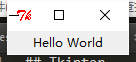
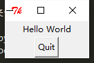
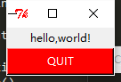
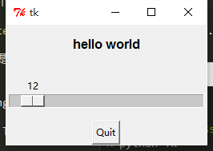

## Tkinter

这个是 Python 自带的 GUI 图像库，然而我最先学的 Python GUI 并不是这个，而是 PyQt 4 ，感觉那个比这个要好看一些，不过这几天有空也可以看一下这个库，看与 PyQt 有什么区别。

先来一个简单的例子试一下

```python
# coding=utf-8

import Tkinter 

top = Tkinter.Tk()
label = Tkinter.Label(top,text="Hello World")
label.pack()
Tkinter.mainloop()
```

效果大概就像这样



竟然还自带一个小的 ico ,真是丑。。。

再来一个小按钮

```python
# coding=utf-8

import Tkinter 

top = Tkinter.Tk()

label = Tkinter.Label(top,text="Hello World")
label.pack()

quit = Tkinter.Button(top,text="Quit",command=top.quit)
quit.pack()

Tkinter.mainloop()
```

效果就像这样



点击 Quit 按钮即可退出。

```
# coding=utf-8

import Tkinter

top = Tkinter.Tk()

hello = Tkinter.Label(top,text="hello,world!")
hello.pack()

quit = Tkinter.Button(top,text="QUIT",command=top.quit,bg='red',fg='white')

quit.pack(fill=Tkinter.X,expand=1)

Tkinter.mainloop()

```

这是一个有些颜色的按钮



接下来是一个可以设置字体大小的按钮

```
# coding=utf-8

import Tkinter

def resize(ev=None):
	label.config(font="Helvetica %d bold"%(scale.get()))

top = Tkinter.Tk()
top.geometry('250x150')

label = Tkinter.Label(top,text='hello world',font="Helvetica -12 bold")
label.pack(fill=Tkinter.Y,expand=1)

scale = Tkinter.Scale(top,from_=10,to=40,orient=Tkinter.HORIZONTAL,command=resize)
scale.set(12)
scale.pack(fill=Tkinter.X,expand=1)

quit = Tkinter.Button(top,text="Quit",command=top.quit,activeforeground='white',activebackground='red')
quit.pack()

top.mainloop()
```

这是一个可以调节字体大小的 Scale ，注意在设置大小的时候，中间的不是乘号 `*` 而是小写的 `X` 。


