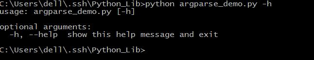
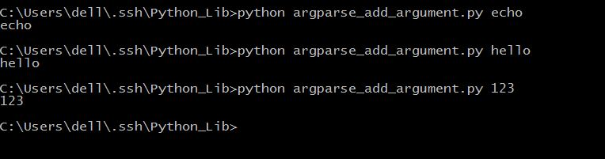
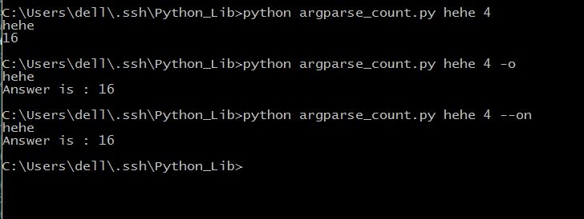

## argparse

向python中传入命令行参数，解析命令行参数和选项。

#### 基本使用

```python
import argparse

parser = argparse.ArgumentParser()
parser.parse_args()
```

保存为argparse_demo.py，运行，看一下结果。


什么结果都没有，就是这样，它本来就什么都不做。
我们可以给它一个参数。'-h'或者'--help'


显示这个函数有一个可选参数'-h'或者'--help'，功能是显示帮助，然后退出。

```python

#导入该模块
import argparse
#创建一个解析对象
parser = argparse.ArgumentParser()
#向该对象中添加你要关注的命令行参数和选项，每一个add_argument方法对应一个你要关注的参数或选项
parser.add_argument("echo")
#最后调用parse_args()方法进行解析,解析成功之后即可使用
args = parser.parse_args()
#回显参数
print args.echo

```

保存为argparse_add_argument.py，运行，看一下结果。
不过，现在我们增加了一个参数 'echo'


将输入的参数回显出来。
现在我们来看一下相应的参数

```python
ArgumentParser(prog=None, usage=None,description=None, epilog=None, parents=[],formatter_class=argparse.HelpFormatter, prefix_chars='-',fromfile_prefix_chars=None, argument_default=None,conflict_handler='error', add_help=True)  

```

ArgumentParser()参数用的不多，一般只需要传递description参数。当调用parser.print_help()或者运行程序时由于参数不正确时，会打印这些描述信息。
- prog:程序的名字，默认为None，用来在help信息中描述程序的名称。
- usage:描述程序用途的字符串。
- description：help信息前的文字。
- epilog：help信息后的文字。
- parents：由ArgumentParser对象组成的列表，它们的arguments选项会被包含到新ArgumentParser对象中。
- formatter_prefix：help信息输出的格式
- prefix_chars：参数前缀，默认为'-'
- formfile_prefix_chars：前缀字符，放在文件名前
- argument_default：参数的全局默认值。
- conflict_handle：解决冲突的策略，默认报错。
- add_help：设为False时，help信息里不再显示'-h','--help'信息

```python
add_argument(name or flags...[, action][, nargs][, const][, default][, type][, choices][, required][, help][, metavar][, dest])

```
add_argument()
- name or flags：命令行参数名或者选项，如上面的address或者-p,--port.其中命令行参数如果没给定，且没有设置defualt，则出错。但是如果是选项的话，则设置为None
- nargs：命令行参数的个数，一般使用通配符表示，其中，'?'表示只用一个，'*'表示0到多个，'+'表示至少一个
- action：参数的存储格式化,默认为store。store_const，值存放在const中。  store_true和store_false，值存为True或False。 append：存为列表。 append_const：存为列表，会根据const关键参数进行添加。  count：统计参数出现的次数。version：版本。 help：help信息。
- default：默认值
- type：参数的类型，默认是字符串string类型，还有float、int等类型
- choices：参数的范围，或者说选择的空间
- required：设定某个选项是否为必选参数，必须出现。
- help：和ArgumentParser方法中的参数作用相似，出现的场合也一致
- metavar：参数在帮助信息中的名字。
- dest： 即参数名。


```python

import argparse
parser = argparse.ArgumentParser(description="This is for test")
#这是必选参数
parser.add_argument("echo",help="echo this str")
#这也是必选参数，参数类型为int
parser.add_argument("int",help="count this int",type=int,action="store")
#这是可选参数，可以写长形式或短形式
parser.add_argument("-o","--on",help="show all",action="store_true")
args=parser.parse_args()
string = args.echo
print string
intchar = args.int
answer = intchar**2
#如果选择全部显示，则显示完整
if args.on:
	print "Answer is : " + str(answer)
else:
	print answer
```
保存为argparse_count.py，运行，看一下结果。

不带'-'的参数，调用时必须键入值，且顺序与程序定义的顺序一致。默认值
带'-'的参数，调用时可以不用输入。