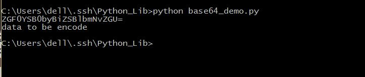
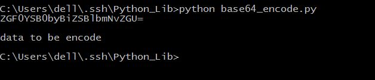

##base64

####基本使用

- base64.b64encode(s[, altchars])
>对字符串使用 Base64 进行编码。返回已编码的字符串。s是要编码的字符串。可选的altchars必须是一个长度至少为2的字符串（多余的字符将被忽略），它表示`+`和`/`字符的替代字母表。这允许应用程序生成的URL或文件系统安全的Base64字符串。默认值为None表示使用标准的Base64字母表。
- base64.b64decode(s[, altchars])
>解码 Base64 编码的字符串。返回已解码的字符串。如果s有错误的填充字符或有非字母表字符出现在字符串中，则引发TypeError .s是要解码的字符串。可选的altchars必须是一个长度至少为2的字符串（多余的字符将被忽略），它表示+和/字符的替代字母表。
- base64.standard_b64encode(s)
>使用标准的Base64字母表编码字符串s。
- base64.standard_b64decode(s)
>使用标准的Base64字母表解码字符串s。
- base64.urlsafe_b64encode(s)
>使用URL安全的字母表编码字符串s，以-和_分别替换标准Base64字母表中的+和/。结果仍然可以包含=。
- base64.urlsafe_b64decode(s)
>使用URL安全的字母表解码字符串s，以-和_分别替换标准Base64字母表中的+和/。
- base64.b32encode(s)
>使用Base32编码字符串。s是要编码的字符串。返回已编码的字符串。
- base64.b32decode(s[, casefold[, map01]])
>对Base32编码的字符串进行解码。返回已解码的字符串。如果s有错误的填充字符或有非字母表字符出现在字符串中，则引发TypeError 。RFC 3548允许数字0映射到字母O，数字1映射到字母I或字母L。可选参数map01不为None时，指定数字1应该映射到哪个字母（当map01不是None时，数字0始终映射到字母O）。出于安全目的缺省值为None，以便在输入中不允许0和1。
- base64.b16encode(s)
>使用Base16编码字符串。s是要编码的字符串。返回已编码的字符串。
- base64.b16decode(s[, casefold])
>对Base16编码的字符串进行解码。返回已解码的字符串。如果s有错误的填充字符或有非字母表字符出现在字符串中，则引发TypeError 。s是要解码的字符串。可选casefold是一个标志，指定是否可以接受小写字母作为输入。出于安全目的，默认值为False。

```python
import base64
old_decode =  "data to be encode"
encode = base64.b64encode(old_decode)
print encode
new_decode = base64.b64decode(encode)
print new_decode
```
保存为base64_demo.py，运行，看一下效果。

####其他函数
- encode()函数也可以进行base64的编码和解码操作
```python
old_decode =  "data to be encode"
encode = old_decode.encode("base64")
print encode
new_decode = encode.decode("base64")
print new_decode
```
保存为base64_encode.py，运行，看一下结果。

可以看出来，效果是与base64模块解码编码一样的结果。
>decode标准语法：str.decode(encoding='UTF-8',errors='strict')
>- encoding -- 要使用的编码，如"UTF-8"。
>- errors -- 设置不同错误的处理方案。默认为 'strict',意为编码错误引起一个UnicodeError。 其他可能得值有 'ignore', 'replace', 'xmlcharrefreplace', 'backslashreplace' 以及通过 codecs.register_error() 注册的任何值。
- 各种转化
```python
int(x [,base ])         #将x转换为一个整数  
long(x [,base ])        #将x转换为一个长整数  
float(x )               #将x转换到一个浮点数  
complex(real [,imag ])  #创建一个复数  
str(x )                 #将对象 x 转换为字符串  
repr(x )                #将对象 x 转换为表达式字符串  
eval(str )              #用来计算在字符串中的有效Python表达式,并返回一个对象  
tuple(s )               #将序列 s 转换为一个元组  
list(s )                #将序列 s 转换为一个列表  
chr(x )                 #将一个整数转换为一个ASCII字符  
unichr(x )              #将一个整数转换为Unicode字符  
ord(x )                 #将一个ASCII字符转换为它的整数值  
hex(x )                #将一个整数转换为一个十六进制字符串  
oct(x )                 #将一个整数转换为一个八进制字符串  
```
其中chr(),ord(),hex()等比较常用。
