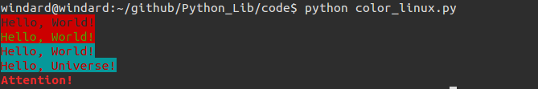

## colorama

厌倦了终端中 python 输出的普普通通的黑白字符，那就在终端中输出不同的颜色吧。

想在终端中输出颜色，在 linux 下可以不依靠任何库来完成，先来看一下原生的方法。

### 直接输出

color设置格式说明：

```
color = \033[code;前景色;背景色m

code:
0 默认
1 粗体
3 斜体
4 下划线
7 反白显示
8 不可见
9 删除线

前景  背景  颜色
30      40  黑色
31      41  红色
32      42  绿色
33      43  黄色
34      44  蓝色
35      45  紫红色
36      46  青蓝色
37      47  白色
1       1   透明色
```

可以通过在终端中输出 color 来改变终端的颜色。

```bash
>>> print "这是粗体"
这是粗体
>>> print "\033[7m"+"这是反白背景"
这是反白背景
>>> print "\033[31m"+"这是黄色"
这是黄色
>>> print "\033[93m"+"这才是黄色"
这才是黄色
>>> print "\033[7;32m"+"绿色反白背景"
绿色反白背景
>>> print "\033[0m"+"回归默认"
回归默认
>>> print "hello world"
hello world
>>>
```



这是一些的 linux 终端控制

```
#font style
DEFAULT = '\033[0m'
BOLD = '\033[1m'
ITALIC =  '\033[03m'
UNDERLINE = '\033[04m'
REVERSE = '\033[07m'
INVISIBLE = '\033[08m'
STRIKETHROUGH = '\033[09m'

#light color
DARKGREY = '\033[90m'
REDL = '\033[91m'    #<=> '\033[91;1m' <=> '\033[1;91;1m'  lightred
GREENL = '\033[0;92;1m'
YELLOWL = '\033[0;93;1m'
BLUEL = '\033[0;94;1m'
PINKL = '\033[0;95;1m'
WHITEL = '\033[0;97m'

#highlight light color
REDHL = '\033[1;91m'
GREENHL = '\033[1;92;1m'
YELLOWHL = '\033[1;93;1m'
BLUEHL = '\033[1;94;1m'
PINKHL = '\033[1;95;1m'
WHITEHL = '\033[1;97m'

# highlight color
REDH = '\033[1;31m' #REDH = '\033[1;31;1m'
GREENH = '\033[1;32;1m'
YELLOWH = '\033[1;33;1m'
BLUEH = '\033[1;34;1m'
PURPLEH = '\033[1;35;1m'
WHITEH = '\033[1;37m'

# color
BLACK ='\033[30m'
RED = '\033[0;31;1m'
GREEN = '\033[0;32;1m'
ORANGE = '\033[0;33;1m'
BLUE = '\033[0;34;1m'
PURPLE = '\033[0;35;1m'
CYAN = '\033[36m'
LIGHTGREY = '\033[37m'
```

再来一个，五颜六色的终端

```python
def print_format_table():
    """
    prints table of formatted text format options
    """
    for style in xrange(8):
        for fg in xrange(30,38):
            s1 = ''
            for bg in xrange(40,48):
                format = ';'.join([str(style), str(fg), str(bg)])
                s1 += '\x1b[%sm %s \x1b[0m' % (format, format)
            print s1
        print '\n'

print_format_table()
```


```
# coding=utf-8

class bcolors:
    BLUE = '\033[95m'
    WHITE = '\033[94m'
    BLACK = '\033[92m'
    GRAY = '\033[93m'
    RED = '\033[91m'
    ENDC = '\033[0m'


print bcolors.BLUE + "First color is blue " + bcolors.ENDC
print bcolors.WHITE + "Second is white" + bcolors.ENDC
print bcolors.BLACK + "Second is black" + bcolors.ENDC
print bcolors.GRAY + "Second is gray" + bcolors.ENDC
print bcolors.RED + "Second is red" + bcolors.ENDC
```

## colorama

上面的方法只能在 linux 下有效，如果想要跨平台的话，可能就需要这个库了

```python


from colorama import init,Fore

init(autoreset=True)
#通过使用autoreset参数可以让变色效果只对当前输出起作用，输出完成后颜色恢复默认设置
print(Fore.RED + 'This is red color')
print('automatically back to default color again')

```


colorama 的色彩值比较有限，只有这些

```
{
    'BLUE': '\x1b[34m',
    'RESET': '\x1b[39m',
    'YELLOW': '\x1b[33m',
    'GREEN': '\x1b[32m',
    'WHITE': '\x1b[37m',
    'CYAN': '\x1b[36m',
    'BLACK': '\x1b[30m',
    'MAGENTA': '\x1b[35m',
    'RED': '\x1b[31m'
}
```

所以我们还需要另一个库，也是同样的功能，叫 termcolor
