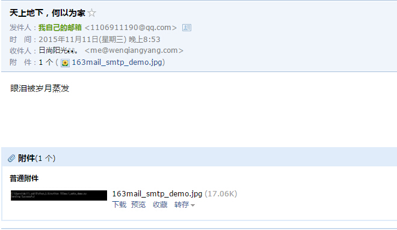

## envelopes

这是将email和smtplib两个库进行封装，使其发送邮件更加方便。    
不过一般Python并不自带，需要自行安装。
>安装方法
>- Linux下：`pip install envelopes`
>- Windows下，点击[这里](envelopes-master.zip)下载文件压缩包，解压后进入文件夹，`python install setup.py`即可安装。

```python


from envelopes import Envelope

#创建一个envelopes对象
envelope = Envelope(
	#发件人的地址，和名称
	from_addr = (u"1106911190@qq.com",u"Windard"),
	#收件人的地址，和名称
	to_addr = (u"me@wenqiangyang.com",u"Yang"),
	#邮件的主题
	subject = u"天上地下，何以为家",
	#邮件的内容
	text_body = u"眼泪被岁月蒸发"
	)

#在邮件中添加附件也非常简单
envelope.add_attachment('images/163mail_smtp_demo.jpg')

#最后连接邮件服务器并发送
envelope.send("smtp.qq.com",login="1106911190@qq.com",password="XXXXXX",tls=True)

print "Sending Successful"
```

保存为envelopes_demo.py，运行，看一下结果。   

   

   

发送邮件的地方也可以不用`envelope.send()`而用原生的`SMTP.SMTP()`，只需要在开始的时候导入`SMTP`，然后就可以`qq=SMTP(host="XXX",login="XXX",password="XXX")`,再用`qq.send(envelope)`来发送出去。   <br>
>envelope也可以进行群发，只需要在设定`to_addr=(u"XXX@XX.com",u"XXX",u"XXX@XX.com",u"XXX")`即可。<br>
>envelope也可以用来发送HTML，只需在对象中使用`html_body=u'XXX',`即可发送HTML文本。<br>
>envelope也可以设定字符编码，只需在对象中使用` charset=u'XXX',`即可设定编码格式。<br>
>envelope也可设定抄送人，只需在对象中设定` cc_addr=u'XXX',`即可设定抄送人，也可以是多个形式的列表。<br>

发现很多很好用的 Python 发邮件的库，比如说 yagmail ，发邮件只需两步

```
yag = yagmail.SMTP(user='18607571914@163.com', password='xxxx', host='smtp.163.com', port='25')
yag.send(to='1106911190@qq.com', subject = "I now can send an attachment", contents='This is contents', attachments=['a.txt', 'b.jpg'])  
```