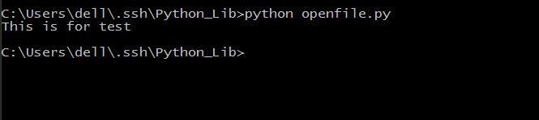
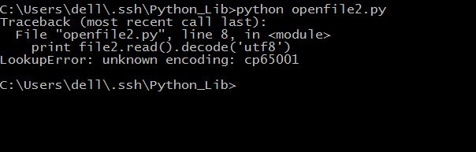

## 文件的读写

#### 打开文件的方式

f.open('file'[,'mode'])

|模式		|描述				  			 |
|------  |----------------				|
|r		|以读方式打开文件，可读取文件信息。|
|w		|以写方式打开文件，可向文件写入信息。如文件存在，则清空该文件，再写入新内容；如果文件不存在则创建。|
|a	    |以追加模式打开文件（即一打开文件，文件指针自动移到文件末尾），如果文件不存在则创建。|
|r+ 	|以读写方式打开文件，可对文件进行读和写操作。|
|w+		|消除文件内容，然后以读写方式打开文件。|
|a+		|以读写方式打开文件，并把文件指针移到文件尾。|
|b		|以二进制模式打开文件，而不是以文本模式。该模式只对Windows或Dos有效，类Unix的文件是用二进制模式进行操作的。|

#### 打开文件的方法

|方法		|描述			|
|------	  |---------		|
|f.open() |打开文件				|
|f.close()|关闭文件				 |
|f.name() |获取文件名称		 |
|f.tell()|获得文件指针位置，标记当前位置，以文件开头为原点|
|f.read([size])|读出文件，size为读取的长度，以byte为单位|
|f.readline([size])|读出一行信息，若定义了size，则读出 一行的一部分|
|f.write(string)|把string字符串写入文件，write()不会在str后加上一个换行符。换行需加'\n'|
|f.writelines(list)|把list中的字符串一行一行地写入文件，是连续写入文件，没有换行。换行需加'\n'|
|f.next()|返回下一行，并将文件操作标记位移到下一行。把一个file用于for … in file这样的语句时，就是调用next()函数来实现遍历的。|
|f.readlines([size])|读出所有行，也就是读出整个文件的信息。(把文件每一行作为一个list的一个成员，并返回这个list。其实它的内部是通过循环调用readline()来实现的。如果提供size参数，size是表示读取内容的总长，也就是说可能只读到文件的一部分)|
|f.fileno()|获得文件描述符，是一个数字。返回一个长整型的”文件标签“|
|f.flush()|刷新输出缓存，把缓冲区的内容写入硬盘|
|f.isatty()|如果文件是一个终端设备文件（Linux系统中），则返回True，否则返回False。|
|f.seek(offset[,where])|把文件指针移动到相对于where的offset位置。where为0表示文件开始处，这是默认值 ；1表示当前位置；2表示文件结尾。(注意：如果文件以a或a+的模式打开，每次进行写操作时，文件操作标记会自动返回到文件末尾)|
|f.truncate([size])|把文件裁成规定的大小，默认的是裁到当前文件操作标记的位置。如果size比文件的大小还要大，依据系统的不同可能是不改变文件，也可能是用0把文件补到相应的大小，也可能是以一些随机的内容加上去。|


按行读取文件的方法

```python
file = open("sample.txt","r")
while 1:
    line = file.readline()
    if not line:
        break
    pass # do something
```


*2015-10-17*
打开不含英文名的文件一般都没有什么问题，主要是文件名含中文的就比较复杂了。
主要有两种方法：
1. unicode转码

```python
filepath=unicode(filepath,'utf8')
fobj=open(filepath,"r")
```

2. 使用u

```python
filepath = u'中文路径'
fobj = open(filepath)
```

我们来试一下

```python
#coding=utf-8
filepath = unicode('测试文档.txt','utf8')
file1 = open(filepath,'w')
file1.write("This is for test")
file1.close()
filepath = u'测试文档.txt'
file2 = open(filepath,'r')
print file2.read()
file2.close()
```

保存为openfile.py，运行，看一下结果。

 

确实可以，显示挺好的。
但是这里又有一个问题了，如果我想要把中文打印出来呢？把刚才的代码稍微改一下

```python
#coding=utf-8
filepath = unicode('测试文档.txt','utf8')
file1 = open(filepath,'w')
file1.write('这是测试文档')
file1.close()
filepath = u'测试文档.txt'
file2 = open(filepath,'r')
print file2.read().decode('utf8')
file2.close()
```

保存为openfile2.py，运行，看一下结果。


真的能够显示，但是或许有同学的显示是这样的。



使用`decode('utf8')`正常显示的Windows的cmd的chcp是936的。decode()是指文件内容以何种方式编码，现在则以同样的这种方式解码。

3.encode()转码

这是因为微软的中文操作系统默认的中文编码格式是GBK，所以正常的cmd里面只能显示GBK格式编码的中文，无法显示utf-8格式编码的中文。

如果想要显示utf-8格式的中文，需要在cmd内键入`chcp 65001`，这是将cmd的显示中文编码改为utf-8。
或者你也可以将`decode('utf8')`改为`decode('gbk')`。

4. 直接使用 gbk

*2015-10-18*
既然我们已经试过了用Python打开文件的问题，你们接下来就是用PHP打开中文文件的问题了！

因为微软的Windows是默认中文编码格式GBK，需要转码成utf-8才可以正常的看到。

```
$filename=iconv('utf-8','gb2312',$filename);
``` 

或者是 

```
file_get_contents(mb_convert_encoding($filename, 'gbk', 'utf-8'));
```
