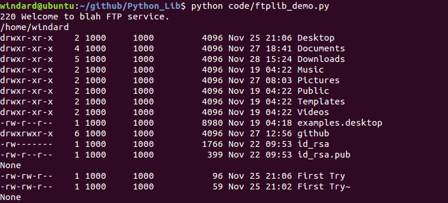
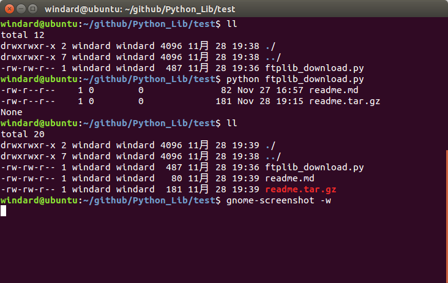

## ftplib

这是python的进行ftp文件传输的库，可以进应用TLS加密，一般的就是创建一个ftp对象ftplib.FTP(),应用加密的话就是创建一个ftp-tls对象ftplib.FTP\TLS()。  
创建ftp对象的工厂函数`class ftplib.FTP([host[, user[, passwd[, acct[, timeout]]]]])`                                           
创建ftp-tls对象的工厂函数`class ftplib.FTP_TLS([host[, user[, passwd[, acct[, keyfile[, certfile[, context[, timeout]]]]]]]])`           

```python
#coding=utf-8
import ftplib
#连接ftp服务器
f = ftplib.FTP('192.168.137.142')
#如果一开始只是构建ftp对象没有连接远程服务器的话，可以使用f.connect()来连接远程服务器
#打印ftp服务器的欢迎信息
print f.getwelcome()
#上面就是使用anonymous帐号匿名登录的
#如果使用帐号登录可以在上面加进去，也可以使用login函数
f.login('windard','windard')
#查看当前目录
print f.pwd()
#查看当前目录文件,这个函数返回值为None
print f.dir()
#进入ftp服务器上某一个文件夹
f.cwd('Desktop')
print f.dir()
f.quit()
```

保存为ftplib_demo.py,运行，看一下结果。                

                   

上面的例子就是建立了一个ftp对象，并连接远程服务器查看服务器上的文件，那么接下里让我们开始上传下载吧。            

```python
#coding=utf-8
import ftplib
#设置缓存区大小
bufsize = 2048
def writeline(data):
	localfile2.write(data+'\n')
f = ftplib.FTP('localhost')
#这次以匿名身份登录
f.login()
print f.dir()
#以二进制格式下载非文本格式文件
#先创建本地文件
localfile1 = open('readme.tar.gz','wb')
f.retrbinary('RETR readme.tar.gz',localfile1.write,bufsize)
localfile1.close()
#以ASCII格式下载文本文件
localfile2 = open('readme.md','w')
f.retrlines('RETR readme.md',writeline)
localfile2.close()
f.quit()
```

保存为ftplib_download.py，运行，看一下结果。

  

`FTP.retrbinary(command, callback[, maxblocksize[, rest]]`这是下载二进制文件的函数，第一个参数表示下载模式以及下载文件名，一般是`RETR filename`的形式，第二个参数返回调用函数，因为这里返回的是一定长度的字节流，所以我们在前面不仅需要先创建一个文件对象，在这里的返回函数不能写文件对象名，而应该是文件对象的写入函数，这样才能完成文件的写入,第三个参数是缓存区大小。            
`FTP.retrlines(command[, callback])`这是下载ASCII文件格式的函数，用法与上面基本一致,但是因为在传送ASCII格式的时候，它是将文件按行读取的，最后舍弃了换行符，如果我们不另加上换行符的话，我们得到的文本文件就会只有一行,所以我们在这里创建了一个文件写入函数，将每一个文件流写入之后都再加上一个换行符。     

那么接下来就是文件上传，同样分为二进制和ASCII两种格式。            

```python
#coding=utf-8
import ftplib
f = ftplib.FTP('localhost')
f.login('windard','windard')
#以二进制格式上传
localfile1 = open('demo.tar.gz','rb')
f.storbinary('STOR demo.tar.gz',localfile1)
localfile1.close()
以ASCII格式上传
localfile2 = open('demo.txt','r')
f.storlines('STOR demo.txt',localfile2)
localfile2.close()
f.quit()
```

保存为ftplib_upload.py。                                 
在这里的二进制文件上传就是对文件使用`read()`而ASCII就是使用`readline()`。 
其他的还有一些关于大容量文件上传及下载和文件改名，删除，创建和删除文件夹等等操作就不做更多的演示了。  