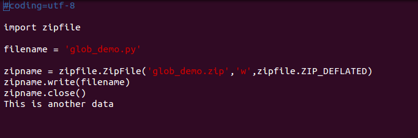

## gzip

功能与linux下的gzip功能是一样的，只能压缩单个文件，可以是直接压缩数据，也可以追加数据。

```python
#coding=utf-8
import gzip
filename = open('zipfile_demo.py','rb')
#创建一个新的压缩文件
g = gzip.open('zipfile_demo.gz','wb')
g.write(filename.read())
filename.close()
g.close()
#打开一个已经创建的压缩文件
a = gzip.GzipFile('zipfile_demo.gz','ab')
a.write("This is another data")
a.close()
```

保存为gzip_demo.py，运行，看一下结果。               

                   

这是直接用vim打开gz压缩文件的样子，可以看到确实是这些文件，而且也加入了后来的数据。           

```python
#coding=utf-8
import gzip
g = gzip.open('zipfile_demo.gz','rb')
f = open('zipfile_demo.py','wb')
f.write(g.read())
f.close()
g.close()
```

保存为gzip_unzip.py。