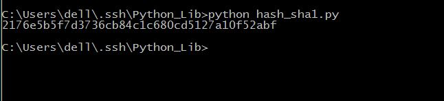

## hashlib

在Python中有内置模块hashlib可以用来生成安全散列算法SHA-1,SHA224,SHA256,SHA384,SHA512及RSA的md5算法。

#### 我们来试一下生成一个sha-1的密文.

```python
# coding=utf-8

import hashlib

decode = "data to be encode"

encode = hashlib.sha1()
encode.update(decode)

print encode.hexdigest()

```

保存为hash_sha1.py，运行，看一下结果。



确实生成了四十位的hash密文。

#### 让我们来看一下hashlib的内置函数有哪些

=======

保存为hash_sha1.py，运行，看一下结果。   

            
                  
确实生成了四十位的hash密文。   

#### 让我们来看一下hashlib的内置函数有哪些
>>>>>>> 9467e1f31bb4743144f249aa9e8e7b2aa74815cf
>- hashlib.algorithms。一个元组，提供该模块保证支持的哈希算法的名称。
>- hash.digest_size  。以字节为单位的哈希结果的大小。
>- hash.block_size   。以字节为单位的哈希算法的内部块的大小。
>- hash.update(arg)  。用字符串arg更新哈希对象。重复的调用等同于单次调用所有参数的连接：m.update(a); m.update(b) 相当于m.update(a+b)。
>- hash.digest()     。返回目前为止传递给update()方法的字符串的摘要。它是一个具有digest_size个字节的字符串，其中可能包含非ASCII 字符，包括空字节。
>- hash.hexdigest()  。类似digest()，但是返回的摘要的字符串的长度翻倍，且只包含十六进制数字。这可用于在电子邮件或其它非二进制环境中安全交换数据。
>- hash.copy()       。返回哈希对象的一个副本（"克隆"）。这可以用于更有效地计算分享一个共同的初始子字符串的字符串的摘要。

