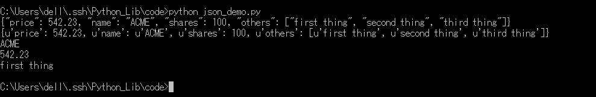
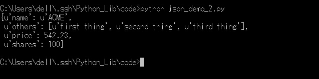
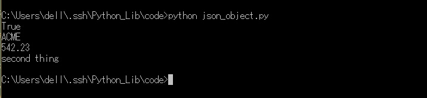

## json

python这么强大的语言当然也可以用来处理json，两个主要的函数是`json.dumps()`和`json.loads()`分别用来将dist字典格式的Python数据编码为json数据格式，和将json数据格式解码为Python的数据格式。

> 还有 ujson 更快，simplejson 兼容性更强

分别有四个主要的函数

```
dump(obj, fp, skipkeys=False, ensure_ascii=True, check_circular=True, allow_nan=True, cls=None, indent=None, separators=None, encoding='utf-8', default=None, sort_keys=False, **kw) # 将 json 转换为字符串并存储到文件中
dumps(obj, skipkeys=False, ensure_ascii=True, check_circular=True, allow_nan=True, cls=None, indent=None, separators=None, encoding='utf-8', default=None, sort_keys=False, **kw) # 将 json 转换为字符串
load(fp, encoding=None, cls=None, object_hook=None, parse_float=None, parse_int=None, parse_constant=None, object_pairs_hook=None, **kw) # 从文件中读取字符串并转换为 json
loads(s, encoding=None, cls=None, object_hook=None, parse_float=None, parse_int=None, parse_constant=None, object_pairs_hook=None, **kw) # 将字符串转换为 json
```

```python
import json

data = {
    'name' : 'ACME',
    'shares' : 100,
    'price' : 542.23,
    'others': ["first thing","second thing","third thing"]
}

json_str = json.dumps(data)
print json_str

python_str = json.loads(json_str)
print python_str
print python_str["name"]
print python_str["price"]
print python_str["others"][0]
```

保存为json_demo.py，运行，看一下结果。



可以看到第一行是json数据格式，第二行是Python的dist数据格式，也就可以正常的读写。
在将json数据格式转化为Python的数据格式了之后，为了更好的展示，可以使用`pprint`来代替原生的`print`，它会按照key的字幕顺序以一种更加美观的方式输出。

```python
import json
from pprint import pprint

data = {
    'name' : 'ACME',
    'shares' : 100,
    'price' : 542.23,
    'others': ["first thing","second thing","third thing"]
}

json_str = json.dumps(data)

python_str = json.loads(json_str)
pprint(python_str)
```

保存为json_demo_2.py,运行，看一下结果。



我们还可以将json数据解析成一个Python对象。

```python
import json

class JSONObject:
	def __init__(self,d):
		self.__dict__=d

data = {
    'name' : 'ACME',
    'shares' : 100,
    'price' : 542.23,
    'others': ["first thing","second thing","third thing"]
}

json_str = json.dumps(data)

python_str = json.loads(json_str, object_hook=JSONObject)
print isinstance(python_str,object)
print python_str.name
print python_str.price
print python_str.others[1]
```

保存为json_object.py，运行，看一下结果。



在解码json的时候可以采用`pprint`来获得一个比较漂亮的输出，在编码json的时候也可以在`dumps()`函数里加上参数`indent=X`来缩进从而获得一个比较漂亮的输出。

2016-01-13 更新

在 Python 中 eval 和 str(unicode) 的功能也可以做 json 数据格式的转化

```
>>> data = {
...     'name' : 'ACME',
...     'shares' : 100,
...     'price' : 542.23,
...     'others': ["first thing","second thing","third thing"]
... }
>>> json_str = str(data)
>>> json_str
"{'price': 542.23, 'name': 'ACME', 'shares': 100, 'others': ['first thing', 'second thing', 'third thing']}"
>>> eval(json_str)
{'price': 542.23, 'name': 'ACME', 'shares': 100, 'others': ['first thing', 'second thing', 'third thing']}
```

但是有一个问题，正确在 json 中为 true，但是在 Python 中为 True，失败在 json 中为 false ，但是在 Python 是为 False。

```
>>> data = "{'name':'ACMA','status':false}"
>>> eval(data)
Traceback (most recent call last):
  File "<stdin>", line 1, in <module>
  File "<string>", line 1, in <module>
NameError: name 'false' is not defined
```

对于 json 数据格式的操作还是让专业的库来干吧。

2017-03-18 更新

json 格式数据与 Python 中的 字典(dict) 并不完全一致，json 只能是双引号包围的字符串，而 Python 中的字符串可以用双引号也可以用单引号。

```
+-------------------+---------------+
| Python            | JSON          |
+===================+===============+
| dict              | object        |
+-------------------+---------------+
| list, tuple       | array         |
+-------------------+---------------+
| str, unicode      | string        |
+-------------------+---------------+
| int, long, float  | number        |
+-------------------+---------------+
| True              | true          |
+-------------------+---------------+
| False             | false         |
+-------------------+---------------+
| None              | null          |
+-------------------+---------------+
```

```
JSONEncoder().encode({"foo": ["bar", "baz"]}) # 将字典格式转换为 json 字符串
JSONDecoder().decode('{"foo": ["bar", "baz"]}') # 将 json 字符串转换为字典格式
```

2017-10-22 更新

json 和 dict 还有两个地方不一样
- dict 在所有的键值对之后还可以有逗号，json 在所有的键值对最后没有逗号
- dict 的键可以是数字，json 的键不能是数字，只能是字符串