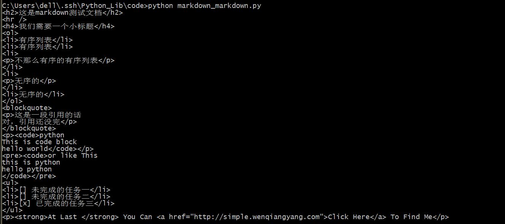
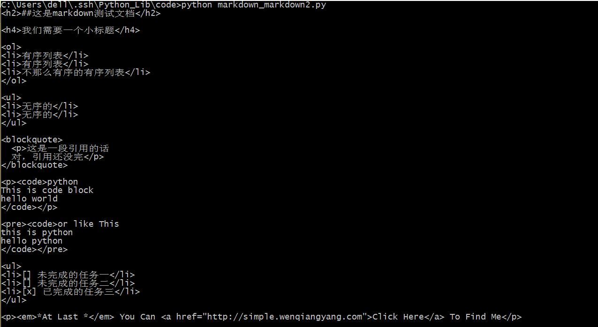
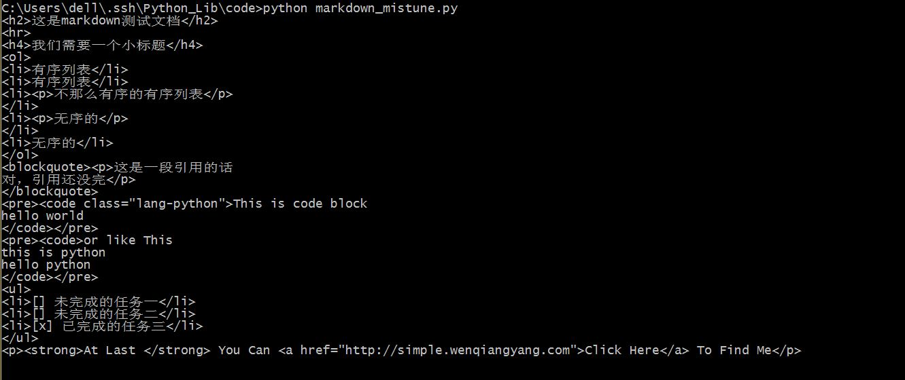
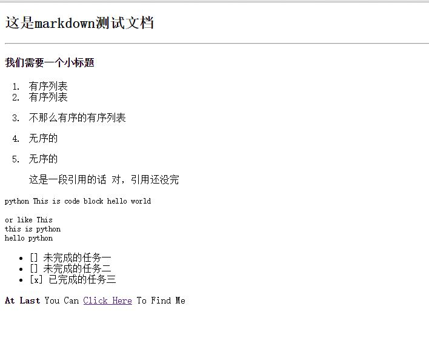

## markdown

最近在准备自己做一个markdown编辑器的时候发现了这个好东西，Python竟然有将markdown格式转换生成HTML的库，而且还不止一个，Markdown，Markdown2，还有Mistune和Misaka。让我来试一下。     

#### 首先是Markdown    

```pyhton


import markdown

data = """
##这是markdown测试文档
-----

#### 我们需要一个小标题

1. 有序列表
2. 有序列表
2. 不那么有序的有序列表

- 无序的
- 无序的

>这是一段引用的话
>对，引用还没完

```python
This is code block
hello world
\`\`\`


	or like This
	this is python 
	hello python


- [] 未完成的任务一
- [] 未完成的任务二
- [x] 已完成的任务三

**At Last ** You Can [Click Here](http://simple.wenqiangyang.com) To Find Me

"""

result = markdown.markdown(data.decode("utf-8"))

print result
```

保存为markdown_markdown.py，运行，看一下结果。               

      

可以看出来还是可以正确解析的，而且也只是将markdown的标志变成HTML的标签，不过注意一点，它只支持utf-8的编码。如果是从文本里面读取的话，不要直接使用open，可以使用codecs。对了，还有一点，markdown不仅能将markdown语法的文本解析成HTML，还能将HTML解析为markdown，功能强大。  

#### markdown2

一样的文本，再来试一下markdown2                     

```python


import markdown2

data = """
##这是markdown测试文档
-----

####我们需要一个小标题

1. 有序列表
2. 有序列表
2. 不那么有序的有序列表

- 无序的
- 无序的

>这是一段引用的话
>对，引用还没完

```python
This is code block
hello world
\`\`\`


	or like This
	this is python 
	hello python


- [] 未完成的任务一
- [] 未完成的任务二
- [x] 已完成的任务三

**At Last ** You Can [Click Here](http://simple.wenqiangyang.com) To Find Me

"""

result = markdown2.markdown(data.decode("utf-8"))

print result
```

保存为markdown_markdown2.py，运行，看一下结果。              

                

还是有一定差别的，看网上说解析速度有区别，但是没有感觉出来。       

#### Mistune           

最后来试下Mistune                

```python


import mistune

data = """
##这是markdown测试文档
-----

####我们需要一个小标题

1. 有序列表
2. 有序列表
2. 不那么有序的有序列表

- 无序的
- 无序的

>这是一段引用的话
>对，引用还没完

```python
This is code block
hello world
\`\`\`


	or like This
	this is python 
	hello python


- [] 未完成的任务一
- [] 未完成的任务二
- [x] 已完成的任务三

**At Last ** You Can [Click Here](http://simple.wenqiangyang.com) To Find Me

"""

result = mistune.markdown(data.decode("utf-8"))

print result
```

保存为markdown_mistune.py，运行，看一下结果。              

                       

结果差不多，感觉这几个markdown解析器都差不多吖，为什么还要这么多呢？        

#### Misaka   

再来看一下最后一个Misaka                              
本来在windows下装这个库没有装成功，准备在ubuntu下试一下，结果发现在ubuntu下也没有装成功，那就没有办法，只能先算了。       


最后，我们来试一下从文件中读取markdown然后解析为HTML，当然，我们先把HTML的开头和结尾写好。

```html
<!DOCTYPE html>
<html lang="en">
<head>
	<meta charset="UTF-8">
	<title>markdown</title>
</head>
<body>

##这是markdown测试文档
-----

####我们需要一个小标题

1. 有序列表
2. 有序列表
2. 不那么有序的有序列表

- 无序的
- 无序的

>这是一段引用的话
>对，引用还没完

```python
This is code block
hello world
\`\`\`


	or like This
	this is python 
	hello python


- [] 未完成的任务一
- [] 未完成的任务二
- [x] 已完成的任务三

**At Last ** You Can [Click Here](http://simple.wenqiangyang.com) To Find Me

</body>
</html>
```

然后再写一个转换的Python文件。

```python

import markdown
import codecs

p = codecs.open("markdown.html","r","utf-8")
d = p.read()
p.close()

r = markdown.markdown(d)

l = codecs.open("markdown2.html","w","utf-8")
l.write(r)
l.close()
```

保存为md2html.py，运行，看一下结果。                 


