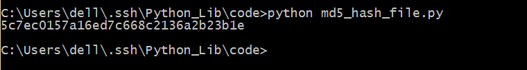

## md5

能够生成md5的模块主要有两个，md5和hashlib。

#### 先来演示一下md5模块。

```python
import md5
decode = "data to be encode"
encode = md5.new()
encode.update(decode)
print encode.hexdigest()
```

保存为md5_md5.py,运行，看一下结果。   

   

确实生成了32位的md5密文。   

#### md5模块的使用非常简洁，具体看一下相关的函数。   

>- md5.new([arg]) 。返回一个md5对象，如果给出参数，则相当于调用了update(arg)
>- md5.updte(arg) 。用string参数arg更新md5对象。注意：如果m.update(a)之后在 m.update(b)，那么就相当于m.update(a+b)。
>- md5.digest()   。返回16字节的摘要，由传给update的string生成，摘要没有ascii字符
>- md5.hexdigest()。以16进制的形式返回32位的md5值     

#### 再来试一下hashlib模块

```python
import hashlib
decode = "data to be encode"
encode = hashlib.md5()
encode.update(decode)
print encode.hexdigest()
```

保存为md5_hash.py，运行，看一下结果。


可以看出来，两次的结果是一样的。  
在hashlib里面也可以使用一句话模式  
`print hashlib.new("md5", "data to be encode").hexdigest()  `
- 文件的md5值

#### 文件的md5
从上面md5的生成可以看出来，只要是一个字符串都可以生成md5值，同样的方法，如果把一个文件以二进制读取出来也可以计算出来，因为md5的不可解密性，md5值经常用来检验文件是否被修改。

```python
#coding=utf-8
import hashlib
#读取二进制文件
filename = open("md5_hash.py","rb")
filecontent = filename.read()
m = hashlib.md5()
m.update(filecontent)
decode = m.hexdigest()
print decode
```

保存为md5_hash_file.py，运行，看一下结果。      

      

这里每次读取文件都是直接打开全部文件读入缓存，如果文件过大的话就会占用过多内存，可以进行稍微改进。      

```python
#coding=utf-8
import hashlib
#读取二进制文件
filename = open("md5_hash.py","rb")
block = 2**20
m = hashlib.md5()
while True:
	data = filename.read(block)
	if not data:
		break
	m.update(data)
decode = m.hexdigest()
print decode
```

保存为md5_hash_bigfile.py，运行，看一下效果。        
      
