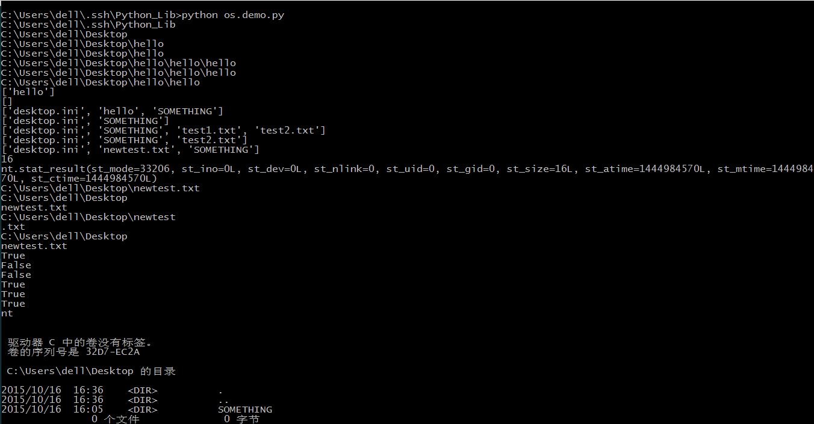
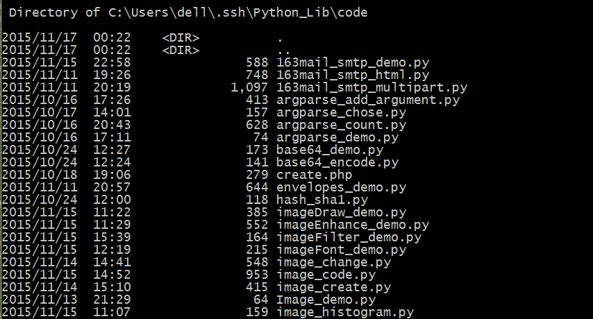
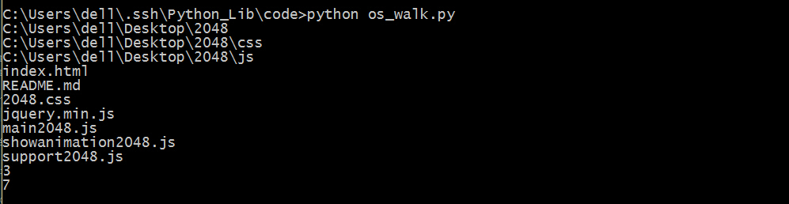

## os

非常基础的一个库，但是却实现了我一个想了很久了功能，识别目录下的所有文件。

1. 取得当前目录-- os.getcwd()
5. 更改当前目录-- os.chdir()
2. 创建一个目录-- os.mkdir()
3. 创建多级目录-- os.makedirs()
4. 删除一个目录,只能删除空目录-- os.rmdir("path")
5. 删除多个目录,删除目录及其下内容-- os.removedirs（"path）
1. 获取目录中的文件及子目录的列表-- os.listdir("path")		隐藏文件也会显示出来
3. 删除一个文件-- os.remove()
4. 文件或者文件夹重命名-- os.rename(old， new)
6. 获取文件大小-- os.path.getsize(filename)
7. 获取文件属性-- os.stat(file)
8. 修改文件权限与时间戳-- os.chmod(file)
9. 路径中加入新的内容-- os.path.join(path,file)
6. 将路径分解为目录名和文件名-- os.path.split()
7. 将目录分解为目录加文件名和文件名的扩展名-- os.path.splitext()
7. 获得路径的路径名-- os.path.dirname()
8. 获得路径的文件名-- os.path.basename()
8. 判断一个路径是否存在或是否为路径-- os.path.isdir("path")
9. 判断一个文件是否存在或这否为文件-- os.path.isfile("file")
10. 判断一个路径（目录或文件）是否存在——os.path.exists()
11. 判断一个路径是否是绝对路径-- os.path.isabs()
9. 读取和设置环境变量-- os.getenv() 与os.putenv()
10. 指示你正在使用的平台-- os.name       对于Windows，它是'nt'，而对于Linux/Unix用户，它是'posix'
11. 给出当前平台使用的行终止符--os.linesep    Windows使用'\r\n',Linux使用'\n',而Mac使用'\r'
12. 运行shell命令-- os.system()  
 >但是这个执行命令行没有返回值，直接输出，不管你有没有print                            
13. 执行shell命令-- os.popen() 
>执行命令行，返回一个file open的对象，需要read才能得到执行结果，但是还是没有返回值，如果需要更多的命令行操作，可以使用commands库
13. 终止当前进程-- os._exit(0)      
14. 循环遍历目录-- os.walk()  返回一个三元组，第一个是路径，第二个是路径下的目录，第三个是路径下的非目录。
15. 系统环境变量-- os.environ 返回系统环境变量，或者是在 HTTP 请求中的请求头。

```python
#coding=utf-8
import os

currentpath = os.getcwd()
print currentpath
changedpath = 'C:\\Users\\dell\\Desktop' 
os.chdir(changedpath)
currentpath = os.getcwd()
print currentpath
os.mkdir('hello')
changedpath = changedpath + '\\hello'
print changedpath
os.chdir(changedpath)
currentpath = os.getcwd()
print currentpath
os.makedirs('hello\\hello')
changedpath = changedpath + '\\hello\\hello'
print changedpath
os.chdir(changedpath)
currentpath = os.getcwd()
print currentpath
os.chdir('../')
currentpath = os.getcwd()
print currentpath
currentlist = os.listdir(currentpath)
print currentlist
os.rmdir('hello')
currentlist = os.listdir(currentpath)
print currentlist
os.chdir('../../')
currentpath = os.getcwd()
currentlist = os.listdir(currentpath)
print currentlist
os.removedirs('hello\\hello')
currentlist = os.listdir(currentpath)
print currentlist
FILE1 = open('test1.txt','w')
FILE1.close()
FILE2 = open('test2.txt','w')
FILE2.close()
currentlist = os.listdir(currentpath)
print currentlist
os.remove('test1.txt')
currentlist = os.listdir(currentpath)
print currentlist
os.rename('test2.txt','newtest.txt')
currentlist = os.listdir(currentpath)
print currentlist
FILE = open('newtest.txt','w')
FILE.write('THis is for test')
FILE.close()
FILESIZE = os.path.getsize('newtest.txt')
print FILESIZE
FILESTAT = os.stat('newtest.txt')
print FILESTAT
currentpath = currentpath + "\\newtest.txt"
print currentpath
(splitpath,splitfile) = os.path.split(currentpath)
print splitpath
print splitfile
(splitpath,splitfile) = os.path.splitext(currentpath)
print splitpath
print splitfile
splitpath = os.path.dirname(currentpath)
splitfile = os.path.basename(currentpath)
print splitpath
print splitfile
isdir = os.path.isfile(currentpath)
isfile = os.path.isdir(currentpath)
print isdir
print isfile
os.remove('newtest.txt')
currentpath = os.path.dirname(currentpath)
isdir = os.path.isfile(currentpath)
isfile = os.path.isdir(currentpath)
print isdir
print isfile
isexist = os.path.exists(currentpath)
print isexist
isabs = os.path.isabs(currentpath)
print isabs
osname = os.name
print osname
linesep = os.linesep
print linesep
os.system('dir')
```

保存为os_improve.py

保存为os_demo.py，运行，看一下结果      

              

重点是还可以运行shell命令。          

```python
import os
shell = "dir"
print os.system(shell)
```

保存为os_shell.py，运行，看一下结果。       

           

试一下用`os.walk()`来遍历文件。        

```python
import os

dirlist = r"C:\Users\dell\Desktop\2048"
filenum = 0
dirnum  = 0
for i,j,k in os.walk(dirlist):
	print i
for i,j,k in os.walk(dirlist):
	for item in k:
		print item
	filenum = filenum + 1
	for index in range(len(k)):
		dirnum = dirnum + 1

print filenum
print dirnum
```

保存为os_walk.py，运行，看一下结果。         

      

给一个查看目录下的所有文件的代码，如果有目录则空格表示递进关系         

```python
# coding=utf-8
import os

def showall(path,leavel=0,filenum=0,show=True):
	newnum = filenum
	currentpath = path;
	dirandfile = os.listdir(path)
	for item in dirandfile:
		newpath = os.path.join(currentpath,item)
		if os.path.isdir(newpath):
			num = showall(newpath,leavel+1,newnum,show)
			newnum = num
		else:
			newnum = newnum + 1
			tab_stop = ""
			if show:
				for tab in range(leavel):
					tab_stop = tab_stop + " "
			print tab_stop + newpath

	return newnum

if __name__ == '__main__':
	num = showall('./',show=False)
	print "File Number : " + str(num)

```

查看系统环境变量

```
# coding=utf-8

import os

environment = os.environ

for i,j in environment.items():
	print "%s : %s "%(i,j)
```

我的电脑的环境变量

```
TMP : C:\Users\dell\AppData\Local\Temp 
COMPUTERNAME : YANGWENQIANG 
USERDOMAIN : YANGWENQIANG 
GOROOT : C:\Go\ 
PSMODULEPATH : C:\Users\dell\Documents\WindowsPowerShell\Modules;C:\Program Files\WindowsPowerShell\Modules;C:\WINDOWS\system32\WindowsPowerShell\v1.0\Modules\ 
COMMONPROGRAMFILES : C:\Program Files (x86)\Common Files 
PROCESSOR_IDENTIFIER : Intel64 Family 6 Model 69 Stepping 1, GenuineIntel 
PROGRAMFILES : C:\Program Files (x86) 
PROCESSOR_REVISION : 4501 
PATH : C:\Python27\Lib\site-packages\PyQt4;C:\ProgramData\Oracle\Java\javapath;C:\Program Files\Dell\DW WLAN Card;C:\Perl64\site\bin;C:\Perl64\bin;C:\Program Files (x86)\Common Files\Intel\Shared Files\cpp\bin\Intel64;C:\Windows\system32;C:\Windows;C:\Windows\System32\Wbem;C:\Windows\System32\WindowsPowerShell\v1.0\;C:\Program Files\WIDCOMM\Bluetooth Software\;C:\Program Files\WIDCOMM\Bluetooth Software\syswow64;C:\Program Files (x86)\NVIDIA Corporation\PhysX\Common;D:\Program Files (x86)\QuickTime\QTSystem\;D:\Program Files\TortoiseSVN\bin;C:\WINDOWS\system32;C:\WINDOWS;C:\WINDOWS\System32\Wbem;C:\WINDOWS\System32\WindowsPowerShell\v1.0\;C:\Python34;C:\Python27;C:\Perl64;C:\Program Files\Java\jdk1.8.0_60\bin;D:\Program Files (x86)\Sublime text2\Sublime2\Sublime2\Sublime;C:\Users\dell\AppData\Local\Google\Chrome\Application;C:\mingw;C:\Python27\Scripts;C:\Ruby22-x64;C:\PHP;C:\curl-7.33.0-win64-ssl-sspi;C:\curl-7.33.0-win64-ssl-sspi;C:\Program Files (x86)\MySQL\MySQL Server 5.7\bin;D:\Program Files (x86)\MySQL\MySQL Server 5.7\bin;C:\sqlite3;C:\Apache24\bin;C:\gunwin32\GetGnuWin32\bin;D:\Program Files (x86)\Tesseract-OCR;C:\Users\dell\.ssh\Python_Lib\project;C:\MinGW\bin;D:\Program Files\cmder\bin;D:\Program Files\cmder;C:\Users\dell\.ssh\Python_Lib\project;C:\Go\bin;C:\Program Files (x86)\Google\Chrome\Application;D:\Program Files\nodejs\;D:\Program Files\VMare\OVFTool;D:\Program Files (x86)\Git\cmd;D:\Program Files (x86)\Git\bin;C:\Ruby22-x64\bin;D:\Program Files (x86)\Nmap;C:\Users\dell\AppData\Roaming\npm 
SYSTEMROOT : C:\WINDOWS 
PROGRAMFILES(X86) : C:\Program Files (x86) 
C_EM64T_REDIST11 : C:\Program Files (x86)\Common Files\Intel\Shared Files\cpp\ 
ASL.LOG : Destination=file 
TESSDATA_PREFIX : D:\Program Files (x86)\Tesseract-OCR\ 
TEMP : C:\Users\dell\AppData\Local\Temp 
WINDIR : C:\WINDOWS 
COMMONPROGRAMFILES(X86) : C:\Program Files (x86)\Common Files 
PROCESSOR_ARCHITECTURE : x86 
ALLUSERSPROFILE : C:\ProgramData 
LOCALAPPDATA : C:\Users\dell\AppData\Local 
FPS_BROWSER_USER_PROFILE_STRING : Default 
HOMEPATH : \Users\dell 
USERDOMAIN_ROAMINGPROFILE : YANGWENQIANG 
JAVA_HOME : C:\Program Files\Java\jdk1.8.0_60 
PROGRAMW6432 : C:\Program Files 
USERNAME : dell 
LOGONSERVER : \\MicrosoftAccount 
COMSPEC : C:\WINDOWS\system32\cmd.exe 
PROGRAMDATA : C:\ProgramData 
CLASSPATH : .;D:\Program Files (x86)\QuickTime\QTSystem\QTJava.zip;C:\Program Files\Java\jdk1.8.0_60\bin;C:\Program Files\Java\jdk1.8.0_60\lib\tools.jar;C:\Users\dell\Desktop\python\java 
FPS_BROWSER_APP_PROFILE_STRING : Internet Explorer 
AWE_DIR : D:\Program Files (x86)\Khrona LLC\Awesomium SDK\1.6.6\ 
SESSIONNAME : Console 
PATHEXT : .COM;.EXE;.BAT;.CMD;.VBS;.VBE;.JS;.JSE;.WSF;.WSH;.MSC;.PY;.RB;.RBW;.CPL 
CONFIGSETROOT : C:\WINDOWS\ConfigSetRoot 
FP_NO_HOST_CHECK : NO 
QTJAVA : D:\Program Files (x86)\QuickTime\QTSystem\QTJava.zip 
OPENSSL_CONF : C:\OpenSSL-Win32\bin\openssl.cfg 
MOZ_PLUGIN_PATH : C:\Program Files (x86)\Foxit Software\Foxit Reader Plus\plugins\ 
HOMEDRIVE : C: 
SYSTEMDRIVE : C: 
NUMBER_OF_PROCESSORS : 4 
APPDATA : C:\Users\dell\AppData\Roaming 
PROCESSOR_LEVEL : 6 
PROCESSOR_ARCHITEW6432 : AMD64 
COMMONPROGRAMW6432 : C:\Program Files\Common Files 
OS : Windows_NT 
PUBLIC : C:\Users\Public 
USERPROFILE : C:\Users\dell 
```

若是作为 cgi 脚本则也会显示 header 的请求头

```python
# coding=utf-8

import os

environment = os.environ

print "Content-type:text/html\r\n\r\n"

for i,j in environment.items():
	print "%s : %s <br />"%(i,j)
```

```
ALLUSERSPROFILE:C:\ProgramData
APPDATA:C:\Users\dell\AppData\Roaming
ASL.LOG:Destination=file
AWE_DIR:D:\Program Files (x86)\Khrona LLC\Awesomium SDK\1.6.6\
C_EM64T_REDIST11:C:\Program Files (x86)\Common Files\Intel\Shared Files\cpp\
CLASSPATH:.;D:\Program Files (x86)\QuickTime\QTSystem\QTJava.zip;%JAVA_HOME%\bin;%JAVA_HOME%\lib\tools.jar;C:\Users\dell\Desktop\python\java
COMMONPROGRAMFILES:C:\Program Files (x86)\Common Files
COMMONPROGRAMFILES(X86):C:\Program Files (x86)\Common Files
COMMONPROGRAMW6432:C:\Program Files\Common Files
COMPUTERNAME:YANGWENQIANG
COMSPEC:C:\WINDOWS\system32\cmd.exe
CONFIGSETROOT:C:\WINDOWS\ConfigSetRoot
Content-type:text/html
CONTENT_LENGTH:
CONTENT_TYPE:text/plain
Date:Thu, 18 Aug 2016 14:05:03 GMT
FP_NO_HOST_CHECK:NO
FPS_BROWSER_APP_PROFILE_STRING:Internet Explorer
FPS_BROWSER_USER_PROFILE_STRING:Default
GATEWAY_INTERFACE:CGI/1.1
GOROOT:C:\Go\
HOMEDRIVE:C:
HOMEPATH:\Users\dell
HTTP_ACCEPT:text/html,application/xhtml+xml,application/xml;q=0.9,image/webp,*/*;q=0.8
HTTP_COOKIE:_ga=GA1.1.2013049555.1445440760
HTTP_REFERER:
HTTP_USER_AGENT:Mozilla/5.0 (Windows NT 10.0; WOW64) AppleWebKit/537.36 (KHTML, like Gecko) Chrome/52.0.2743.116 Safari/537.36
JAVA_HOME:C:\Program Files\Java\jdk1.8.0_60
LOCALAPPDATA:C:\Users\dell\AppData\Local
LOGONSERVER:\\MicrosoftAccount
MOZ_PLUGIN_PATH:C:\Program Files (x86)\Foxit Software\Foxit Reader Plus\plugins\
NUMBER_OF_PROCESSORS:4
OPENSSL_CONF:C:\OpenSSL-Win32\bin\openssl.cfg
OS:Windows_NT
PATH:C:\Python27\Lib\site-packages\PyQt4;C:\ProgramData\Oracle\Java\javapath;C:\Program Files\Dell\DW WLAN Card;C:\Perl64\site\bin;C:\Perl64\bin;C:\Program Files (x86)\Common Files\Intel\Shared Files\cpp\bin\Intel64;C:\Windows\system32;C:\Windows;C:\Windows\System32\Wbem;C:\Windows\System32\WindowsPowerShell\v1.0\;C:\Program Files\WIDCOMM\Bluetooth Software\;C:\Program Files\WIDCOMM\Bluetooth Software\syswow64;C:\Program Files (x86)\NVIDIA Corporation\PhysX\Common;D:\Program Files (x86)\QuickTime\QTSystem\;D:\Program Files\TortoiseSVN\bin;C:\WINDOWS\system32;C:\WINDOWS;C:\WINDOWS\System32\Wbem;C:\WINDOWS\System32\WindowsPowerShell\v1.0\;C:\Python34;C:\Python27;C:\Perl64;C:\Program Files\Java\jdk1.8.0_60\bin;D:\Program Files (x86)\Sublime text2\Sublime2\Sublime2\Sublime;C:\Users\dell\AppData\Local\Google\Chrome\Application;C:\mingw;C:\Python27\Scripts;C:\Ruby22-x64;C:\PHP;C:\curl-7.33.0-win64-ssl-sspi;C:\curl-7.33.0-win64-ssl-sspi;C:\Program Files (x86)\MySQL\MySQL Server 5.7\bin;D:\Program Files (x86)\MySQL\MySQL Server 5.7\bin;C:\sqlite3;C:\Apache24\bin;C:\gunwin32\GetGnuWin32\bin;D:\Program Files (x86)\Tesseract-OCR;C:\Users\dell\.ssh\Python_Lib\project;C:\MinGW\bin;D:\Program Files\cmder\bin;D:\Program Files\cmder;C:\Users\dell\.ssh\Python_Lib\project;C:\Go\bin;C:\Program Files (x86)\Google\Chrome\Application;D:\Program Files\nodejs\;D:\Program Files\VMare\OVFTool;D:\Program Files (x86)\Git\cmd;D:\Program Files (x86)\Git\bin;C:\Ruby22-x64\bin;D:\Program Files (x86)\Nmap;C:\Users\dell\AppData\Roaming\npm
PATH_INFO:
PATH_TRANSLATED:C:\Users\dell\Desktop\python
PATHEXT:.COM;.EXE;.BAT;.CMD;.VBS;.VBE;.JS;.JSE;.WSF;.WSH;.MSC;.PY;.RB;.RBW;.CPL
PROCESSOR_ARCHITECTURE:x86
PROCESSOR_ARCHITEW6432:AMD64
PROCESSOR_IDENTIFIER:Intel64 Family 6 Model 69 Stepping 1, GenuineIntel
PROCESSOR_LEVEL:6
PROCESSOR_REVISION:4501
PROGRAMDATA:C:\ProgramData
PROGRAMFILES:C:\Program Files (x86)
PROGRAMFILES(X86):C:\Program Files (x86)
PROGRAMW6432:C:\Program Files
PSMODULEPATH:C:\Users\dell\Documents\WindowsPowerShell\Modules;C:\Program Files\WindowsPowerShell\Modules;C:\WINDOWS\system32\WindowsPowerShell\v1.0\Modules\
PUBLIC:C:\Users\Public
QTJAVA:D:\Program Files (x86)\QuickTime\QTSystem\QTJava.zip
QUERY_STRING:
REMOTE_ADDR:127.0.0.1
REMOTE_HOST:YangWenqiang
REQUEST_METHOD:GET
SCRIPT_NAME:/cgi-bin/environment.py
Server:SimpleHTTP/0.6 Python/2.7.10
SERVER_NAME:YangWenqiang
SERVER_PORT:8001
SERVER_PROTOCOL:HTTP/1.0
SERVER_SOFTWARE:SimpleHTTP/0.6 Python/2.7.10
SESSIONNAME:Console
SYSTEMDRIVE:C:
SYSTEMROOT:C:\WINDOWS
TEMP:C:\Users\dell\AppData\Local\Temp
TESSDATA_PREFIX:D:\Program Files (x86)\Tesseract-OCR\
TMP:C:\Users\dell\AppData\Local\Temp
USERDOMAIN:YANGWENQIANG
USERDOMAIN_ROAMINGPROFILE:YANGWENQIANG
USERNAME:dell
USERPROFILE:C:\Users\dell
WINDIR:C:\WINDOWS
```