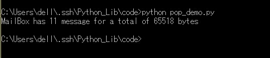

## poplib

pop也是邮箱服务的，和SMTP一起用，smtplib用来连接邮箱服务器发送邮件，poplib用来连接服务器接受邮件。  
```python
#coding=utf-8

import poplib

#邮箱信息
host = "pop.163.com"
user = "18607571914@163.com"
password = "XXXXXX"
#连接邮件服务器
p = poplib.POP3(host)
p.user(user)
p.pass_(password)

#邮箱里邮件总的信息
status = p.stat()
print "MailBox has %d message for a total of %s bytes"%(status[0],status[1])
p.quit()
```

保存为pop_demo.py，运行，看一下结果。    

      

好吧，这只是个开始，接下来我们来点复杂的。      

```python
#coding=utf-8

import poplib

#邮箱信息
host = "pop.163.com"
user = "18607571914@163.com"
password = "XXXXXX"
#连接邮件服务器
p = poplib.POP3(host)

#打印服务器欢迎信息
print p.getwelcome()

p.user(user)
p.pass_(password)

#邮箱里邮件总的信息
status = p.stat()
print "MailBox has %d message for a total of %s bytes"%(status[0],status[1])

#返回每个邮件的编号和大小
resp, mails, octets = p.list()
print mails

# 获取最新一封邮件, 注意索引号从1开始:
index = len(mails)
resp, lines, octets = p.retr(index)

print lines

#这样可以更加直观的查看邮件
msg_content = '\r\n'.join(lines)
print msg_content

#删除邮件
try:
	p.dele(index)
	print "Deleting Successful"
except:
	print "Deleting Failed"

p.quit()
```

保存为pop_second.py，运行，看一下结果。   

算了，结果就不放图了，这里已经基本上能够看到大概的邮箱的情况了，但是这还不够，我们需要查看邮件的具体内容。而具体的邮件内容就是我们发邮件时的msg对象的逆向解析了,当然，如果你在发送的时候是直接使用字符串发送过去的，那么接受到的就直接是可以识别的字符串。    

```python
#coding=utf-8

import poplib
import email
from email.parser import Parser
from email.header import decode_header
from email.utils import parseaddr

def showAttachment(msg):
	maintype=msg.get_content_maintype()
	if maintype == 'multipart':
		for part in msg.get_payload():
			showAttachment(part)
	elif maintype == 'text':
		if  not msg["Content-Disposition"]:
			pass
		else:
			print "This mail has an Attachment"
			filename = msg["Content-Disposition"].split("\"")[1]
			print "File Name: "+filename
			print ""

def showSubject(msg):
	try:
		print msg["Subject"]
		print ""
	except:
		print ""	
		pass

#邮箱信息
host = "pop.163.com"
user = "18607571914@163.com"
password = "XXXXXX"
p = poplib.POP3(host)

print p.getwelcome()+"\n"

p.user(user)
p.pass_(password)

#邮箱里邮件总的信息
status = p.stat()
print "MailBox has %d message for a total of %s bytes"%(status[0],status[1])
print "-"*80

#返回每个邮件的编号和大小
resp, mails, octets = p.list()

#显示所有邮件的主题
for index in range(1,len(mails)+1):
	resp, lines, octets = p.retr(index)
	msg_content = '\r\n'.join(lines)
	msg = Parser().parsestr(msg_content)
	print "This Is No.%s Mail Subject :"%index
	showSubject(msg)
	showAttachment(msg)

#获取最新一封邮件, 注意索引号从1开始:
print "\n\n\nThe Lastest Mail is: \n"
index = len(mails)
resp, lines, octets = p.retr(index)
msg_content = '\r\n'.join(lines)
msg = Parser().parsestr(msg_content)
print "Subject :"
showSubject(msg)
showAttachment(msg)

p.quit()
```
保存为pop_third.py，这个代码的功能是读取所有邮件的主题，和最近一封邮件的内容。       
但是可以看到在读取邮件标题的时候还是一堆乱码，需要对其进行解码。  
     
```python
#coding=utf-8

import poplib
import email
from email.parser import Parser
from email.header import decode_header
from email.utils import parseaddr

def showAttachment(msg):
	maintype=msg.get_content_maintype()
	if maintype == 'multipart':
		for part in msg.get_payload():
			showAttachment(part)
	elif maintype == 'text':
		if  not msg["Content-Disposition"]:
			pass
		else:
			print "-"*50
			print "This mail has an Attachment"
			filename = msg["Content-Disposition"].split("\"")[-2]
			print "File Name: "+filename
			print ""

def downloadAttachment(msg):
	maintype=msg.get_content_maintype()
	if maintype == 'multipart':
		for part in msg.get_payload():
			downloadAttachment(part)
	elif maintype == 'text':
		if  not msg["Content-Disposition"]:
			pass
		else:
			download = raw_input("Do You Want To Download The Attachment?[yes|no]\n")
			if download.lower().startswith("no"):
				print "OK,Do Not Download"
				pass
			else:
				filename = msg["Content-Disposition"].split("\"")[-2]
				downloadfile = open(filename,"wb")
				downloadfile.write(msg.get_payload(decode=True))
				downloadfile.close()
				print "Download Successful"

def showSubject(msg):
	try:
		decode = "utf-8"
		if decode_header(msg["Subject"])[0][1]=="gbk":
			print decode_header(msg["Subject"])[0][0].decode("gbk").encode("utf-8")
		print unicode(decode_header(msg["Subject"])[0][0],decode)	
	except:
		print ""	
		pass

def showMoreInfo():
	try:
		print "From: " + msg["From"]
		print "To  : " + msg["to"]
	except:
		print ""
		pass

def showContent(msg):
	contentType = msg.get_content_type()
	if contentType.lower().startswith("multipart"):
		for i in msg.get_payload():
			showContent(i)
	elif contentType.lower().endswith("base64"):
		pass
	else:
		print msg.get_payload(decode=True)


#邮箱信息
host = "pop.163.com"
user = "18607571914@163.com"
password = "XXXXXX"
p = poplib.POP3(host)

print p.getwelcome()+"\n"

p.user(user)
p.pass_(password)

#邮箱里邮件总的信息
status = p.stat()
print "MailBox has %d message for a total of %s bytes"%(status[0],status[1])
print "-"*80

#返回每个邮件的编号和大小
resp, mails, octets = p.list()

#显示所有邮件的主题
for index in range(1,len(mails)+1):
	resp, lines, octets = p.retr(index)
	msg_content = '\r\n'.join(lines)
	msg = Parser().parsestr(msg_content)
	print "This Is No.%s Mail Subject :"%index
	showSubject(msg)
	showAttachment(msg)

#获取最新一封邮件, 注意索引号从1开始:
print "\n\n\nThe Lastest Mail is: \n"
index = len(mails)
resp, lines, octets = p.retr(index)
msg_content = '\r\n'.join(lines)
msg = Parser().parsestr(msg_content)
showMoreInfo()
print "Subject :"
showSubject(msg)
print "Content :"
showContent(msg)
showAttachment(msg)

#是否下载附件
downloadAttachment(msg)

p.quit()

```
