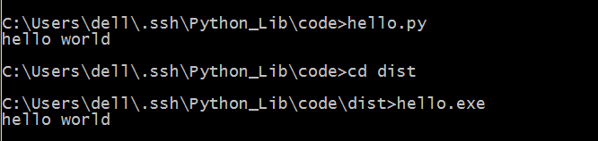

##py2exe

如果你写好了一个软件，想给更多的人使用，那么公布你的源代码是个不错的主意，但可能不是最好的主意，把它做成二进制可执行文件公布出去，想必会更好一些。

那么py2exe就是这样一个工具，将你的Python文件编译为可执行文件，方便在没有安装Python的Windows上运行。

###安装

在[这里](http://sourceforge.net/projects/py2exe/files/py2exe/0.6.9/)下载对应的系统和Python版本安装。

###一个简单的例子

```python
#coding=utf-8
print "hello world"

```

保存为hello.py

```python
#coding=utf-8
from distutils.core import setup
import py2exe

setup(console=['hello.py'])
```

保存为setup.py

将以上两个文件放在同一目录下，执行`python setup.py py2exe`，就会在当前目录下产生两个新的文件夹，在dist文件夹下就有已经编译好的hello.exe



###PyQt的编译

```python
#coding=utf-8
from distutils.core import setup
import py2exe
import sys
 
#this allows to run it with a simple double click.
sys.argv.append('py2exe')
 
py2exe_options = {
        "includes": ["sip"],
        "dll_excludes": ["MSVCP90.dll",],
        "compressed": 1,
        "optimize": 2,
        "ascii": 0,
        "bundle_files": 1,
        }
 
setup(
      name = '2048 Game',
      version = '1.0',
      author  = 'Windard Yang',
      author_email = '1106911190@qq.com',
      # windows = ['2048.py',], 
      windows = [{'script':'2048.py','icon_resources': [(0, '2048.ico')],}], 
      zipfile = None,
      options = {'py2exe': py2exe_options}
      )
```

###pygame的编译

```python
#coding=utf-8

try:
    from distutils.core import setup
    import py2exe, pygame
    from modulefinder import Module
    import glob, fnmatch
    import sys, os, shutil
except ImportError, message:
    raise SystemExit,  "Sorry, you must install py2exe, pygame. %s" % message

# 这个函数是用来判断DLL是否是系统提供的（是的话就不用打包）
origIsSystemDLL = py2exe.build_exe.isSystemDLL
def isSystemDLL(pathname):
    # 需要hack一下，freetype和ogg的dll并不是系统DLL
    if os.path.basename(pathname).lower() in ("libfreetype-6.dll", "libogg-0.dll", "sdl_ttf.dll"):
        return 0
    return origIsSystemDLL(pathname)
# 把Hack过的函数重新写回去
py2exe.build_exe.isSystemDLL = isSystemDLL

# 这个新的类也是一个Hack，使得pygame的默认字体会被拷贝
class pygame2exe(py2exe.build_exe.py2exe):
    def copy_extensions(self, extensions):
        # 获得pygame默认字体
        pygamedir = os.path.split(pygame.base.__file__)[0]
        pygame_default_font = os.path.join(pygamedir, pygame.font.get_default_font())
        # 加入拷贝文件列表
        extensions.append(Module("pygame.font", pygame_default_font))
        py2exe.build_exe.py2exe.copy_extensions(self, extensions)

# 这个类是我们真正做事情的部分
class BuildExe:
    def __init__(self):
        #------------------------------------------------------#
        ##### 对于一个新的游戏程序，需要修改这里的各个参数 #####
        #------------------------------------------------------#

        # 起始py文件
        self.script = "MyGames.py"
        # 游戏名
        self.project_name = "MyGames"
        # 游戏site
        self.project_url = "about:none"
        # 游戏版本
        self.project_version = "0.0"
        # 游戏许可
        self.license = "MyGames License"
        # 游戏作者
        self.author_name = "xishui"
        # 联系电邮
        self.author_email = "blog@eyehere.net"
        # 游戏版权
        self.copyright = "Copyright (c) 3000 xishui."
        # 游戏描述
        self.project_description = "MyGames Description"
        # 游戏图标(None的话使用pygame的默认图标)
        self.icon_file = None
        # 额外需要拷贝的文件、文件夹(图片，音频等)
        self.extra_datas = []
        # 额外需要的python库名
        self.extra_modules = []
        # 需要排除的python库
        self.exclude_modules = []
        # 额外需要排除的dll
        self.exclude_dll = ['']
        # 需要加入的py文件
        self.extra_scripts = []
        # 打包Zip文件名(None的话，打包到exe文件中)
        self.zipfile_name = None
        # 生成文件夹
        self.dist_dir ='dist'

    def opj(self, *args):
        path = os.path.join(*args)
        return os.path.normpath(path)

    def find_data_files(self, srcdir, *wildcards, **kw):
        # 从源文件夹内获取文件
        def walk_helper(arg, dirname, files):
            # 当然你使用其他的版本控制工具什么的，也可以加进来
            if '.svn' in dirname:
                return
            names = []
            lst, wildcards = arg
            for wc in wildcards:
                wc_name = self.opj(dirname, wc)
                for f in files:
                    filename = self.opj(dirname, f)

                    if fnmatch.fnmatch(filename, wc_name) and not os.path.isdir(filename):
                        names.append(filename)
            if names:
                lst.append( (dirname, names ) )

        file_list = []
        recursive = kw.get('recursive', True)
        if recursive:
            os.path.walk(srcdir, walk_helper, (file_list, wildcards))
        else:
            walk_helper((file_list, wildcards),
                        srcdir,
                        [os.path.basename(f) for f in glob.glob(self.opj(srcdir, '*'))])
        return file_list

    def run(self):
        if os.path.isdir(self.dist_dir): # 删除上次的生成结果
            shutil.rmtree(self.dist_dir)

        # 获得默认图标
        if self.icon_file == None:
            path = os.path.split(pygame.__file__)[0]
            self.icon_file = os.path.join(path, 'pygame.ico')

        # 获得需要打包的数据文件
        extra_datas = []
        for data in self.extra_datas:
            if os.path.isdir(data):
                extra_datas.extend(self.find_data_files(data, '*'))
            else:
                extra_datas.append(('.', [data]))

        # 开始打包exe
        setup(
            cmdclass = {'py2exe': pygame2exe},
            version = self.project_version,
            description = self.project_description,
            name = self.project_name,
            url = self.project_url,
            author = self.author_name,
            author_email = self.author_email,
            license = self.license,

            # 默认生成窗口程序，如果需要生成终端程序(debug阶段)，使用：
            # console = [{
            windows = [{
                'script': self.script,
                'icon_resources': [(0, self.icon_file)],
                'copyright': self.copyright
            }],
            options = {'py2exe': {'optimize': 2, 'bundle_files': 1,
                                  'compressed': True,
                                  'excludes': self.exclude_modules,
                                  'packages': self.extra_modules,
                                  'dist_dir': self.dist_dir,
                                  'dll_excludes': self.exclude_dll,
                                  'includes': self.extra_scripts} },
            zipfile = self.zipfile_name,
            data_files = extra_datas,
            )

        if os.path.isdir('build'): # 清除build文件夹
            shutil.rmtree('build')

if __name__ == '__main__':
    if len(sys.argv) < 2:
        sys.argv.append('py2exe')
    BuildExe().run()
    raw_input("Finished! Press any key to exit.")
```