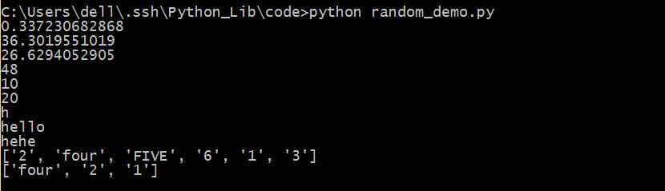

##random

功能非常简单，就是生成随机数了。               
1. random.random()用于生成一个0到1之间的随机浮点数：0<=n<=1 。      
2. random.uniform(a,b)用来生成一个a与b之间的随机符号数，并不指定a与b的相对大小。          
3. random.randint(a,b)用来生成一个a与b之间的整数，其中a是下限，b是上限。             
4. random.randrange([start], stop[, step])用来生成指定范围，按基数递增的一个集合中的一个随机元素。random.randrange(10,100,2)相当于random.choice(range(10,100,2))。         
5. random.choice(sequence)用来生成参数中的一个随机元素，参数的类型可以是列表，元组或者字符串，字典等。        
6. random.shuffle(list)用来将一个列表中的元素打乱，返回原来的数组。
7. random.sample(sequence, k)用来从指定序列中获得指定长度的片段，参数类型不定。         

```python
#coding=utf-8
import random

#生成一个0到1之间的随机数
print random.random()

#生成一个a与b之间的随机符号数
print random.uniform(10,50)
print random.uniform(50,10)

#生成一个大于a小于b的随机整数
print random.randint(10,50)

#生成一个指定范围内按基数递增的集合中的一个随机元素
print random.randrange(10,50,10)
#上一句相当于这一句
print random.choice(range(10,50,10))

#从指定序列中随机选取一个元素
print random.choice("hello,world")
print random.choice(['hello','world'])
print random.choice(('hello','world',"hehe"))

#将一个列表中的序列打乱,返回原来的数组
p = ['1','2','3','four','FIVE','6']
random.shuffle(p)
print p

#生成一个指定序列中指定长度的片段
p = ['1','2','3','four','FIVE','6']
print random.sample(p,3)
```

保存为random_demo.py，运行，看一下结果。              
          
