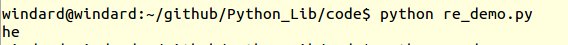
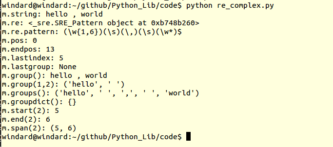

## re
这是python的正则表达式库，现在几乎所有的编程语言都支持正则表达式了，无可否认，正则表达式确实强大。

### 正则表达式基本语法

与其他编程语言的正则表达式基本类似。

|特殊字符|匹配说明|
|--          |---         |
| \          |转义字符  |
|\d         |单个数字 [0-9] |
|\D         |单个非数字 |
|\s          |单个空白字符[<空格>\t\n\r\f\v]|
|\S          |单个非空白字符 |
|\w         |单个单词字符[a-zA-Z0-9]|
|\W        |单个非单词字符[^\w]|
|\A         |匹配字符串的开头|
|\Z         |匹配字符串的结尾|
|\b         |匹配仅在开头或结尾的空字符|
|\B         |匹配不在开头或结尾的空字符|
|\\\\          |匹配字符\|
| .           |匹配除换行符'\n'之外的任意字符|
|*           |匹配前一个字符零次到无限次|
|+          |匹配前一个字符一次到无限次|
|？         |匹配前一个字符零次或一次   |
|{m}       |匹配前一个字符m次|
|{m,n}   |匹配前一个字符m次到n次|
|^         |匹配字符串的开头，也可以在一个字符集内表示取非|
|\$          |匹配字符串的结尾|
|[……]        |表示一个字符集|
|(……)   |表示一个分组|


## 基本使用

python提供了两种不同的基本正则匹配，分别是match和search。

match是从字符串开头做匹配，search是从字符串中做任意匹配，返回值都是一个Match实例,他们的用法基本一致，`match(pattern, string, flags=0)`和`search(pattern, string, flags=0)`。

在python里面为了避免反斜杠\\的困扰，一般都使用原生字符串，即使用r'XXX'

```

>>> a = re.match(r"he","hello , world")
>>> a
<_sre.SRE_Match object at 0xb70afdb0>
>>> a.group()
'he'
>>> b = re.search(r"wo","hello , world")
>>> b
<_sre.SRE_Match object at 0xb70afdb0>
>>> b.group()
'wo'
>>> c = re.match(r"wo","hello , world")
>>> c
>>> type(c)
<type 'NoneType'>
>>> re.match(r'(hello) , (world)', a).group(0)
'hello , world'
```

但是这种匹配一般只能找到匹配的一个，有时我们需要找到所有的匹配，这就需要findall函数，用法也与上面的两个一样`findall(pattern, string, flags=0)`,直接返回一个数组，数组的每一项都是字符串。

```

>>> d = re.findall(r"wo","hello , world")
>>> d
['wo']
>>> e = re.findall(r"\w","hello , world")
>>> e
['h', 'e', 'l', 'l', 'o', 'w', 'o', 'r', 'l', 'd']

```

除了查找之外，正则表达式还有两个很重要的功能就是分割与替换，在这里分别是sub和split，用法是`sub(pattern, repl, string, count=0, flags=0)`和`split(pattern, string, maxsplit=0, flags=0)`,返回改变之后的字符串，传入值保持不变。

> repl 即可以为一个字符串，也可以为一个可执行函数

```

>>> a = "hello , world"
>>> b = re.sub(r"o","0","hello , world")
>>> b
'hell0 , w0rld'
>>> a
'hello , world'
>>> c = re.split(r"\s","hello , world")
>>> c
['hello', ',', 'world']
>>> a
'hello , world'
>>> re.sub(r'(hello) , (world)', r'\2 , \1', a)
'world , hello'
>>> '%s , %s' % re.match(r'(hello) , (world)', a).groups()
'hello , world'
>>> '%s , %s' % (re.match(r'(hello) , (world)', a).group(2), re.match(r'(hello) , (world)', a).group(1))
'world , hello'
```

关于sub函数，还有一个subn函数，用法与sub一致，但是返回一个元组，由改变之后的字符串和改变的个数组成

```

>>> b = re.subn(r"o","0","hello , world")
>>> b
('hell0 , w0rld', 2)
>>> a
'hello , world'
```

## 总结

- 使用 match 从头开始匹配，使用 search 从中匹配
- 使用 group 查看匹配结果，使用 groups 查看匹配分组结果

## 高级使用
高级使用是先将正则表达式的字符串形式编译成Pattern实例，然后用Pattern实例处理字符串并得到一个Match实例，再对这个Match实例进行处理。

```


import re

pattern = re.compile(r"he")

match = pattern.match("hello , world")

if match:
    print match.group()

```

保存为re_demo.py，执行，看一下结果。


compile函数`compile(pattern, flags=0)`，这里的参数flags和上面的函数里的flags都是匹配模式，可以使用`|`表示同时生效，可选的参数有：
1. re.I(re.IGNORECASE): 忽略大小写 <br>
2. re.M(re.MULTILINE): 多行模式，改变'^'和'\$'的行为 <br>
3. re.S(re.DOTALL): 点任意匹配模式，改变'.'的行为 <br>
4. re.L(re.LOCALE): 使预定字符类 \w \W \b \B \s \S 取决于当前区域设定 <br>
5. re.U(re.UNICODE): 使预定字符类 \w \W \b \B \s \S \d \D 取决于unicode定义的字符属性 <br>
6. re.X(re.VERBOSE): 详细模式。这个模式下正则表达式可以是多行，忽略空白字符，并可以加入注释 <br>

Match对象 是一次匹配的结果，包含很多关于此次匹配的信息

属性：
1. string: 匹配时使用的文本
2. re: 匹配时使用的Pattern对象
3. pos: 文本中正则表达式开始搜索的索引。
4. endpos: 文本中正则表达式结束搜索的索引。
5. lastindex: 最后一个被捕获的分组在文本中的索引。如果没有被捕获的分组，将为None
6. lastgroup: 最后一个被捕获的分组的别名。如果这个分组没有别名或者没有被捕获的分组，将为None

方法：
1. group([group1, …]): 获得一个或多个分组截获的字符串；指定多个参数时将以元组形式返回。group1可以使用编号也可以使用别名；编号0代表整个匹配的子串；不填写参数时，返回group(0),相当于全部返回；没有截获字符串的组返回None；截获了多次的组返回最后一次截获的子串
2. groups([default]): 以元组形式返回全部分组截获的字符串。相当于调用group(1,2,…last)。default表示没有截获字符串的组以这个值替代，默认为None
3. groupdict([default]): 返回以有别名的组的别名为键、以该组截获的子串为值的字典，没有别名的组不包含在内。default含义同上
4. start([group]): 返回指定的组截获的子串在string中的起始索引（子串第一个字符的索引）。group默认值为0
5. end([group]): 返回指定的组截获的子串在string中的结束索引（子串最后一个字符的索引+1）。group默认值为0
6. span([group]): 返回(start(group), end(group))
7. expand(template): 将匹配到的分组代入template中然后返回。template中可以使用\id或\g<id>、\g<name>引用分组，但不能使用编号0。\id与\g<id>是等价的；但\10将被认为是第10个分组，如果你想表达\1之后是字符'0'，只能使用\g<1>0

```python


import re

pattern = re.compile(r"(\w{1,6})(\s)(\,)(\s)(\w*)$")
m = re.match(pattern,"hello , world")

print "m.string:", m.string
print "m.re:", m.re
print "m.re.pattern:", m.re.pattern
print "m.pos:", m.pos
print "m.endpos:", m.endpos
print "m.lastindex:", m.lastindex
print "m.lastgroup:", m.lastgroup

print "m.group():", m.group()
print "m.group(1,2):", m.group(1, 2)
print "m.groups():", m.groups()
print "m.groupdict():", m.groupdict()
print "m.start(2):", m.start(2)
print "m.end(2):", m.end(2)
print "m.span(2):", m.span(2)

```

保存为re_complex.py，运行，看一下结果。



### 贪婪与懒惰

正则表达式默认是贪婪模式，即匹配尽可能多的字符，如 `+` 匹配一个到无穷多个，就匹配尽可能多的到不匹配为止，如果采用懒惰模式，则就刚好匹配一个，不再多了。

|代码 / 语法 |匹配说明|
|--          |---         |
|*?          |重复任意次，但尽可能的少重复            |
|+?          |重复1次或更多次，但尽可能少重复            |
|??          |重复0次或1次，但尽可能少重复            |
|{n, m}?     |重复n到m次，但尽可能少重复            |
|{n,}?       |重复n次以上，但尽可能少重复            |

```
import re

m = re.match(r'<html>(.*)', "<html><body><title>this is title</title></body></html>>")

print m.group()

m = re.match(r'<html>(.*?)', "<html><body><title>this is title</title></body></html>>")

print m.group()

```

输出

```
<html><body><title>this is title</title></body></html>>
<html>
```

## 参考链接

[正则表达式30分钟入门教程](http://deerchao.net/tutorials/regex/regex.htm)