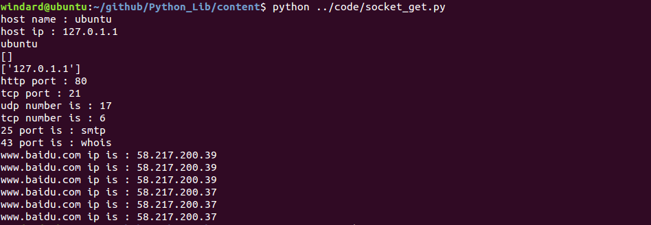

## socket

socket网络编程，我其实一直是拒绝讲这个的，因为这个socket涉及到的知识面之广，我怕我个人也难以解释清楚。

socket是一种基于TCP/IP协议的，在传输层与应用层之间进行信息交流的网络通信方式，它主要用于在同一台主机或不同的主机的进程之间的通信。

TCP/IP协议是一套使用使用广泛的通信协议的合集。

正如在全中国推行普通话一样，通信协议就是通信标准，不同的语言或者信息在同样的标准下可以相互传输并正常交流，这就是通信协议的功能。

在这里我们就不再深入的研究TCP/IP协议，它包括很多的内容，具体的可以看一下：
《TCP/IP协议详解》

[协议森林](http://www.cnblogs.com/vamei/archive/2012/12/05/2802811.html)

这是一张TCP/IP参考模型图。


可以看到图中除了TCP协议还有UDP协议。
TCP协议需要经过三次握手才能建立持久稳定的连接，而UDP协议只管收发信息，并不会管是否接受。
TCP协议是持久的，有效的，可靠的。
UDP协议是快速的，简单的，少量的。
socket对TCP和UDP都支持。

那么接下来让我们看一下socket在哪里呢。


socket抽象层是在TCP与UDP协议的运输层之上的与应用层连接的抽象层，也就是说socket能够通过使用TCP协议或者UDP协议来实现很多相关的应用性协议功能的，比如说http，https，FTP，smtp，DNS等。

因为socket起源于Unix，Unix/Linux的基本原则之一就是`一切皆文件`，都可以用`打开(open )-->读写(read/write)-->关闭(close)`模式来进行操作。

所以socket的使用是非常简单的，如下图所示。


网络通信之间都是至少需要一个服务器端和一个客户端的，我们的socket就先从简单的客户端开始。

#### 简单的TCP协议的网络客户端

```python
#coding=utf-8
import socket,sys

host = sys.argv[1]
port = int(sys.argv[2])

s = socket.socket(socket.AF_INET,socket.SOCK_STREAM)
try:
	s.connect((host,port))
	print "Connect Successful"
except:
	print "Connect Failed"

s.send("hello server")

buf = s.recv(1024)
print "Received From Sercer : " + buf
```

保存为socket_client.py，运行，看一下结果。


可以看到，我先是在本机开了一个ftp服务器，用socket可以成功连接上去，然后就是连接百度的http服务器，看到也连接成功了，最后一个是连接后面的socket服务器，同样的返回了服务器的回复。可是为什么百度的http服务器没有回复呢？因为我们向它发送的请求不对,如果想要得到返回数据，我们需要发送一个GET请求,`GET / \HTTP1.1\r\n\r\n`。

#### 简单的TCP协议的网络服务器

```python
#coding=utf-8
import socket

host = "127.0.0.1"
port = 8081

s = socket.socket(socket.AF_INET,socket.SOCK_STREAM)
s.bind((host,port))
s.listen(5)

print "Server is running on port %s Press Ctrl-C to stop"%port

while 1:
	clientsock,clientaddr = s.accept()
	print "Welcome from %s : %s"%(clientaddr[0],clientaddr[1])
	resquest = clientsock.recv(1024)
	print "Received From client : " + resquest
	clientsock.send("Hello client")
	clientsock.close()

s.close()
```

保存为socket_server.py，运行，看一下结果。


以上就是我们的socket的一个简单的使用了，接下来我们详细的讲解一下socket客户端和服务器端的相应的功能。

> 在 Windows 下无法使用 Ctrl + C 停止 socket 服务器，需要使用 Ctrl + Break。 <br>
> 然而在很多笔记本上没有 Break 键，使用 Fn + B 代替 Break 键，即 Ctrl + Fn + B 停止 socket 服务器端。


#### 建立一个socket客户端
1. 创建socket对象
`socketobject = socket.socket(family=AF_INET[,type=SOCK_STREAM[,protocal=0]])`
family，协议族，有`AF_INET`包括internet地址，`AF_INET6`包括ipv6的internet地址，`AF_UNIX`同一台机器上,family默认为`AF_INET`。
type，类型，有`SOCK_STREAM`数据流套接字，`SOCK_DGRAM`数据报套接字，`SOCK_RAW`原始套接字,type默认为`SOCK_STREAM`。
protocal，指定协议，有`IPPROTO_TCP`TCP协议，`IPPTOTO_UDP`UDP协议，`IPPROTO_SCTP`SCTP协议,`IPPROTO_TIPC`TIPC协议，默认为0，即自动选择type类型对应的默认协议。

2. 根据主机和端口找到socket并连接
`socketobject.connect((host,port))`
host和port构成一个元组。

3. 发送和接收数据
`socketobject.recv()`和`socketobject.send()`接收和发送数据。

#### 建立一个socket服务器
1. 创建一个socket对象
`socketcobject = socket.socket(family[[,type])`

2. 将socket绑定到一个指定端口上
`socketobject.bind((host,port))`
host和port构成一个元组，如果host为`0.0.0.0`或者为空时表示其可以接受所有ip的连接,如果port为0,即表示动态的选择一个端口。

3. 设置socket监听数目并开始监听
`socketobject.listen(number)`                                 number大于0,如果同时有多个客户端连接，即进入队列，若队列已满，则拒绝进入。

4. 连接客户端
`client = socketobject.accept()`
client是一个socket对象和socket信息的元组。

5. 发送和接收数据
`clientobject.recv()`和`clientobject.send()`接收和发送数据。
发送数据还可以用`clientobject.sendall()`

6. 关闭客户端连接
`clientobject.close()`

7. 关闭socket服务器端
`socketobject.close()`

#### socketobject的其他函数
1. socketobject.settimeout()
2. socketobject.gettimeout()
3. socketobject.getpeername()
4. socketobject.getsocketname()
5. socketobject.getsocketoption()

```python
#coding=utf-8
import socket,sys

host = sys.argv[1]
port = int(sys.argv[2])

s = socket.socket(socket.AF_INET,socket.SOCK_STREAM)
try:
	s.connect((host,port))
	print "Connect Successful"
except:
	print "Connect Failed"

s.send("hello server")

timeout = s.gettimeout()
print timeout

s.settimeout(2)

timeout = s.gettimeout()
print timeout

buf = s.recv(1024)
print "Received From Sercer : " + buf
```

保存为socket_client_improve.py，运行，看一下结果。


#### socket的其他功能函数
1. socket.gethostname()
2. socket.gethostbyname(host)
3. socket.gethostbyaddr(host)
4. socket.getservbyname(servicename[,protocolname])
5. socket.getprotobyname(name)
6. socket.getservbyport(port[,protocolname])
7. socket.getaddrinfo(host,port[,family])
8. socket.setdefaulttimeout()
9. socket.getdefaulttimeout()
10. socket.ssl()

```python
#coding=utf-8

import socket

hostname = socket.gethostname()
print "host name : " + hostname

hostip = socket.gethostbyname(hostname)
print "host ip : " + hostip

host = socket.gethostbyaddr(hostip)
for item in host:
	print item

httpport = socket.getservbyname("http")
print "http port : " + str(httpport)

ftpport = socket.getservbyname("ftp","tcp")
print "tcp port : " + str(ftpport)

udpnumber = socket.getprotobyname("udp")
print "udp number is : " + str(udpnumber)

tcpnumber = socket.getprotobyname("tcp")
print "tcp number is : " + str(tcpnumber)

servivename = socket.getservbyport(25)
print "25 port is : " + servivename

servivename = socket.getservbyport(43)
print "43 port is : " + servivename

addrinfo = socket.getaddrinfo("www.baidu.com",None)
for item in addrinfo:
	print "www.baidu.com ip is : " + item[4][0]
```

保存为socket_get.py，运行，看一下结果。




#### IP 地址与数字的相互转换

IPv4 的地址与数字相互转换

```
ip2num = lambda x:sum([256**j*int(i) for j,i in enumerate(x.split('.')[::-1])])
num2ip = lambda x: '.'.join([str(x/(256**i)%256) for i in range(3,-1,-1)])
```

#### 可复用的服务器端

我们现在的服务器端虽然是可以监听多个客户端连接，但是如果有一个客户端已经连接上却长时间占据着不结束的话，就会阻塞后面客户端的连接。

所以为了可复用的服务器端，我们想到可以用多线程，来避免客户端阻塞。

```python
#coding=utf-8

import socket
import thread

host = "127.0.0.1"
port = 8081

s = socket.socket(socket.AF_INET,socket.SOCK_STREAM)
s.bind((host,port))
s.listen(5)

def connect(clientsock,clientaddr):
	print "Welcome from %s : %s"%(clientaddr[0],clientaddr[1])
	clientsock.send("Hello client \n")
	while 1:
		resquest = clientsock.recv(1024)
		while not len(resquest):
			break
		print "Received From No.%s client : "%clientaddr[1] + resquest,

print "Server is running on port %s Press Ctrl-C to stop"%port

while 1:
	clientsock,clientaddr = s.accept()
	thread.start_new_thread(connect ,(clientsock,clientaddr))

s.close()
```

保存为socket_server_thread.py，运行，看一下结果。

现在可以通过多个telnet来与服务器端相连接了，但是这里有一个新的问题，每一次当关闭服务器端之后，再次打开的时候就会报出端口已被占的错误。


因为在你的socket端口在关闭之后系统会自动为你保存一段时间，防止你再次需要时被其他服务占用，那么我们可以通过可重用套接字来解决这个问题。

```python
#coding=utf-8

import socket
import thread

def connect(clientsock,clientaddr):
	print "Welcome from %s : %s"%(clientaddr[0],clientaddr[1])
	clientsock.send("Hello client \n")
	while 1:
		resquest = clientsock.recv(1024)
		while not len(resquest):
			break
		print "Received From No.%s client : "%clientaddr[1] + resquest,


host = "127.0.0.1"
port = 8081

s = socket.socket(socket.AF_INET,socket.SOCK_STREAM)

old_state = s.getsockopt(socket.SOL_SOCKET,socket.SO_REUSEADDR)
print "Old State is : " + str(old_state)

s.setsockopt(socket.SOL_SOCKET,socket.SO_REUSEADDR,1)
new_state = s.getsockopt(socket.SOL_SOCKET,socket.SO_REUSEADDR)
print "New State is : " + str(new_state)

s.bind((host,port))
s.listen(5)

print "Server is running on port %s Press Ctrl-C to stop"%port

while 1:
	clientsock,clientaddr = s.accept()
	thread.start_new_thread(connect ,(clientsock,clientaddr))

s.close()
```

保存为socket_server_sockopt.py，运行，看一下结果。


#### 异步 IO 的 socket 程序

在多个客户端连接的时候，服务器就会阻塞，一般可以采用的解决办法有 多线程，多进程，异步 IO ，协程等，我们来试一下 异步 IO 的操作，常用的异步 IO 操作有 select ， poll ，epoll ， kqueue 等，可以在 Windows 上使用的只有 select ，支持 Linux 设备的是select ， poll ，epoll 等，而 kqueue 是 Mac 上的。

用来测试 异步 IO 的服务器端

```
# coding=utf-8

import socket, traceback, time

host = ''
port = 8081

s = socket.socket(socket.AF_INET, socket.SOCK_STREAM)
s.setsockopt(socket.SOL_SOCKET, socket.SO_REUSEADDR, 1)
s.bind((host, port))
s.listen(5)

while 1:
	try:
		clientsock, clientaddr = s.accept()
	except KeyboardInterrupt:
		raise
	except:
		traceback.print_exc()
		continue

	try:
		print "Got connection from", clientsock.getpeername()
		while 1:
			try:
				clientsock.sendall(time.asctime()+'\n')
			except:
				break
			time.sleep(5)
	except (KeyboardInterrupt, SystemExit):
		raise
	except:
		traceback.print_exc()

	try:
		clientsock.close()
	except KeyboardInterrupt:
		raise
	except:
		traceback.print_exc()

```

使用 poll 的异步 IO 操作，在 Windows 下无法运行

```
# coding=utf-8 

import socket, sys, select

port = 8081
host = 'localhost'

spinsize = 10
spinpos  = 0
spindir  = 1

def spin():
	global spinsize, spinpos, spindir
	spinstr = '.'*spinpos + '|' +'.'*(spinsize -spinpos -1)
	sys.stdout.write('\r' + spinstr + ' ')
	sys.stdout.flush()

	spinpos += spindir

	if spinpos < 0:
		spindir = 1
		spinpos = 1
	elif spinpos >= spinsize:
		spinpos -= 2
		spindir = -1

s = socket.socket(socket.AF_INET, socket.SOCK_STREAM)
s.connect((host, port))

p = select.poll()
p.register(s.fileno(), select.POLLIN | select.POLLERR | select.POLLHUP)

while 1:
	results = p.poll(50)
	if len(results):
		if results[0][1] == select.POLLIN:
			data = s.recv(4096)
			if not len(data):
				print "\rRemote end closed and connection; exiting."
				break
			sys.stdout.write('\rReceived: '+data)
			sys.stdout.flush()
		else:
			print "\rProblem occured; exiting."
			sys.exit(0)
	spin()

```

使用 select 的异步 IO 操作，跨平台。

```
# coding=utf-8

import socket, sys, select

port = 8081
host = 'localhost'

spinsize = 10
spinpos  = 0
spindir  = 1

def spin():
	global spinsize, spinpos, spindir
	spinstr = '.'*spinpos + '|' +'.'*(spinsize -spinpos -1)
	sys.stdout.write('\r' + spinstr + ' ')
	sys.stdout.flush()

	spinpos += spindir

	if spinpos < 0:
		spindir = 1
		spinpos = 1
	elif spinpos >= spinsize:
		spinpos -= 2
		spindir = -1

s = socket.socket(socket.AF_INET, socket.SOCK_STREAM)
s.connect((host, port))

while 1:
	infds, outfds, errfds = select.select([s], [], [s], 0.05)
	if len(infds):
		data = s.recv(4096)
		if not len(data):
			print "\rRemote end closed connection:exiting."
			break

		sys.stdout.write('\rReceived: '+data)
		sys.stdout.flush()

	if len(errfds):
		print "\rProblem occured;exiting."
		sys.exit(0)

	spin()
```

#### UDP 连接
UDP 是数据报协议，非面向连接的协议。

socket_udp_server.py

```
# coding=utf-8

import socket
from time import ctime

host = '127.0.0.1'
port = 1234
bufsize = 1024

udpsock = socket.socket(socket.AF_INET, socket.SOCK_DGRAM)
udpsock.bind((host, port))

while 1:
	print "Waiting for message ... "
	data , addr = udpsock.recvfrom(bufsize)
	udpsock.sendto('[%s] %s'%(ctime(), data), addr)
	print ' ... received from and teturned to:', addr

udpsock.close()
```

socket_udp_client.py

```
# coding=utf-8

import socket

host = '127.0.0.1'
port = 1234

bufsize = 1024

udpsock = socket.socket(socket.AF_INET, socket.SOCK_DGRAM)

while 1:
	data = raw_input(">")
	if not data:
		break
	udpsock.sendto(data, (host, port))
	data, addr = udpsock.recvfrom(bufsize)
	if not data:
		break
	print data

udpsock.close()
```

#### socket聊天服务器

聊天服务器用到了一个新的库，select,用于动态的监听所有的io网络，并返回可用的io。这里涉及到一些同步异步，阻塞非阻塞的内容，在我的另一片博客里有详细的讲解。

```python
#coding=utf-8

import sys
import socket
import select
import argparse

def runserver(host,port):
	s = socket.socket(socket.AF_INET,socket.SOCK_STREAM)
	s.setsockopt(socket.SOL_SOCKET,socket.SO_REUSEADDR,1)
	s.bind((host,port))
	s.listen(10)

	print "Server is running ... "

	inputs = [0,s]
	outputs = []
	clients = {}

	while True:
		try:
			readable,writeable,exceptional = select.select(inputs,outputs,[])
			for sock in readable:
				if sock == s:
					clientsock,clientaddr = sock.accept()
					recvname = clientsock.recv(1024)
					if recvname.endswith("NAME:"):
						clientname = str(clientaddr)
					else:
						clientname = recvname.split('NAME:')[1]
					clientsock.sendall("Welcome " + clientname + "\n")
					print clientname + " Come In"
					clients[clientsock] = (clientname,clientaddr,clientsock)
					inputs.append(clientsock)
					for output in outputs:
						output.sendall("Welcome " + clientname + " Come In \n")
					outputs.append(clientsock)
				elif sock == 0:
					message = sys.stdin.readline()
					if message.startswith("QUIT"):
						print "Server is close ... "
						sys.exit(0)
					for output in outputs:
						output.sendall("Server : " + message)
				else:
					data = sock.recv(1024)
					if data:
						if data.startswith("SECRECT"):
							print "SECRECT " + clients[sock][0] + " : " + data,
							output = data.split(" ")[1]
							message = data.split(" ")[2]
							for client in clients.values():
								if client[0] == output:
									client[2].sendall("SECRECT " + clients[sock][0] + " : " + message)
						else:
							print clients[sock][0] + " : " + data,
							for output in outputs:
								if output != sock:
									output.sendall(clients[sock][0] + " : " + data)
					else:
						name = clients[sock][0]
						print name+" leaved "
						for output in outputs:
							output.sendall(name+" leaved \n")
						inputs.remove(sock)
						outputs.remove(sock)
						del clients[sock]


		except KeyboardInterrupt:
			print "Server is close ... "
			break

def runclient(host,port,name=None):
	s = socket.socket(socket.AF_INET,socket.SOCK_STREAM)
	s.setsockopt(socket.SOL_SOCKET,socket.SO_REUSEADDR,1)
	s.connect((host,port))
	if name!=None:
		s.sendall("NAME:"+name)
	else:
		s.sendall("NAME:")

	print s.recv(1024),

	while True:
		try:
			readable,writeable,exceptional = select.select([0,s],[],[])
			for sock in readable:
				if sock == s:
					data = sock.recv(1024)
					if not data:
						print "Server is closed"
						sys.exit(0)
					sys.stdout.write(data)
					sys.stdout.flush()
				else:
					data = sys.stdin.readline()
					if data.startswith("QUIT"):
						print "Client is closed"
						sys.exit(0)
					s.sendall(data)
		except KeyboardInterrupt:
			print "Client is closed"
			break

if __name__ == '__main__':
	parser = argparse.ArgumentParser(description="socket chatroom")
	parser.add_argument("--type",help="chose the type",action="store",default="client",dest="type")
	parser.add_argument("--host",help="input your host",action="store",default="127.0.0.1",dest="host")
	parser.add_argument("--port",help="input your port",action="store",default=8888,type=int,dest="port")
	parser.add_argument("--name",help="input your name",action="store",default=None,dest="name")
	args = parser.parse_args()
	chattype = args.type
	host = args.host
	port = args.port
	name = args.name
	if chattype.startswith("server"):
		runserver(host,port)
	elif chattype.startswith("client"):
		runclient(host,port,name)
	else:
		print "your input is wrong"

```

保存为socket_chatroom.py。

#### socket HTTP 服务器

```python
# coding=utf-8
# Written by Vamei
# A messy HTTP server based on TCP socket 

import socket

# Address
HOST = ''
PORT = 8001

text_content = '''
HTTP/1.x 200 OK  
Content-Type: text/html

<head>
<title>WOW</title>
</head>
<html>
<body>
<p>Wow, Python Server</p>

<form name="input" action="/" method="post">
First name:<input type="text" name="firstname"><br>
<input type="submit" value="Submit">
</form> 
</body>
</html>
'''

f = open('image1.png','rb')
pic_content = '''
HTTP/1.x 200 OK  
Content-Type: image/jpg

'''
pic_content = pic_content + f.read()

# Configure socket
s    = socket.socket(socket.AF_INET, socket.SOCK_STREAM)
s.bind((HOST, PORT))

# Serve forever
while True:
    s.listen(5)
    conn, addr = s.accept()                    
    request    = conn.recv(1024)         # 1024 is the receiving buffer size
    method     = request.split(' ')[0]
    src        = request.split(' ')[1]

    print 'Connected by', addr
    print 'Request is:', request

    # if GET method request
    if method == 'GET':
        # if ULR is /test.jpg
        if src == '/test.jpg':
            content = pic_content
        else:
            content = text_content
        # send message
        conn.sendall(content)
    # if POST method request
    if method == 'POST':
        form = request.split('\r\n')
        idx = form.index('')             # Find the empty line
        entry = form[idx:]               # Main content of the request

        value = entry[-1].split('=')[-1]
        conn.sendall(text_content + '\n <p>' + value + '</p>')
        ######
        # More operations, such as put the form into database
        # ...
        ######
    # close connection
    conn.close()
```

#### Socket HTTP 转发

将 8080 端口转发到 80 端口

```
# coding=utf-8

import time
import socket
import urllib

host = '127.0.0.1'
port = 8080
server = socket.socket(socket.AF_INET, socket.SOCK_STREAM)
server.bind((host,port))
print "server is running ... "

while 1:
	server.listen(5)
	conn,addr = server.accept()
	url = "http://127.0.0.1:5002/"
	request = conn.recv(1024).split(" ")[1]
	page = urllib.urlopen(url+request).read()
	print time.strftime('%Y-%m-%d %H:%M:%S')," [%s:%s] %s"%(addr[0],addr[1],request)
	conn.sendall(page)
	conn.close()

```

## socket 常见错误标志

[Errno 9] Bad file descriptor

[Errno 22] 无效的参数

[Errno 24] 打开的文件过多

[Errno 32] 断开的管道

[Errno 104] 连接被对端重置

[Errno 107] 传输端点尚未连接

[Errno 111] 拒绝连接

[Error 10013] 试图使用被禁止的访问权限去访问套接字

[Errno 10048] 通常每个套接字地址(协议/网络地址/端口)只允许使用一次 端口被占用 

[Errno 10053] 服务器端断开一个已经建立的连接

[Errno 10054] 远程主机强迫关闭了一个现有的连接

[Errno 10057] 由于套接字没有连接并且(当使用一个sendto调用发送数据报套接字时)没有提供相应的地址，发送或接受数据的请求没有被接受。

[Error 10061] 目标机器积极拒绝连接，未启动服务器或服务器已关闭