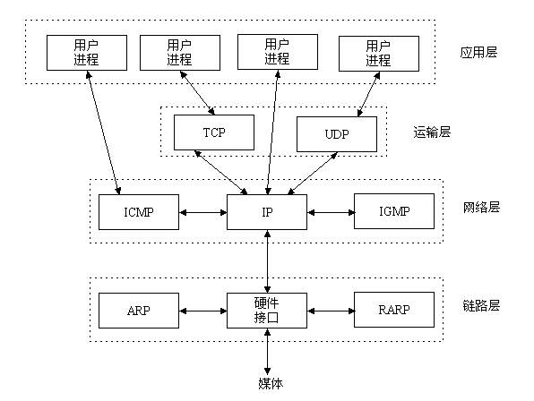
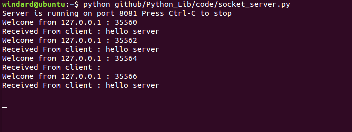

##socket

socket网络编程，我其实一直是拒绝讲这个的，因为这个socket涉及到的知识面之广，我怕我个人也难以解释清楚。                                             

socket是一种基于TCP/IP协议的，在传输层与应用层之间进行信息交流的网络通信方式，它主要用于在同一台主机或不同的主机的进程之间的通信。              
TCP/IP协议是一套使用使用广泛的通信协议的合集。                           
正如在全中国推行普通话一样，通信协议就是通信标准，不同的语言或者信息在同样的标准下可以相互传输并正常交流，这就是通信协议的功能。         

在这里我们就不再深入的研究TCP/IP协议，它包括很多的内容，具体的可以看一下：          
《TCP/IP协议详解》                              
[协议森林](http://www.cnblogs.com/vamei/archive/2012/12/05/2802811.html)                    

这是一张TCP/IP参考模型图。                        


可以看到图中除了TCP协议还有UDP协议。        
TCP协议需要经过三次握手才能建立持久稳定的连接，而UDP协议只管收发信息，并不会管是否接受。                             
TCP协议是持久的，有效的，可靠的。                       
UDP协议是快速的，简单的，少量的。                             
socket对TCP和UDP都支持。                              

那么接下来让我们看一下socket在哪里呢。                        


socket抽象层是在TCP与UDP协议的运输层之上的与应用层连接的抽象层，也就是说socket能够通过使用TCP协议或者UDP协议来实现很多相关的应用性协议功能的，比如说http，https，FTP，smtp，DNS等。                             

网络通信之间都是至少需要一个服务器端和一个客户端的，我们的socket就先从简单的客户端开始。    

####简单的TCP协议的网络客户端              

```python
#coding=utf-8
import socket,sys

host = sys.argv[1]
port = int(sys.argv[2])

s = socket.socket(socket.AF_INET,socket.SOCK_STREAM)
s.connect((host,port))

while 1:
    buf = s.recv(2048)
    if not len(buf):
        break
    print buf
```

保存为socket_client.py，运行，看一下结果。                   
                 
可以看到，我先是在本机开了一个ftp服务器，用socket可以成功连接上去，然后就是连接百度的http服务器，看到也连接成功了，最后一个是连接后面的socket服务器，同样的返回了服务器的回复。可是为什么百度的http服务器没有回复呢？因为我们向它发送的请求不对。              

####简单的TCP协议的网络服务器

```python
#coding=utf-8
import socket

host = "127.0.0.1"
port = 8081

s = socket.socket(socket.AF_INET,socket.SOCK_STREAM)
s.bind((host,port))
s.listen(5)

print "Server is running on port %s Press Ctrl-C to stop"%port

while 1:
	clientsock,clientaddr = s.accept()
	print "Welcome from %s : %s"%(clientaddr[0],clientaddr[1])
	resquest = clientsock.recv(1024)
	print "Received From client : " + resquest
	clientsock.send("Hello client")
```

保存为socket_server.py，运行，看一下结果。                  
                         
                         

以上就是我们的socket的一个简单的使用了，接下来我们详细的讲解一下socket客户端和服务器端的相应的功能。                         

####建立一个socket客户端
1. 创建socket对象                           
`socketobject = socket.socket(family[,type])`                 
family有`AF_INET`包括internet地址，`AF_INET6`包括ipv6的internet地址，`AF_UNIX`同一台机器上。                    
type有`SOCK_STREAM`数据流套接字，`SOCK_DGRAM`数据报套接字，`SOCK_RAW`原始套接字。                  

####socket的其他功能函数
1. socket.gethostname() 
2. socket.gethostbyname(host) 
3. socket.gethostbyaddr(host) 
4. socket.getservbyname(servicename[,protocolname]) 
5. socket.getprotobyname(name) 
6. socket.getservbyport(port[,protocolname])

```python
#coding=utf-8

import socket

hostname = socket.gethostname()
print "host name : " + hostname

hostip = socket.gethostbyname(hostname)
print "host ip : " + hostip

host = socket.gethostbyaddr(hostip)
for item in host:
	print item

httpport = socket.getservbyname("http")
print "http port : " + str(httpport)

ftpport = socket.getservbyname("ftp","tcp")
print "tcp port : " + str(ftpport)

udpnumber = socket.getprotobyname("udp")
print "udp number is : " + str(udpnumber)

tcpnumber = socket.getprotobyname("tcp")
print "tcp number is : " + str(tcpnumber)

servivename = socket.getservbyport(25)
print "25 port is : " + servivename

servivename = socket.getservbyport(43)
print "43 port is : " + servivename
```

保存为socket_get.py，运行，看一下结果。                       
                 


