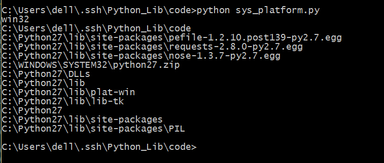
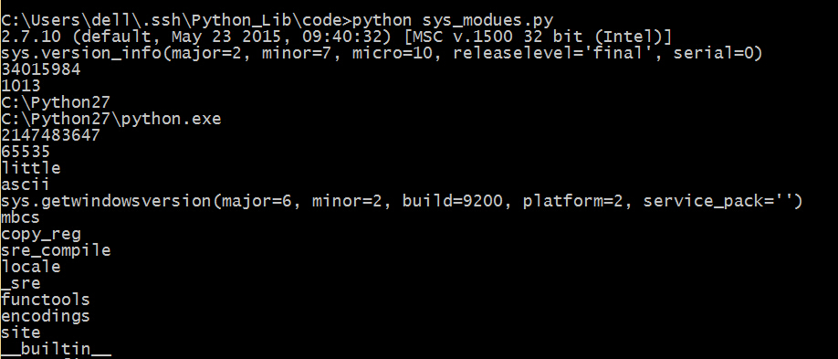
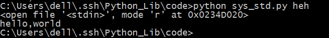

## sys

这个模块也可以传入命令行参数，但是它的参数必须是指定的，没有argparse那么好用，毕竟，这个库的主要功能不是为了传递命令行参数。

#### 基本使用
1. `sys.argv` 获得传入的命令行参数。

```
# coding=utf-8
import sys

#默认第0个是程序自身
print sys.argv[1]

#默认传进来的参数都是字符串，所以这样的加法是直接相加
print sys.argv[2] + sys.argv[3]

#如果想要做加法的话需要这样相加
print int(sys.argv[2])+int(sys.argv[3])

#计算传进来的未知长度的数字之和
num = 0
for i in sys.argv[2:]:
	num = num+int(i)
print num
```

保存为sys_argv.py，运行，看一下结果。


2. `sys.platform()` 获得当前终端是Windows下还是Linux下。
3. `sys.exit(n)` 退出程序，它有一个可选的整数参数，当n为0是是正常退出，其他为不正常，可抛异常事件捕获，默认为0。
>注意，此处的`sys.exit()`和`os._exit()`和`exit()/quit()`都能够退出Python程序，但是`sys.exit()`一般用在主线程中退出整个Python进程，因为在子线程中其无法结束主线程，而`os._exit()`不抛出异常，不执行清理工作，能够退出主线程，`exit()/quit()`一般在交互式shell中使用。
4. `sys.path` 系统的环境变量，返回列表。

```python

import sys
print sys.platform
path = sys.path
for i in path:
	print i
sys.exit(0)
print "This won't run"
```

保存为sys_platform.py，运行，看一下结果。


#### 进阶操作

5. `sys.modules()` python导入了哪些库，返回元组。
6. `sys.version` Python解释器的版本信息。
7. `sys.hexversion` 用十六进制表示Python解释器的版本号。
8. `sys.maxint` 最大的int值
9. `sys.maxunicode` 最大的Unicode值
10. `sys.copyright` Python解释器的版权信息
11. `sys.version_info` Python解释器的详细信息
12. `sys.api_version` 解释器的C的API版本
13. `sys.exec_prefix` Python文件的安装路径
14. `sys.byteorder` 本地字节规则的指示器，返回big表示big-endian，little表示little-endian    15. `sys.getdefaultencoding()` 返回你当前所用的默认编码格式。Python z.x返回ASCII，Python 3.x返回Unicode
16. `sys.setdefaultencoding()` 设定当前的默认编码格式
17. `sys.executable`  返回Python解释器的具体位置
18. `sys.getwindowsversion()`  获得Windows版本

```python

import sys
print sys.version
print sys.version_info
print sys.hexversion
print sys.api_version
print sys.exec_prefix
print sys.executable
print sys.maxint
print sys.maxunicode
print sys.byteorder
print sys.getdefaultencoding()
print sys.getwindowsversion()
print sys.getfilesystemencoding()
modules =  sys.modules
for i in modules.keys():
	print i
print sys.copyright
```

保存为sys_modules.py，运行，看一下结果。



18. `sys.platform` 解释器运行的平台名称
19. `sys.stdout` 标准输出流
20. `sys.stdin`  标准输入流
21. `sys.stderr` 错误输出流

```python

import sys
data = sys.stdin
print data
sys.stdout.write("hello,world")
```

保存为sys_std.py，运行，看一下结果。




19. `sys.getrecursionlimit()` 获得 python 最大递归深度
20. `sys.setrecursionlimit(15000)` 在 Mac 上默认为 1000
