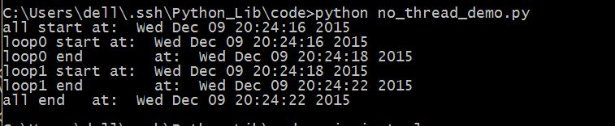
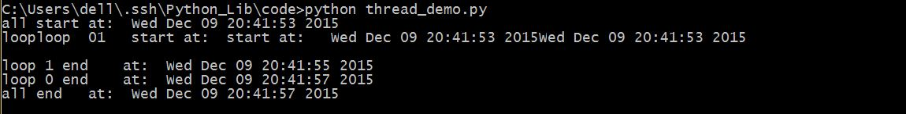

##Thread

多线程，但是这个多线程的库已经用的很少了，现在大家用的都是threading的这个库。它在多线程的控制上不如threading，以及不支持守护线程。不过我们还是先来讲一下这个库，对多线程有一个简单的了解。                              
首先假设我们有两个任务，一个需要2秒钟来完成，一个需要4秒钟来完成，花费时间我们用sleep来代替。那么正常情况下，我们需要6秒才能完成这两个任务。代码如下。                      
```python
#coding=utf-8

from time import ctime,sleep

def loop0():
	print 	"loop0 start at: ",ctime()
	sleep(2)
	print 	"loop0 end 	 at: ",ctime()

def loop1():
	print 	"loop1 start at: ",ctime()
	sleep(4)
	print 	"loop1 end 	 at: ",ctime()

print "all start at: ",ctime()

loop0()
loop1()

print "all end   at: ",ctime()
```

保存为no_thread_demo.py，运行，看一下结果。                                   
                

可以看到确实是花费了6秒钟，现在，我们再来使用多线程是他们同时进行，并且使用锁，把主进程锁住等待全部子进程完成，那么应该只花费4秒钟就可以全部完成了。                         

```python
#coding=utf-8

import thread
from time import ctime,sleep

#这次两个函数只用一个函数体,在函数结束后释放这个锁
def loop(nloop,nsec,lock):
	print "loop",nloop," start at: ",ctime()
	sleep(nsec)
	print "loop",nloop,"end    at: ",ctime()
	lock.release()

print "all start at: ",ctime()

#两个函数运行时间
loops = [4,2]

#这是两个锁的列表
locks = []

nloops = range(len(loops))

#创建两个锁
for i in nloops:
	lock = thread.allocate_lock()
	lock.acquire()
	locks.append(lock)

#创建两个带锁的线程
for i in nloops:
	thread.start_new_thread(loop,(i,loops[i],locks[i]))

#等待两个带锁的线程结束
for i in nloops:
	while locks[i].locked():
		pass
print "all end   at: ",ctime()
```

保存为thread_demo.py，运行，看一下结果。                             
                               

两个函数由于同时开始，他们的开始的函数都写到一起了。。。不过还是可以看到确实整个函数只进行了4秒钟。    
