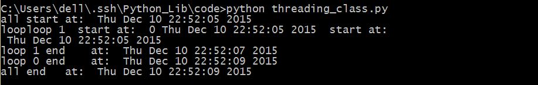

## threading

#### 基本使用

在thread的库里还需要我们自己的去设定锁，并且在主线程里阻塞主线程的进行来判断锁是否已经释放。但是在threading库里，因为守护线程的存在，主线程会自动等待子线程全部结束才会继续下去，不过在这里还是需要手动的将子线程加入(join)到主线程中。
还是上一个例子，我们用threading来试一下。

```python
#coding=utf-8
import threading
from time import ctime,sleep
def loop(nloop,nsec):
	print "loop",nloop," start at: ",ctime()
	sleep(nsec)
	print "loop",nloop,"end    at: ",ctime()
print "all start at: ",ctime()
loops = [4,2]
threads = []
nloops = range(len(loops))
#创建两个线程
for i in nloops:
	t = threading.Thread(target=loop,args=(i,loops[i]))
	threads.append(t)
#让两个线程同时开始
for i in nloops:
	threads[i].start()
#将两个线程加入主线程
#如果将join和start在一起的话
#就会阻塞主线程的执行
#没有产生另一个子线程
#所以并没有开启多线程
#还是一个线程一个线程的执行
for i in nloops:
	threads[i].join()
print "all end   at: ",ctime()
```

保存为threading_demo.py，运行，看一下结果。


#### 创建多线程的几种方法

上面我们演示的是最基本的创建多线程的方式，也是最不推荐的方式。实际上threading库一共为我们提供三种创建多线程的方法，后两种更加的体现了Python面向对象的特性。

三种创建多线程的方法
1. 创建一个threading的实例，传给它一个参数。
2. 创建一个threading的实例，传给它一个可调用的类对象。
3. 从threading派生出一个子类，创建这个子类的实例。

那么接下里我们分别演示一下另外的两种方法。

###### 创建一个threading的实例，传给它一个可调用的类对象
这里我们需要先创建一个类供线程启动的时候执行，然后在线程启动的时候，Thread对象会调用我们创建的对象的执行函数。

```python
#coding=utf-8

import threading
from time import ctime,sleep

class ThreadFunc(object):
	def __init__(self, func ,args,name=""):
		self.args = args
		self.func = func
		self.name = name

	def __call__(self):
		apply(self.func,self.args)

def loop(nloop,nsec):
	print "loop",nloop," start at: ",ctime()
	sleep(nsec)
	print "loop",nloop,"end    at: ",ctime()

print "all start at: ",ctime()

loops = [4,2]
threads = []
nloops = range(len(loops))

for i in nloops:
	t = threading.Thread(target=ThreadFunc(loop,(i,loops[i]),loop.__name__))
	threads.append(t)

for i in nloops:
	threads[i].start()

for i in nloops:
	threads[i].join()

print "all end   at: ",ctime()
```

保存为threading_class.py，运行，看一下结果。



#### 从threading派生出一个子类，创建这个子类的实例
创建一个继承自Thread的之类，然后构造这个之类的实例，这时，Thread的start方法在就要在之类里重写为run方法。

```python
#coding=utf-8

import threading
from time import ctime,sleep

class MyThread(threading.Thread):
	def __init__(self,func,args,name=""):
		threading.Thread.__init__(self)
		self.name = name
		self.func = func
		self.args = args

	def run(self):
		apply(self.func,self.args)

def loop(nloop,nsec):
	print "loop",nloop," start at: ",ctime()
	sleep(nsec)
	print "loop",nloop,"end    at: ",ctime()

print "all start at: ",ctime()

loops = [4,2]
threads = []
nloops = range(len(loops))

for i in nloops:
	t = MyThread(loop,(i,loops[i]),loop.__name__)
	threads.append(t)

for i in nloops:
	threads[i].start()

for i in nloops:
	threads[i].join()

print "all end   at: ",ctime()
```

保存为threading_class_MyThread.py，运行，看一下结果。


#### 生产者-消费者模式

然后我们再来介绍一种多线程模式，生产者-消费者模式，这也是现实生活中最常用的多线程模式。
假设我们有这样一条工程，一共有两道工序。必须等到第一道工序结束了才能进行第二道工序。这时我们就引入了生产者和消费者的概念，第一道工序是生产者，第二道工序是消费者，分别是两个线程。
首先我们需要使用Queue队列模块，让多个线程之间共享数据。生产者不停的往队列里面加入货物，消费者不停的从队列里消费货物。
假设我们一共有100个货物，生产者与消费者所需时间都是1秒以内的随机时间。

```python
#coding=utf-8

import threading
from Queue import Queue
from random import random
from time import ctime,sleep

def writeQ(queue):
	for i in range(100):
		print "Producting project for Q..."
		sleep(random())
		# sleep(random()/2.0)
		queue.put('xxx',1)
		print "Size now",queue.qsize()

def readQ(queue):
	for i in range(100):
		print "Consuming project from Q..."
		sleep(random())
		queue.get(1)
		print "Size now",queue.qsize()

print "all start at: ",ctime()

funcs = [writeQ,readQ]
nfunc = range(len(funcs))

q = Queue(48)
threads = []

for i in nfunc:
	t = threading.Thread(target=funcs[i],args=(q,))
	threads.append(t)

for i in nfunc:
	threads[i].start()

for i in nfunc:
	threads[i].join()

print "all end   at: ",ctime()
```

保存为为threading_queue.py，运行，看一下结果。

###### 八个线程
最后总花费大概50秒左右，已经能够把效率提高一倍了。可是仅仅这样怎么够，这才两个线程，让我们来开八个线程试一下，生产者和消费者各四个线程。
果然在把生产者消费者线程增多的时候，相比较效率提高了很多。

```python
#coding=utf-8

import threading
from Queue import Queue
from random import random
from time import ctime,sleep

def writeQ(queue):
	for i in range(25):
		print "Producting project for Q..."
		sleep(random())
		queue.put('xxx',1)
		print "Size now",queue.qsize()

def readQ(queue):
	for i in range(25):
		print "Consuming project from Q..."
		sleep(random())
		queue.get(1)
		print "Size now",queue.qsize()

print "all start at: ",ctime()

funcs = [writeQ,readQ]
nfunc = range(len(funcs))

q = Queue(48)
threads = []

for i in nfunc:
	for j in range(4):
		t = threading.Thread(target=funcs[i],args=(q,))
		threads.append(t)

for i in range(8):
	threads[i].start()

for i in range(8):
	threads[i].join()

print "all end   at: ",ctime()
```

保存为threading_queue_last.py。
我们这是把生产者消费者同时执行，如果在生产者花费时间较短，只要时间在消费者的时候，我们可以先让生产者生产全部的货物，然后开多个子线程让消费者将其消费完为止。


#### 资源锁定
前面我们已经看到因为线程同步的原因，输出的时候总是显得不那么整齐，就是因为多线程在抢占同一个资源的原因。而如果我们在对同一个数据进行操作时，因为多线程的原因，可能一个线程对其进行操作还未结束另一个线程就强行进行了下一轮更改，这样的话肯定会有一些问题。
所以这就需要资源锁定，当一个资源被锁定的时候，同时只能有一个资源对其进行操作，这样就保证了多线程的安全性。

我们先来看一下没有资源锁的情况

```python
#coding=utf-8

import threading
from time import ctime,sleep

counter = 0

class MyThread1(threading.Thread):
	def __init__(self):
		threading.Thread.__init__(self)

	def run(self):
		global counter
		counter += 1
		print "  "+str(counter)+"  "

class MyThread2(threading.Thread):
	def __init__(self):
		threading.Thread.__init__(self)

	def run(self):
		global counter
		counter -= 1
		print "  "+str(counter)+"  "

if __name__ == '__main__':
	threads = []
	for i in range(20):
		if i%2:
			t = MyThread1()
		else:
			t = MyThread2()
		threads.append(t)

	for t in threads:
		t.start()
```

保存为Threading_nolock.py，运行，看一下结果。


现在我们将其上锁。

```python
#coding=utf-8

import threading
from time import ctime,sleep

counter = 0
lock = threading.Lock()

class MyThread1(threading.Thread):
	def __init__(self):
		threading.Thread.__init__(self)

	def run(self):
		if lock.acquire():
			global counter
			counter += 1
			print "  "+str(counter)+"  "
			lock.release()

class MyThread2(threading.Thread):
	def __init__(self):
		threading.Thread.__init__(self)

	def run(self):
		if lock.acquire():
			global counter
			counter -= 1
			print "  "+str(counter)+"  "
			lock.release()

if __name__ == '__main__':
	threads = []
	for i in range(20):
		if i%2:
			t = MyThread1()
		else:
			t = MyThread2()
		threads.append(t)

	for t in threads:
		t.start()
```

保存为threading_lock.py，运行，看一下结果。


