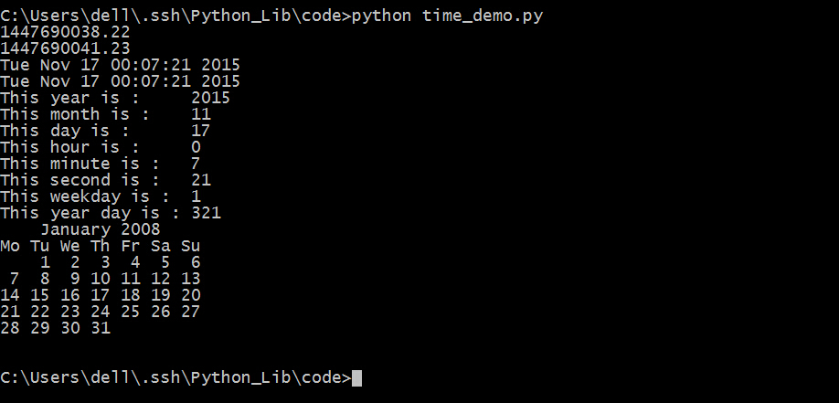
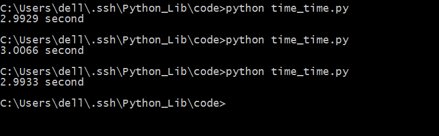

##time

时间函数time，使用起来也非常简单，一般用来取得当前时间，和计算一段时间差。      
```python
#coding=utf-8
import time
import calendar

# 显示从1970年1月1日到现在经过了多长时间
print time.time()
#延迟3秒
time.sleep(3)
print time.time()

#显示当前时间
print time.ctime()
#time.ctime(t) 显示从1970年1月1日过了t秒钟的时间


#或者这样
print time.asctime( time.localtime(time.time()) )

#详细的时间参数
print "This year is :     " + str(time.localtime(time.time()).tm_year)
print "This month is :    " + str(time.localtime(time.time()).tm_mon)
print "This day is :      " + str(time.localtime(time.time()).tm_mday)
print "This hour is :     " + str(time.localtime(time.time()).tm_hour)
print "This minute is :   " + str(time.localtime(time.time()).tm_min)
print "This second is :   " + str(time.localtime(time.time()).tm_sec)
print "This weekday is :  " + str(time.localtime(time.time()).tm_wday)
print "This year day is : " + str(time.localtime(time.time()).tm_yday)

#获取某月日历
print calendar.month(2008, 1)
```
保存为time_demo.py，运行，看一下效果。           
       
计算时间差。          
```python
import time

start_time = time.clock()
time.sleep(3)
end_time   = time.clock()
print "%.4f second"%(end_time - start_time) 
```
保存为time_time.py，运行，看一下结果。         
         
可以看到每次执行的时间都不一样，但是都在3秒左右。          
