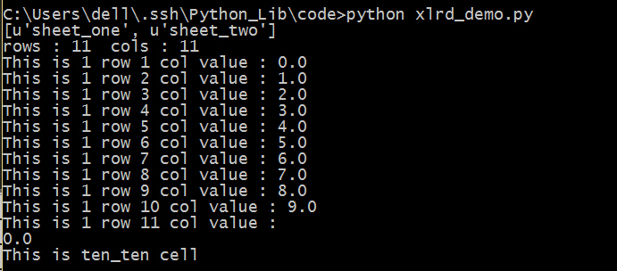

##xlrd

用Python打开Excel并读取,但是这个只能读。不能写入。         
```python
#coding=utf-8
import xlrd
#打开一个Excel表单
data = xlrd.open_workbook("test.xls")
#查看每个sheet名称
print data.sheet_names()
#得到第一个工作表单
table1 = data.sheets()[0]
#或者也可以这样得到
table2 = data.sheet_by_index(1)
#或者也可以这样得到
table3 = data.sheet_by_name(u"sheet_one")
#获得行数和列数
nrows = table2.nrows
ncols = table2.ncols
print "rows : " + str(nrows) + "  cols : " + str(ncols) 
#获得整行或者整列的值
row1 = table2.row_values(0)
for i in range(ncols):
	print "This is 1 row %s col value : %s"%(i+1,row1[i])
cols = table2.col_values(1)
#得到某个单元格的值
cell = table2.cell(0,0).value
print cell
#也可以使用行列索引
cell = table2.row(10)[10].value
print cell
```
保存为xlrd_demo.py，运行，看一下结果。   
   
