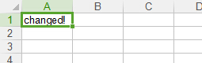

## xlutils

真是坑爹吖，一个简单的Excel还要这样折磨我，这个是用来再已有的Excel表单上修改的。
而且其实这个是调用了上面两个的方法来实现自己的功能。      

```python
#coding=utf-8
from xlrd import open_workbook
from xlutils.copy import copy
 
 #打开表单时，保留原有表单格式
rb = open_workbook('test.xls',formatting_info=True)
 
#通过sheet_by_index()获取的sheet没有write()方法
rs = rb.sheet_by_index(0)

wb = copy(rb)
 
#通过get_sheet()获取的sheet有write()方法
ws = wb.get_sheet(0)
ws.write(0, 0, 'changed!')
 
wb.save('test.xls')
```

保存为xlutils_demo.py，运行，看一下结果。   

           
