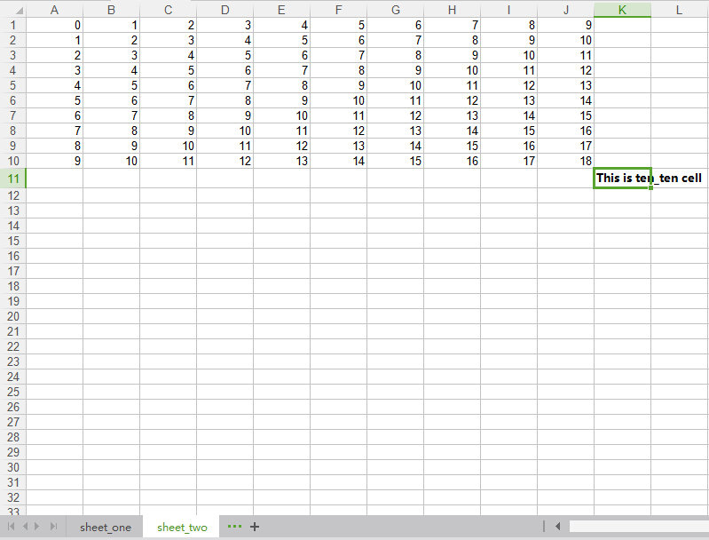

##xlwt

强大的Python与Excel交互，可以用xlwt打开Excel表单并写入，但是只能写入，不能读取。  
```python
#coding=utf-8
import xlwt
#设定打开文档的编码格式，或者留空
excel = xlwt.Workbook('utf-8')
#新建一个sheet
table1 = excel.add_sheet("sheet_one")
#写入数据table.write(行，列，值)
table1.write(0,0,"test")
#如果对一个单元格重复操作就会报错
#需要引入可以覆盖
table2 = excel.add_sheet("sheet_two",cell_overwrite_ok=True)
for i in range(10):
	for j in range(10):
		table2.write(i,j,i+j)
#另外，也可以为表单使用样式
style = xlwt.XFStyle()
#设置字体
font  = xlwt.Font()
font.name = "MicroSoft YaHei"
#加粗
font.bold = True
style.font = font
table2.write(10,10,"This is ten_ten cell",style)
excel.save('test.xls')
```
保存为xlwt_demo.py，运行，看一下结果。   
   
